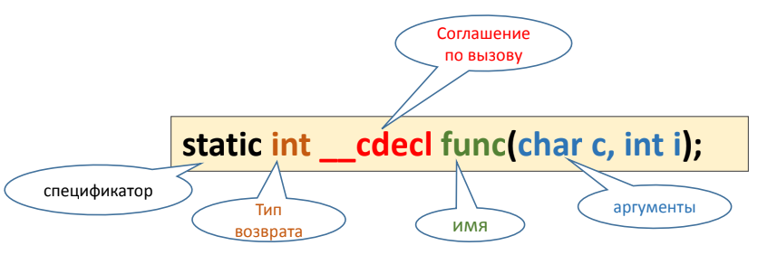
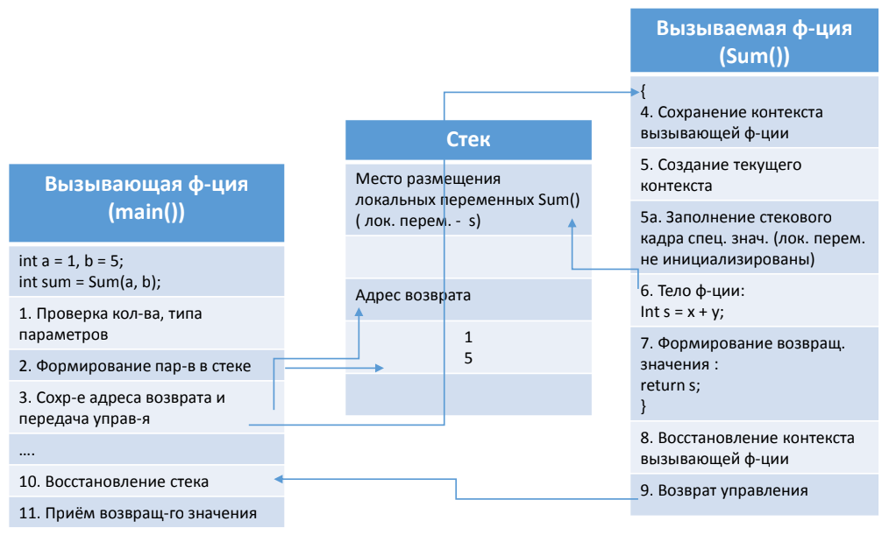
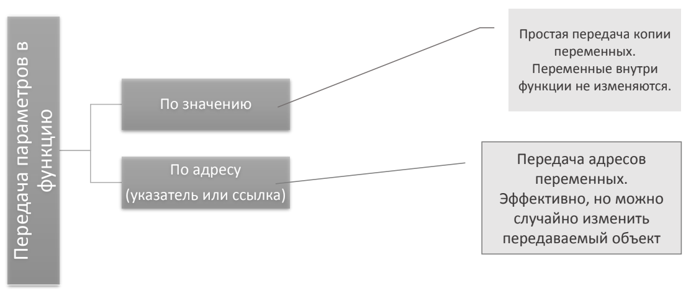
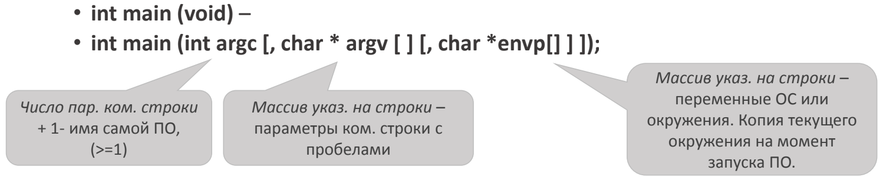

[**Назад**](https://github.com/BurdichxD4r/Cpp_Lessons/tree/master#course-ccqt)
# Функции в языке С. I
## Определение и основные понятия
**Функция** — это последовательность инструкций для выполнения определенного задания. Может быть выполнена в разных участках кода с разным набором данных.

Для выполнения функции требуется:
- Сформировать исходные данные;
- Передать управление на начало функции;
- По окончанию работы функции вернуть управление и результат обратно;

**Функция** может принимать параметры, выполнять набор инструкций, может формировать результат.

Результат работы функции – **единственная величина**.


**Объявление** функции (прототип) – предварительное описание, которое извещает компилятор о типе возвращаемого значения, кол-ве и типах передаваемых в функцию аргументах и др. свойствах функции.

**Определение** функции (реализация) – включает те же поля что и прототип функции, плюс «тело функции», заключенное в {}.

**Тело функции** – инструкции выполняемые при её вызове.

**Вызов** функции – это выражение, которое указывает процессору прервать выполнение текущего задания и приступить к выполнению вызываемой функции.



## Вызов функции

При вызове функции компилятором обеспечивается:

Связь по управлению:
- Передача управления на начало ф-ции и возврат управления на след. за вызовом ф-ции инструкцию;
- Сохранение и восстановление контекста вызывающей части;

Связь по данным – механизм, позволяющий передавать данные из вызывающей ф-ции в вызываемою и возвращать результаты работы ф-ции в вызывающую ф-цию.



## Соглашение о вызове функции
- Существуют разные способы превращения вызова ф-ции в машинные
команды. Эти способы называют – соглашения о вызове, они
определяют моменты:
    - Как передаются параметры (через стек или через регистры) и в каком порядке.
    - Кто восстанавливает стек (вызывающая или вызываемая ф-ция);
    - Как компилятор формирует внутреннее имя ф-ции в объектном файле.
- **__cdecl**, **__stdcall**, **__fastcall** – основные соглашения, могут быть использованы при объявлении и определении ф-ции.
- **Например: f(‘A’, 10, 9999, 1.23)**; // вызов

||__cdecl|__stdcall|__fastcall|
|---|---|---|---|
|Внутр-ее имя|?f@@YAXDFHN@Z(_f)|?f@@YGXDFHN@Z(_f@20)|?f@@YIXDFHN@Z(@f@20)|
|Передача парам-в|Справа налево в стеке|Справа налево в стеке|Регистр, стек справа налево|

## Способы передачи параметров в функции



|Параметры|Прототип|Вызов|
|---|---|---|
|Выражение|void F(int, double)|F(f1(), x+y)|
|Указ. на массив|void Fp(T* p1, T (*p2)[M], T (*p3)[M][L])|Fp (ar1, ar2, ar3)|
|Ссылки на массив|void Fr(T (&ar)[N][M])|Fr(ar), где (int ar[5][10])|

## Поток (stream)
- Термин для обозначения программных средств по организации ввода/вывода. Стандартная библиотека предоставляет эти возможности при помощи функций и спец. структур данных.
- При запуске программы в стартовом коде станд. библиотеки создается и инициализируется структуры данных типа **FILE**, которые по умолчанию связываются с устройствами ввода/вывода (клавиатура/экран).
- Эти структуры наз. ***стандартными потоками ввода/вывода***. Именно
эти структуры – потоки используются функциями станд. библиотеки для вывода на экран и приёма пользовательского ввода с клавиатуры.
- Для явного использования эти структур доступны глобальные указатели типа *FILE:
    - **Stdout** – указатель на структуру данных, связанную с потоком вывода
    - **Stdin** – указатель для потока ввода.

## Параметры функции main()
Ф-ция main() может иметь несколько форм:



```c
int main (int argc, char* argv[]){
    for (int i =0; i < argc; ++i){
        std::cout << argv[i]<<std::endl;
    }
    return 0;
}
```
```c
int main (int argc, char* argv[], char* envp[]){
    for (int i =0; envp[i]!=0; ++i){
        std::cout << envp[i]<<std::endl;
    }
    return 0;
}
```
## Вызов inline-функции
Функция со спецификатором **inline** - встроенная ф-ция. Компилятор встречая вызов такой ф-ции должен подставлять вместо **вызова**, **тело ф-ции**.
- При использовании встроенных функций:
    - Исключаются накладные расходы на вызов ф-ции;
    - Сохраняется структура текста программы;
    - Увеличивается объем исполняемого файла.
- Чтобы использовать встроенную ф-цию:
    - Тело ф-ции должно быть в заголовочном файле;
    - Компилятор может провести оптимизацию и не встроить вашу ф-цию;
    - Компилятор не встраивает (рекурсивные, ф-ции с вызовом через указатель, ф-ции с переменным числом параметров)

## Переменное число параметров у функции (Эллипсис)
- Наличие многоточия (...) в списке параметров в объявлении и в
определении!
- Компилятор отключает контроль соответствия типов параметров при вызове, теперь за это отвечает программист!
- У ф-ции должен быть хотя бы 1 обязательный параметр.
- Ф-ция должна иметь механизм определения точного числа параметров при каждом вызове.
```c
double Func (int i, char c, ...); // прототип
Func (3, 'G', 5, 6, -1);          // вызов
```
## Функции ввода-вывода
Ф-ции **printf()**, **scanf()** – используются для форматированного ввода-вывода и являются примерами ф-ций с переменным числом параметров.
```c
// Форматировнный вывод:
int printf(const char*, ...);
fprintf();
sprintf();
/* Функция:
Исходя из указанных параметров, формирует строку;
Выводит ее на экран.
Обязательный параметр – строка,
наличие символа % говорит что пользователь хочет вывести
еще один или несколько величин. Они рассматриваются как
необязательные параметры.
Управлять выводом можно при помощь доп. информации
сразу за символом %:
*/
%[flag][width][.precision][{h || l ||I ||I32 || I64}] type
```
```c
// Форматировнный ввод:
int scanf(const char*, ...);
fscanf();
sscanf();
/* Функция:
Принимает пользовательский ввод с клавиатуры и использует
стандартный поток ввода stdin.
Принимает 1 обязательный параметр – строку, посредством
которой интерпретируются вводимые значения и любое
количество необязательных параметров.
При задании необязательных параметров принципиально
указание адреса переменной, по которому будет помещён
результат перевода из строкового представления.
Спецификатор (*) предписывает ф-ции игнорировать очередное
входное значение.
*/
%[*][width][{h || l ||I ||I32 || I64}] type
```
## Запись в файл
Функция **fputs()** записывает в файл строку, то есть набор символов, который завершается символом '\0'. Она имеет следующий прототип:

int fputs(const char *s, FILE *stream);

```c
#include <stdio.h>
int main(void)
{
    // строка для записи
    char * message = "This string will be written into file – data.txt";
    // файл для записи
    char * filename = "data.txt";
    // запись в файл
    FILE *fp = fopen(filename, "w");
    if(fp)
    {
    fputs(message, fp); // записываем строку
    fclose(fp);
    printf("File has been written\n");
    }
    return 0;
}
```
## Чтение из файла
Функция **fgets()** считывает из файла одну строку и имеет следующий прототип:

char * fgets(char *s, int n, FILE *sream);

```c
#include <stdio.h>
int main(void)
{
    // файл чтения
    char * filename = "data.txt";
    // буфер для считывания данных из файла
    char buffer[256];
    // чтение из файла
    FILE *fp = fopen(filename, "r");
    if(fp)
    {
        // пока не дойдем до конца, считываем по 256 байт
        while((fgets(buffer, 256, fp))!=NULL)
        {
            printf("%s", buffer);
        }
    fclose(fp);
    }
    return 0;
}
```
# Практика
## Функция вывода массива на экран
```c
#include <stdio.h>
void print_arr(int arr[], int n){
    for (int k = 0; k < n; k++){
        printf("arr[%d] = %d\t", k, arr[k]);
    }
    printf("\n");
}

void print_arr2(int arr[][5], int k, int n){
    for (int i = 0; i < k; i++, printf("\n")){
        for(int j = 0; j < n; j++){
            printf("arr[%d][%d] = %d\t", i, j, arr[i][j]);
        }
    }
    printf("\n");
}

int main(void){
    int q[5] = {5,4,2,3,4};
    int q2[2][5] = { {1, 2, 3, 4, 5}, {0, 9, 8, 7, 6} };
    print_arr(q, 5);
    print_arr2(q2, 2, 5);
    return 0;
}
```
## Вывод параметров ф-ции main().
```cpp
int main (int argc, char* argv[]){
    for (int i = 0; i < argc; ++i){
        std::cout << argv[i] << std::endl;
    }
    return 0;
}
```
```cpp
int main (int argc, char* argv[], char* envp[]){
    for (int i = 0; envp[i] != 0; ++i){
        std::cout << envp[i] << std::endl;
    }
    return 0;
}
```
## Запись и чтение из файла
- Оформить код чтения/записи в файл. В виде функций.
```c
```
## Эллипсис
Определим функцию, которая вычисляет сумму чисел, причем количество чисел - нефиксированно.
```c
#include <stdio.h>
#include <stdarg.h>

int sum(int n, ...){
    int result = 0;
    va_list factor; // указатель va_list
    va_start(factor, n); // устанавливаем указатель
    for(int i = 0; i < n; i++){
        result += va_arg(factor, int); // получаем знач. текущего параметра типа int
    }
    va_end(factor); // завершаем обработку параметров
    return result;
}

int main(void){
    printf("%d \n", sum(4, 1, 2, 3, 4));
    printf("%d \n", sum(5, 12, 21, 13, 4, 5));
return 0;
}
```
# Домашняя работа
- Придумать эллипсис со своим механизмом контроля вводимых параметров.
- Массив:
    - считывается из файла;
    - передается в функцию где он сортируется по убыванию ;
    - отсортированный массива возвращается из функции ;
    - сохраняется в файл ;

Т.о задачу необходимо оформить в виде 3-х ф-ций:
- Считывание из файла
- Сортировки
- Запись в файл.