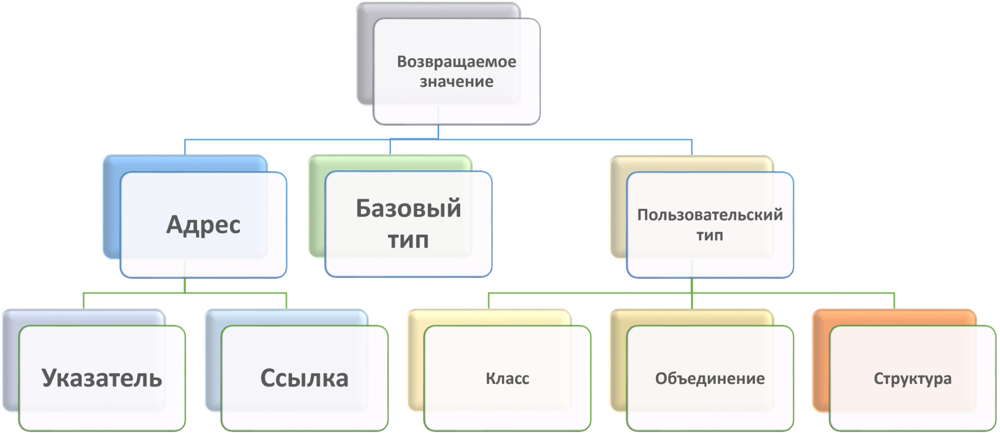
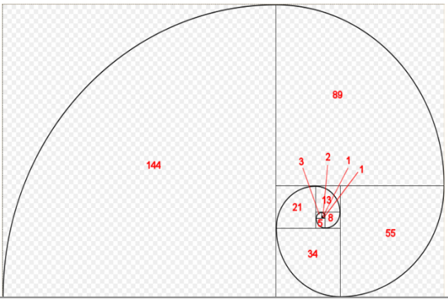
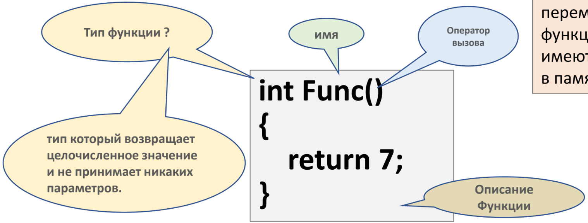

[**Назад**](https://github.com/BurdichxD4r/Cpp_Lessons/tree/master)
# Функции в языке С. II
## Виды возвращаемых значений
- Указатель или ссылка на объект со статическим временем существования;
- Указатель на строковый литерал (в стат. обл. памяти);
- Указатель на динамически созданный объект.

Данные разного типа возвращаются по разному:
- **Базовые типы и адреса** возвращаются на регистре;
- **Длинные целые** на паре регистров;
- **Вещественные типы** - через стек;
- **Массивы** – возвращаются через возврат адреса начала массива;
- **Структуры, классы** – по значению сложным вызовом ф-ции.



## Возвращение базового типа
- **Возврат по значению** — это самый простой и безопасный тип возврата. При возврате по значению, копия возвращаемого значения передается обратно в вызывающую функцию. Можно возвращать литералы (например, 7),  переменные (например, x) или выражения (например, x + 2), что делает этот способ очень гибким.
- Возврат по значению идеально подходит для возврата переменных, которые были объявлены внутри функции, или для возврата  аргументов функции, которые были переданы по значению. Но возврат по значению медленный при работе со структурами и классами.
```c
int doubleValue(int a){
    int value = a * 3;
    return value; // копия value
    //возвращается здесь
} // value выходит из области видимости здесь
```
Не используйте возврат по значению:
- при возврате стандартных массивов или указателей (используйте возврат по адресу);
- при возврате больших структур или классов (используйте возврат по ссылке).
## Возвращение указателей
- Возврат по адресу — это возврат адреса переменной обратно в вызывающую функцию. Возврат по адресу может возвращать только адрес переменной. Литералы и выражения возвращать нельзя, так как они не имеют адресов. Поскольку при возврате по адресу просто копируется адрес, то этот процесс очень быстрый.
- Но, этот способ имеет один недостаток, если вы попытаетесь возвратить адрес локальной переменной, то получите неожиданные результаты. Конечным результатом будет то, что вызывающая функция получит адрес освобожденной памяти (висячий указатель).
- Возврат по адресу часто используется для возврата динамически выделенной памяти обратно в выз-щую функцию:
```c
int * doubleValue(int a){
    int value = a * 3;
    return &value; // value возвращается
    // по адресу здесь
} // value уничтожается здесь
```
- при возврате переменных, которые были объявлены внутри функции (используйте возврат по значению);
- при возврате большой структуры или класса, который был передан по ссылке (используйте возврат по ссылке).
```cpp
int * allocateArray(int size){
    return new int[size];
}

int main(){
    int * array = allocateArray(20);
    // Делаем что-нибудь с array
    delete[] array;
    return 0;
}
```
- при возврате динамически выделенной памяти;
- при возврате аргументов функции, которые были переданы по адресу.
## Возвращение ссылок (С++)
- Значения, возвращаемые по ссылке, должны быть переменными (вы не сможете вернуть ссылку на литерал или выражение). При возврате по ссылке в вызывающую функцию возвращается ссылка на переменную. Затем вызыв. функция может её использовать для продолжения изменения переменной, что может быть иногда полезно. Этот способ очень быстрый и при возврате больших структур или классов.
- Однако, вы не должны возвращать локальные переменные по ссылке.
```cpp
int & doubleValue(int a){
int value = a * 3;
return value; // value возвращается по ссылке здесь
} // value уничтожается здесь
```
- при возврате переменных, которые были объявлены внутри функции (используйте возврат по значению);
- при возврате стандартного массива или значения указателя (используйте возврат по адресу).
- при возврате ссылки-параметра;
- при возврате элемента массива, который был передан в функцию;
- при возврате большой структуры или класса, который не уничтожается в конце функции (например, тот, который был передан в функцию).
## Функция и const
- Передача функции параметров const:

`void SomeFunc(const int *pn);`

**Const** – используется и в прототипе и в реализации ф- ции, нельзя модифицировать такой параметр в теле функции. Используется для передаче в функцию адреса объекта. Не стоит объявлять параметры с модификатором **const** – которые передаются **по значению**.
```c
const char * SomeFunc(){ return "Name2";}

int main(){
    const char * pc2 = SomeFunc();
}
```
- Возвращение функцией значений const:

`const char* SomeFunc();`

Имеет смысл только при возврате адреса.
## Перегрузка функции (С++)
- **Перегрузка функций** — это возможность определять несколько функций с одним и тем же именем, но с разными параметрами.
```cpp
int subtract(int a, int b); // целочисленная версия
double subtract(double a, double b); // версия типа с плавающей запятой
int subtract(int a, int b, int c);
```
Тип возврата функции НЕ учитывается при перегрузке функции

Функции не могут быть перегруженными если:
- Имеющие совпадающие тип и число аргументов, но разные типы возврата.
- Имеющие неявно совпадающие типы аргументов. (int, int&).

Механизм перегрузки достаточно большое количество правил для неявного преобразования. Если есть сомнения – лучше пользоваться явным преобразованием: `static_cast<type>(name);`

Эти 2 ф-ции нельзя считать различными!
```cpp
int getRandomValue();
double getRandomValue();
```
## Параметры по умолчанию
**Параметр по умолчанию** (или «необязательный параметр») — это параметр функции, который имеет определенное (по умолчанию) значение. Если пользователь не передает в функцию значение для параметра, то используется значение по умолчанию. Если же пользователь передает значение, то это значение используется вместо значения по  умолчанию.

Функция может иметь несколько параметров по умолчанию, но имеют место правила:
- **Все параметры по умолчанию в прототипе или в определении функции должны находиться справа**.

Кроме того:
- **Рекомендуется объявлять параметры по умолчанию в предварительном объявлении, а не в определении функции** (особенно, если предварительное объявление находится в **заголовочном файле**).
```cpp
#include <iostream>
void printValues(int a, int b = 5){
    std::cout << "a: " << a << std::endl;
    std::cout << "b: " << b << std::endl;
}

int main(){
printValues(1); // в качестве b будет использоваться значение по умолчанию - 5
printValues(6, 7); // в качестве b будет использоваться значение, предоставляемое пользователем - 7
}
```
**Функции с параметрами по умолчанию** могут быть перегружены, Но параметры по умолчанию НЕ относятся к параметрам, которые учитываются при определении уникальности функции.
```c
void printValues(int a);
void printValues(int a, int b = 15);
// одинаковые
```
## Рекурсивные функции
• Рекурсивная функция (или просто «рекурсия») в языке С/C++ — это функция, которая вызывает сама себя.
- Рекурсивные вычисления выполняются повторным выполнением одного и того же кода с разными наборами данных.
- Достоинством рекурсии является возможность создания компактного кода.
- Недостатками – накладные расходы на вызов функции и затраты стека на организацию каждого вложенного вызова.
```c
// Возвращаем сумму всех чисел между 1 и value
int sumCount(int value){
    if (value <= 0)
        return 0; // базовый случай (условие завершения)
    else if (value == 1)
        return 1; // базовый случай (условие завершения)
    else
        return sumCount(value - 1) + value; // рекурсивный вызов функции
}
```
«**Техника безопасности**» при работе с рекурсией:
- Обеспечить условие завершение рекурсии.
- Избегать использование локальных переменных так как они увеличивают размер стекового кадра для каждого вложенного вызова.
```cpp
#include <iostream>
void countOut(int count){
    std::cout << "push " << count << '\n';
    if (count > 1) // условие завершения
    countOut(count-1);
    std::cout << "pop " << count << '\n';
}

int main(){
    countOut(4);
    return 0;
}
```
## Рекурсивные алгоритмы
- Рекурсивные функции обычно решают проблему, сначала найдя решение для подмножеств проблемы (рекурсивно), а затем модифицируя это «подрешение», дабы добраться уже до верного решения. В вышеприведенном примере, алгоритм sumCount(value) сначала решает sumCount(value-1), а затем добавляет значение value, чтобы найти решение для sumCount(value).
- Во многих рекурсивных алгоритмах некоторые данные ввода производят предсказуемые данные вывода. Например, sumCount(1) имеет предсказуемый вывод 1 (вы можете легко это вычислить и проверить самостоятельно). Случай, когда алгоритм при определенных данных ввода производит предсказуемые данные вывода, называется базовым случаем. Базовые случаи работают как условия для завершения выполнения алгоритма. Их часто можно идентифицировать, рассматривая результаты вывода для следующих значений ввода: 0, 1, «» или null.



Каждое из чисел Фибоначчи — это длина стороны квадрата, в которой находится данное число. Математически числа Фибоначчи определяются следующим образом: F(n) = 0, если n = 0 1, если n = 1 f(n-1) + f(n-2), если n > 1
```cpp
#include <iostream>

int fibonacci(int number){
    if (number == 0)
        return 0; // базовый случай (условие завершения)
    if (number == 1)
        return 1; // базовый случай (условие завершения)
    return fibonacci(number-1) + fibonacci(number-2);
}

// Выводим первые 13 чисел Фибоначчи
int main(){
    for (int count=0; count < 13; ++count)
    std:: cout << fibonacci(count) << " ";
    return 0;
}
```
## Указатель на функцию



Подобно переменным, функции также имеют свой адрес в памяти.

Для определения типа функции необходимо учитывать:
- **Тип возвращаемого значения**;
- **Набор передаваемых в функцию параметров**;

Язык C++ неявно конвертирует функцию в указатель на функцию, поэтому не нужно использовать оператор адреса (&) для получения адреса функции.
```cpp
// Что бы узнать адрес ф-ции:
#include <iostream>

int boo(){ // код функции boo() находится в ячейке памяти 002B1050
    return 7;
}

int main(){
    std::cout << boo;
    return 0;
}
```
```cpp
/* fcnPtr - это указатель на функцию, которая не
принимает никаких аргументов и возвращает
целочисленное значение: */

int (* fcnPtr)();
fcnPtr = Func;

/* fcnPtr теперь указывает на функцию Func()
Мы хотим, чтобы fcnPtr содержал адрес функции
Func(), а не возвращаемое значение из Func().
Поэтому скобки здесь не нужны! */
```
## Вызов функции через указатель
```cpp
// Явное разыменование:
int boo(int a){
return a;
}

int main(){
    // присваиваем функцию boo() указателю fcnPtr
    int (* fcnPtr)(int) = boo;
    // вызываем функцию boo(7), используя fcnPtr
    (*fcnPtr)(7);
    return 0;
}
```
```cpp
// Неявное разыменование:
int boo(int a){
    return a;
}

int main(){
    // присваиваем функцию boo() указателю fcnPtr
    int (* fcnPtr)(int) = boo;
    // вызываем функцию boo(7), используя fcnPtr
    fcnPtr(7);
    return 0;
}
```
*Примечание*: Параметры по умолчанию не будут работать с функциями, вызванными через указатели на функции. Параметры по умолчанию обрабатываются во время компиляции (т.е. вам нужно предоставить аргумент для параметра по умолчанию во время компиляции). Однако указатели на функции обрабатываются во время выполнения.
## Функции обратного вызова
Одна из самых полезных вещей, которую вы можете сделать с указателями на функции — это передать функцию в качестве аргумента другой функции. Функции, используемые в качестве аргументов для других функций, называются **функциями обратного вызова**.
```cpp
bool ascending(int a, int b){
    return a > b;
}

bool descending(int a, int b){
    return a < b;
}

// Сортировка по умолчанию выполняется в порядке возрастания
void selectionSort(int *array, int size, bool (*comparisonFcn)(int, int) = ascending);

int main(){
    int array[8] = { 4, 8, 5, 6, 2, 3, 1, 7 };
    // Сортируем массив в порядке убывания, используя функцию descending()
    selectionSort(array, 8, descending);
    printArray(array, 8);
    // Сортируем массив в порядке возрастания, используя функцию ascending()
    selectionSort(array, 8, ascending);
    printArray(array, 8);
    return 0;
}

void selectionSort(int *array, int size, bool (*comparisonFcn)(int, int)){
    // Перебираем каждый элемент массива
    for (int startIndex = 0; startIndex < size; ++startIndex){
        // bestIndex - это индекс макс/мин элемента, который мы обнаружили до этого момента
        int bestIndex = startIndex;
        // Ищем наименьший/наибольший элемент среди оставшихся в массиве (начинаем со startIndex+1)
        for (int currentIndex = startIndex + 1; currentIndex < size; ++currentIndex){
            // Если текущий элемент меньше/больше нашего предыдущего найденного макс/мин элемента,
            if (comparisonFcn(array[bestIndex], array[currentIndex])) // СРАВНЕНИЕ ВЫПОЛНЯЕТСЯ ЗДЕСЬ
                // то это наш новый макс/мин элемент в этой итерации
                bestIndex = currentIndex;
        }
        // Меняем местами наш стартовый элемент с найденным макс/мин элементом
        std::swap(array[startIndex], array[bestIndex]);
    }
}
```
## Typedef и сложные указатели
Объявление начинающееся с **typedef** – это указание компилятору, что задаваемый в объявлении синоним типа не будет именем переменной а будет использован в качестве псевдонима указанного типа:
- typedef *тип* ***синоним_типа***

`typedef double (*PF)(double);`

Теперь PF является псевдонимом типа для указателя на ф-цию, которая принимает параметр double и возвращает значение double
```cpp
// Теперь вместо написания следующего:

bool validate(int a, int b, double (*fcnPtr)(double));

// Мы можем написать следующее:

bool validate(int a, int b, PF pfcn);
```
# Практика
## Перегрузка и параметры-константы
При перегрузке функций константный параметр отличается от неконстантного параметра только для ссылок и указателей. В остальных случаях константый параметр будет идентичен неконстантному параметру.<br>
Например, следующие два прототипа при перегрузке различаться НЕ будут:<br>
void print(int);<br>
void print(const int);
```cpp
#include <iostream>

int square(const int *);

int square(int *);

int main(){
    const int n1{2};
    int n2{3};
    int square_n1 {square(&n1)};
    int square_n2 {square(&n2)};
    std::cout << "square(n1): " << square_n1 << "\tn1: " << n1 << std::endl;
    std::cout << "square(n2): " << square_n2 << "\tn2: " << n2 << std::endl;
}

int square(const int * num){
    return *num * *num ;
}

int square(int * num){
    *num = *num * *num; // изменяем значение по адресу в указателе
    return *num;
}
```
Здесь функция square принимает указатель на число и возводит его в квадрат. Но первом случае параметр представляет указатель на константу, а во втором - обычный указатель. В первом вызове `int square_n1 {square(&n1)};` Компилятор будет использовать версию `int square(const int*);` так как передаваемое число n1 представляет константу. Поэтому переданное в эту функцию число n1 не изменится. В втором вызове `int square_n2 {square(&n2)};` Компилятор будет использовать версию `int square(int*);`.
## Пример перегрузки функции abs()
```cpp
#include <iostream>

using namespace std;

int abs(int x){
    cout << "(function A)";
    return x > 0 ? x : -x;
}

double abs(double x){
    cout << "(function B)";
    return (1 - 2 * (x < 0)) * x;
}

char abs(char x){
    cout << "(function C)";
    return x > 0 ? x : -x;
}

double abs(double x, double y){
    cout << "(function D)";
    return sqrt(x * x + y * y);
}

int main(){
    cout << abs(-3) << endl;
    cout << int(abs(char(-3L))) << endl;
    cout << abs(-3.0) << endl;
    cout << abs('0') << endl;
    cout << abs(3, 4) << endl;
    return 0;
}
```
## Указатели на функции
```c
#include <stdio.h>

int add(int x, int y){
    return x + y;
}

int subtract(int x, int y){
    return x - y;
}

int main(void){
    int a = 10;
    int b = 5;
    int result;
    int (* operation)(int, int);
    operation = add;
    result = operation(a, b);
    printf("result = %d \n", result); // result = 15
    operation = subtract;
    result = operation(a, b);
    printf("result = %d \n", result); // result = 5
    return 0;
}
```
```c
#include <stdio.h>

void hello(){
    printf("Hello, World \n");
}

void goodbye(){
    printf("Good Bye, World \n");
}

int main(void){
    // определяем указатель на функцию
    void (* message)(void);
    message = hello; // указатель указывает на функцию hello
    message(); // вызываем функцию, на которую указыывет указатель
    message = goodbye; // указатель указывает на функцию goodbye
    message(); // вызываем функцию, на которую указыывет указатель
    return 0;
}
```
## Массивы указателей на функции
```c
#include <stdio.h>

void add(int x, int y){
    printf("x + y = %d \n", x + y);
}

void subtract(int x, int y){
    printf("x + y = %d \n", x - y);
}

void multiply(int x, int y){
    printf("x * y = %d \n", x * y);
}

int main(void){
    int a = 10;
    int b = 5;
    void (* operations[3])(int, int) = {add, subtract, multiply};
    // получаем длину массива
    int length = sizeof(operations)/sizeof(operations[0]);
    for(int i = 0; i < length; i++){
        operations[i](a, b); // вызов функции по указателю
    }
    return 0;
}
```
## Рекурсивные функции
```c
#include <stdio.h>

int fibonachi(int n){
    if (n == 0 || n == 1) return n;
    return fibonachi(n - 1) + fibonachi(n - 2);
}

int main(void){
    int fib4 = fibonachi(4);
    int fib5 = fibonachi(5);
    int fib6 = fibonachi(6);
    printf("4 Fibonachi number: %d \n", fib4);
    printf("5 Fibonachi number: %d \n", fib5);
    printf("6 Fibonachi number: %d \n", fib6);
    return 0;
}
```
```cpp
#include <iostream>

using namespace std;

int sum(int y, int x);

int main(){
    int a, b;

    cout << "Enter 1-st number: " << endl;
    cin >> a;
    cout << "Enter 2-st number: " << endl;
    cin >> b;
    cout << sum(b, a) << endl;

    return 0;
}

int sum(int y, int x){
    int s = 0;
    if ((y - 1) == x){
        s = y + x;
    }else{
        s = y + sum(y - 1, x);
    }
    return s;
}
```
Вычислить сумму чисел в интервале, заданном вводимыми числами. Использовать рекурсивную функцию.
```cpp
#include <iostream>

using namespace std;

int power(long int x, unsigned int y);

int main(){
    int a, b;
    cout << "Enter number: " << endl;
    cin >> a;
    cout << "Enter power: " << endl;
    cin >> b;
    cout << power(a, b) << endl;
    return 0;
}

int power(long int x, unsigned int y){
    int d = 0;
    if (y == 0){
        d = 1;
    }else if (y == 1){
        d = x;
    }else if (y % 2 == 0){
        d = power (x * x, y/2);
    }else{
        d = x * power(x * x, y/2);
    }
    return d;
}
```
Возвести заданное число в заданную степень. Использовать рекурсивную функцию.
# Домашняя работа #9
Определить массив указателей на функции. Вводить цифру, определяющую, какую функцию надо выполнить:
- 0 - найти min число;
- 1 - найти max число;
- 2 - вычислить сумму;
- 3 - вычислить разность;
- 4 - произведение чисел;
- 5 - найти частное;
- 6 - завершить работу.

Выполнить соответствующую функцию , используя указатель на неё.