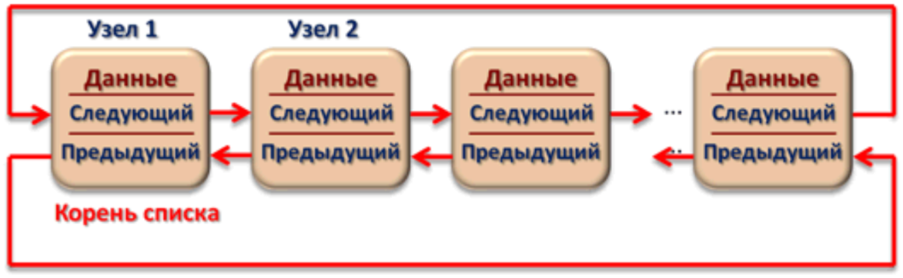

[**Назад**](https://github.com/BurdichxD4r/Cpp_Lessons/tree/master#course-ccqt)
# Списки, Деревья, Стек, Очередь
## Связанные Списки
Динамическая структура данных, состоящая из узлов, каждый из них содержит как данные, так и 1 или 2 ссылки («связки») на след. и/или пред. узел списка.

Преимуществом перед массивом является структурная гибкость: порядок элементов связного списка может не совпадать с порядком расположения элементов данных в памяти компьютера, а порядок  обхода списка всегда явно задаётся его внутренними связями.


## Линейный однонаправленный список
Структура данных, состоящая из элементов одного типа, связанных между собой последовательно посредством указателей. Каждый эл-т списка имеет указатель на след. эл-т. Последний на **NULL**. Элемент, на который нет указателя, является первым. Это корень списка или **HEAD**.

Здесь ссылка в каждом узле указывает на следующий узел. В односвязном списке можно передвигаться только в сторону конца списка. Узнать адрес предыдущего элемента, опираясь на содержимое текущего узла, невозможно.
```c
struct List {
    char * data;
    struct List * next;
};
```


## Линейный циклический список
Каждый узел ОЦС содержит 1 поле указателя на следующий узел. Поле указателя последнего узла содержит адрес первого узла (корня списка).


## Двусвязный(двунаправленный)список
Здесь ссылки в каждом узле указывают на пред. и на след. узел в списке.

Как и односвязный список, двусвязный допускает только последовательный доступ к эл-там, но при этом дает возможность перемещения в обе стороны. В таком списке проще производить удаление и перестановку эл-тов, т.к. легко доступны адреса тех эл-тов списка, указатели которых направлены на изменяемый эл-т.




## Преимущество и недостатки списков
- **+** операции вставки и удаления быстрые. О(1). Независимо от текущего эл-та спуска и его емкости, для вставки или удаления эл-та всегда требуется одно и то же время
- **-** списки требуют большего объема памяти
- **-** получение доступа к их эл-там принадлежит к классу О(n). В этом случае важно кол-во эл-тов в списке: при поиске n-ного элемента мы начинаем с некоторой позиции в списке и переходим по ссылкам вплоть до искомого эл-та. Чем больше эл-тов в списке, тем больше переходов придется совершить.

## Сравнение списков с массивами
|Массив|Список|
|:-:|:-:|
|Выделение памяти осуществляется единовременно под весь массив до начала его использования|**Выделение памяти может быть увеличена или уменьшена во время выполнения**|
|При удалении/добавлении элемента требуется копирование всех последующих элементов для осуществления их сдвига|**Удаление/добавление элемента осуществляется переустановкой указателей, при этом сами данные не копируются**|
|**Для хранения элемента требуется объем памяти, необходимый только для хранения данных этого элемента**|Для хранения элемента требуется объем памяти, достаточный для хранения данных этого элемента и указателей (1 или 2) на другие элементы списка|
|**Доступ к элементам может осуществляться в произвольном порядке**|Возможен только последовательный доступ к элементам|


## Дерево
- Дерево – нелинейная структура данных, представляющая собой древовидную структуру в виде набора связанных узлов.
- Преимущество деревьев в том, что, несмотря на относительную сложность их формирования, все операции с ними являются очень простыми. Так, например, операции вставки, удаления и поиска элементов в дереве выполняются в тысячи, а то и десятки тысяч раз быстрее чем аналогичные операции с неупорядоченным массивом.


## Двоичное дерево
- Иерархическая структура данных, в которой каждый узел имеет не более 2 потомков (детей).
- Как правило, 1-ый называется родительским узлом, а дети называются левым и правым наследниками. Двоичное дерево не является упорядоченным ориентированным деревом.
```c
struct Node {
    char *data;
    struct Node *left, *right;
};
Typedef Node *PNode;
```

## Куча
- Дерево, удовлетворяющее свойство: если B является узлом-потомком узла A, то ключ(A) ≥ ключ(B). Из этого следует, что элемент с наибольшим ключом всегда является корневым узлом кучи.
- Не существует никаких ограничений относительно того, сколько узлов- потомков имеет каждый узел кучи, хотя на практике обычно не более 2.

## Стек (Stack)
Структура данных, представляющая из себя упорядоченный набор элементов, в которой добавление новых элементов и удаление существующих производится с одного конца, называемого вершиной стека по принципу LIFO (англ. last in — first out, «последним пришёл — первым вышел»).


## Стек. Реализация
Обычно стек можно реализовать в виде массива эл-тов.
```c
const MAXSIZE = 10;

typedef struct {
    char data[MAXSIZE];
    int sz;
}Stack;
```
## Операции со стеком
Возможны 3 операции со стеком:
- добавление эл-та (проталкивание, **push()**)
- удаление эл-та (**pop()**)
- чтение головного эл-та (**peek()**)
## Стек.push()
При проталкивании (**push**) добавляется новый эл-т, указывающий на эл-т, бывший до этого головой. Новый эл-т теперь становится головным.
```c
int push(Stack * S, char x){
    if (S -> sz == MAXSIZE){
        printf("Error: stack overflow!\n");
        return 1; // error
    }
    S -> data[S -> sz] = x; // add new element
    S -> sz++;
    return 0; // ok
}
```
## Стек.pop()
При удалении элемента (**pop**) убирается первый, а головным становится тот, на который был указатель у этого объекта (след. эл-т). При этом значение убранного эл-та возвращается.
```c
char pop (Stack * S){
    if (S -> sz == 0){
        exit(STACK_UNDERFLOW); // stack is empty
    }
    S -> sz--;
    return S -> data[S -> sz];
}
```
```c
int isEmpty(Stack * S){
    return (S -> sz == 0);
}
```
## Стек.peek()
Чтение верхнего эл-та стека (**peek**), просто читаем, что есть внутри, но не убираем эл-т.
```c
char peek(const Stack * S){
    if (S -> sz <= 0) {
        exit(STACK_UNDERFLOW);
    }
    return S -> data[S -> sz - 1];
}
```
## Стек. Использование
```c
int main(){
    Stack stack;
    stack.sz = 0;

    push(&stack, 3);
    push(&stack, 7);
    pop(&stack);
    pop(&stack);
    return 0;
}
```
## Очередь (Queue)
Структура данных типа «список», позволяющая добавлять эл-ты только в конец списка, и извлекать их из его начала. Функционирует по принципу FIFO (First In, First Out — «первым пришёл — первым вышел), для которого характерно, что все эл-ты 1, 2, ..., n, добавленные раньше эл-та n+1, будут удалены прежде, чем будет удален эл-т n+1. Очередь может быть определена как частный случай односвязного списка, который обслуживает эл-ты в порядке их поступления.


# Практика
## Списки
- Требуется создать список из элементов последовательности целых чисел, вводимых пользователем. Также требуется написать функцию удаления всех элементов списка, имеющих некоторое значение x.
## Пояснение
p -> next имеет значение NULL, так как указатель p расположен в конце списка. Указатель tmp ссылается на только что созданный узел, который мы хотим добавить в конец списка. Следовательно, нужно сделать так, чтобы последний элемент текущего списка ссылался на добавляемый узел (а не на NULL). Именно для этого используется строчка p -> next = tmp.
## Код целиком
```c
/* TODO: Требуется создать список из элементов последовательности
	целых чисел, вводимых пользователем. Также требуется написать
	функцию удаления всех элементов списка, имеющих некоторое
	значение x.
*/

#include <stdio.h>
#include <stdlib.h>
#define True 1

/*  int value — хранимое значение, может быть любого типа.
    struct Node * next — указатель на следующий узел списка.
    List — название структуры.
*/
typedef struct Node{
    int value;
    struct Node * next;
} List;

List * create(int data){
    // Выделение памяти под корень списка
    List * tmp = (List *)malloc(sizeof(List));
    // Присваивание значения узлу
    tmp -> value = data;
    // Присваивание указателю на следующий элемент значения NULL
    tmp -> next = NULL;
    return tmp;
}

/* Добавление нового элемента со значением x в
конец списка, то есть после элемента, на который
указывает указатель last.
*/
void add_element_end(int data, List * head){
    // Выделение памяти под корень списка
    List * tmp = (List *)malloc(sizeof(List));
    // Присваивание значения узлу
    tmp -> value = data;
    // Присваивание указателю на следующий элемент значения NULL
    tmp -> next = NULL;
    // Присваивание новому указателю указателя head.
    // Присваивание выполняется для того, чтобы не потерять указатель на «голову» списка
    List * p = head;
    // Сдвиг указателя p в самый конец первоначального списка
    while (p -> next != NULL){
        p = p -> next;
    }
    // Присваивание указателю p -> next значения указателя tmp (созданный новый узел)
    p -> next = tmp;
}

List * add_element_n_position(int data, int n, List * head){
    // Присваивание новому указателю указателя head.
    // Присваивание выполняется для того, чтобы не потерять указатель на «голову» списка
    List * p = head;
    // Счетчик
    int count = 1;
    // Поиск позиции n
    while (count < n - 1 && p -> next != NULL){
        p = p -> next;
        count++;
    }
    // Выделение памяти под узел списка
    List * tmp = (List *)malloc(sizeof(List));
    // Присваивание значения узлу
    tmp -> value = data;
    // Присваивание указателю tmp -> next значения указателя p -> next (созданный новый узел)
    tmp -> next = p -> next;
    // Присваивание указателю p -> next значения указателя tmp (созданный новый узел)
    p -> next = tmp;
    return head;
}

void print(List * tmp){
    while (tmp != NULL){
        // Вывод значения узла
        printf("%d ", tmp -> value);
        // Сдвиг указателя к следующему узлу
        tmp = tmp -> next;
    }
    printf("\n");
}

List * remove_element(int x, List * head){
    // Присваивание новому указателю tmp указателя head, p - NULL
    List * tmp = head, * p = NULL;
    // Проверка списка на пустоту
    if (head == NULL) return NULL;
    // Если список не пуст, поиск указателя на искомый элемент
    while (tmp && tmp -> value != x){
        p = tmp;
        tmp = tmp -> next;
    }
    // Если удаляемый элемент первый
    if (tmp == head){
        head = tmp -> next;
        free(tmp);
        return head;
    }
    // Если в списке нет искомого элемента, то возвращаем первоначальный список
    if (!tmp) return head;
    // Присваивание новому указателю указателя tmp
    p -> next = tmp -> next;
    // Освобождение памяти для указателя tmp
    free(tmp);
    return head;
}

List * remove_all(List * head){
    // Сдвиг указателя head в самый конец первоначального списка
    while (head != NULL){
        // Присваивание новому указателю указателя head
        List * p = head;
        head = head -> next;
        // Освобождение памяти для указателя p
        free(p);
    }
    return NULL;
}

int main(){
    // заглавный и последний элементы списка
    List * head;
    int a;
    printf("a = ");
    scanf("%d", &a);
    // формируем список
    head = create(a);
    while (True){
        printf("a = ");
        scanf("%d", &a);
        if (a != 0)
            add_element_end(a, head); // добавляем к списку очередной элемент
        else
            break;
    }
    print(head); // печатаем список
    printf("Delete x = ");
    scanf("%d", &a);
    // удаляем все элементы списка, имеющие значение a
    head = remove_element(a, head);
    print(head); // печатаем новый список
    head = remove_all(head); // удаляем весь список
    return 0;
}
```