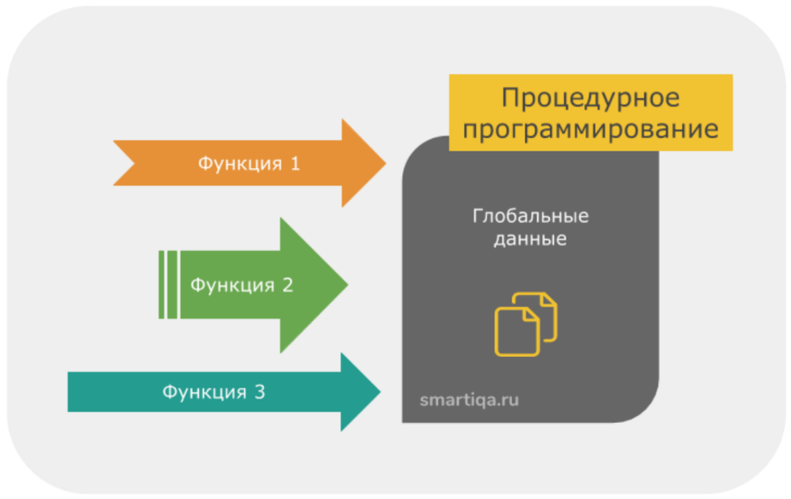
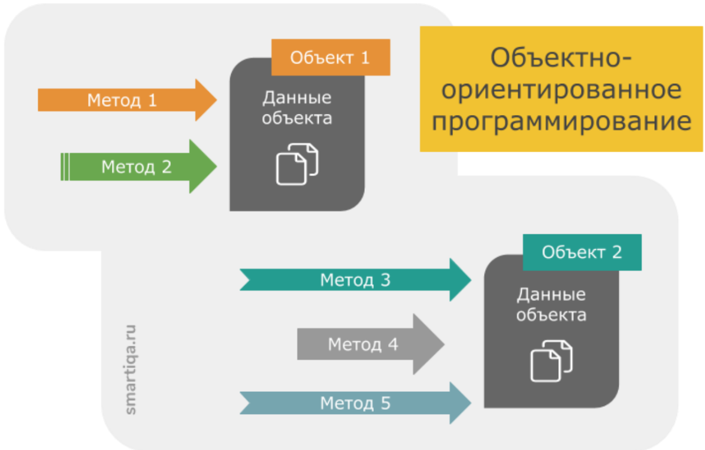
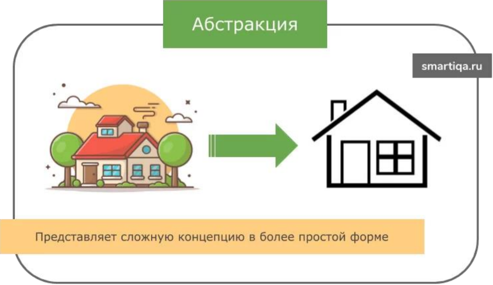
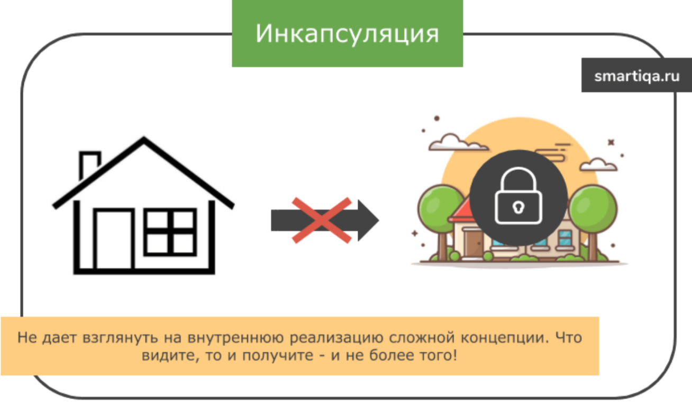
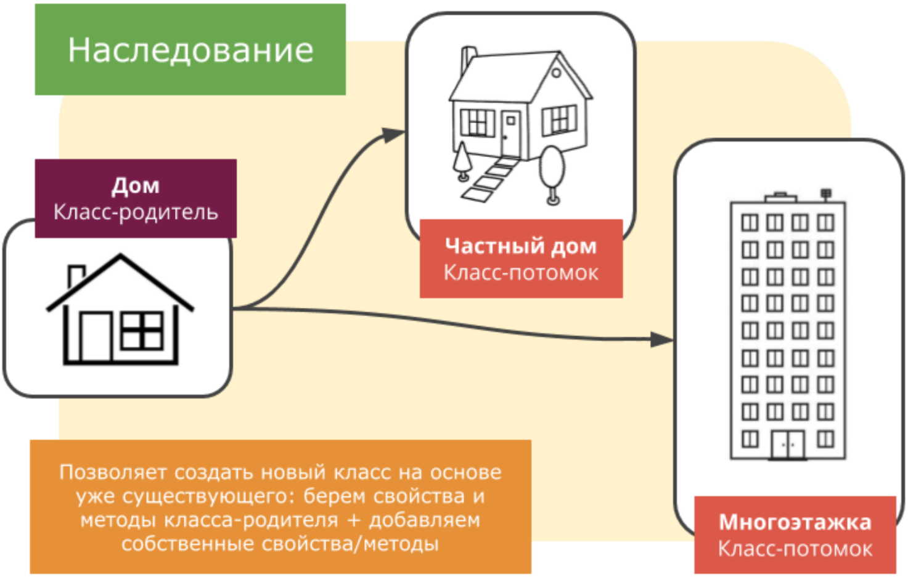
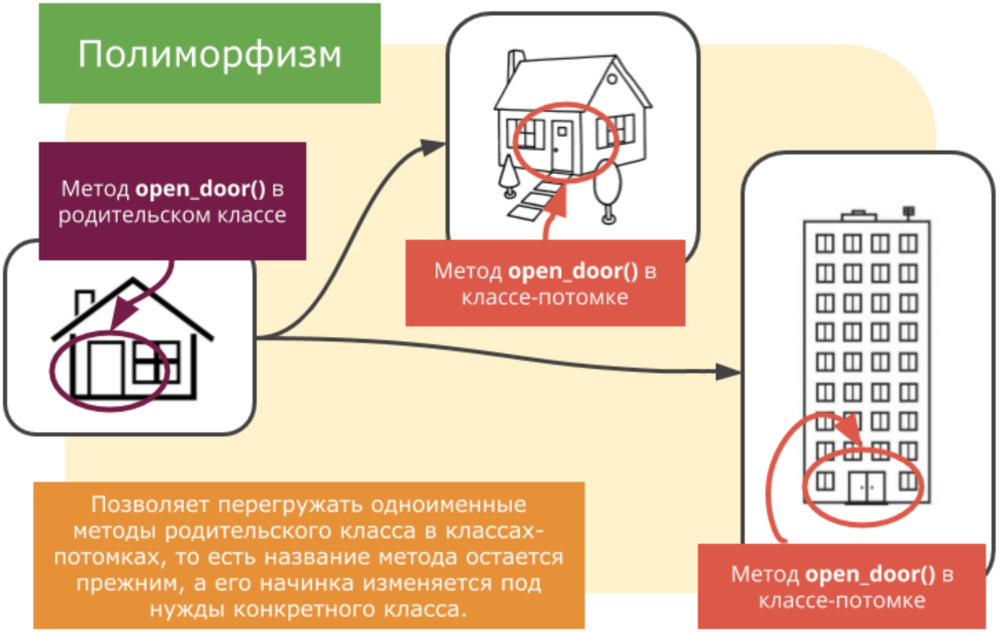
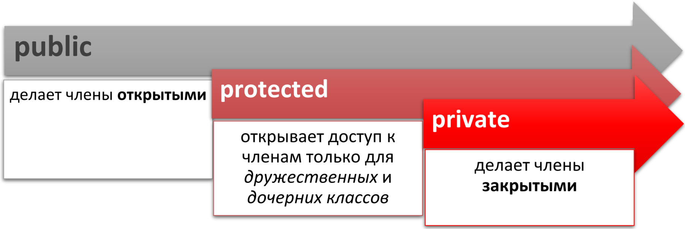
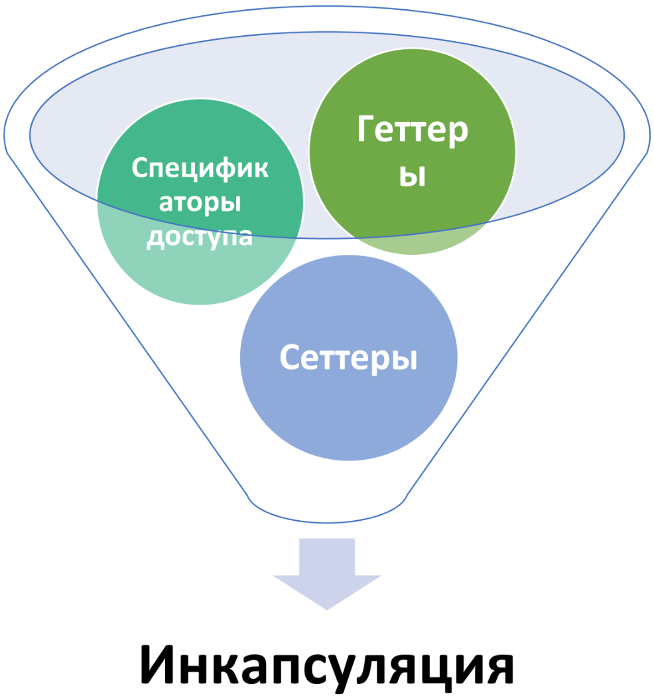

[**Назад**](https://github.com/BurdichxD4r/Cpp_Lessons/tree/master#course-ccqt)
# Принципы ООП. Классы. Объекты.
## Традиционное программирование vs ООП


|||
|:-:|:-:|
|Традиционное программирование часто не позволяет использовать интуитивное представление реальности. Это является делом программиста — управлять и соединять свойства (переменные) с поведением (функциями) соответствующим образом|ООП даёт возможность создавать объекты, которые объединяют свойства и поведение в самостоятельный союз, который затем можно использовать многократно.|
```
ООП не заменяет традиционные методы программирования. ООП — это дополнительный инструмент управления сложностью.
```
По сути любая программа представляет собой совокупность данных и операций по их обработке. Но что важнее, сами данные или операции над ними? В языках, в основе работы которых лежит принцип процедурного программирования (Basic, C, Pascal, Go), главным является код для  обработки данных. При этом сами данные имеют второстепенное значение.

В основе ООП лежит простая и элегантная идея, в соответствии с которой главное в программе - это данные. Именно они определяют, какие методы будут использоваться для их обработки. Т. е. данные первичны, код для обработки этих данных - вторичен.



- В процедурном подходе основой программы является функция. Функции вызывают друг друга и при необходимости передают данные. В программе функции живут отдельно, данные — отдельно.
- Основной недостаток процедурного подхода - сложность создания и поддержки больших программ. Наличие сотен функций в таких проектах очень часто приводит к ошибкам и спагетти-коду.
- В основе объектно-ориентированного программирования лежит понятие объекта. Объект совмещает в себе и функции и данные.
- Основное преимущество ООП перед процедурным программированием - изоляция кода на уровне классов, что позволяет писать более простой и лаконичный код.
## Принципы ООП
- **Абстракция** – процесс выделения общих характеристик и функциональностей системы, игнорируя детали реализации. Основной является идея представить объект минимальным набором полей и методов при этом с достаточной точностью для решаемой задачи.
- **Инкапсуляция** – сокрытие внутренней реализации объекта от внешнего мира. Внешний мир может взаимодействовать с объектом класса только через определенные интерфейсы, не имея прямого доступа к его внутренним данным.
- **Наследование** в ООП – концепция, согласно которой одни классы, называемые родительскими, могут лежать в основе других – дочерних. При этом дочерние классы перенимают свойства и поведение своего родителя.
- **Полиморфизм** – (многообразие), понятие, которое позволяет разным сущностям выполнять одни и те же действия вне зависимости от их внутреннего устройства.
## Абстракция
Абстракция - принцип ООП, согласно которому объект характеризуется свойствами, которые отличают его от всех остальных объектов и при этом четко определяют его концептуальные границы.


Абстракция позволяет:
- Выделить главные и наиболее значимые свойства предмета.
- Отбросить второстепенные характеристики.



Зачем нужна абстракция? Если мыслить масштабно - то она позволяет бороться со сложностью реального мира. Мы отбрасываем все лишнее, чтобы оно нам не мешало, и концентрируемся только на важных чертах объекта.
## Инкапсуляция
Инкапсуляция - принцип ООП, согласно которому сложность реализации программного компонента должна быть спрятана за его интерфейсом.

На что обратить внимание?
- Отсутствует доступ к внутреннему устройству программного компонента.
- Взаимодействие компонента с внешним миром осуществляется посредством интерфейса, который включает публичные методы и поля.



Как в данном случае будет работать инкапсуляция? Она будет позволять нам смотреть на дом, но при этом не даст подойти слишком близко. Например, мы будем знать, что в доме есть дверь, что она коричневого цвета, что она открыта или закрыта. Но каким способом и из какого материала она сделана, инкапсуляция нам узнать не позволит.

**Для чего нужна инкапсуляция?**
1. Инкапсуляция упрощает процесс разработки, т. к. позволяет нам не вникать в тонкости реализации того или иного объекта.
2. Повышается надежность программ за счет того, что при внесении изменений в один из компонентов, остальные части программы остаются неизменными.
3. Становится более легким обмен компонентами между программами.
## Наследование
Наследование - способ создания нового класса на основе уже существующего, при котором класс-потомок заимствует свойства и методы родительского класса и также добавляет собственные.

На что обратить внимание?
- Класс-потомок = Свойства и методы родителя + Собственные свойства и методы.
- Класс-потомок автоматически наследует от родительского класса все поля и методы.
- Класс-потомок может дополняться новыми свойствами.
- Класс-потомок может дополняться новыми методами, а также заменять(переопределять) унаследованные методы. Переопределить родительский метод - это как? Это значит, внутри класса потомка есть метод, который совпадает по названию с методом родительского класса, но функционал у него новый - соответствующий потребностям класса-потомка.



**Для чего нужно наследование?**
- Дает возможность использовать код повторно. Классы-потомки берут общий функционал у родительского класса.
- Способствует быстрой разработке нового ПО на основе уже существующих открытых классов.
- Наследование позволяет делать процесс написания кода более простым.
## Полиморфизм
Полиморфизм - это поддержка нескольких реализаций на основе общего интерфейса. Другими словами, полиморфизм позволяет перегружать одноименные методы родительского класса в классах-потомках.



Как итог - за одинаковым названием могут скрываться методы с совершенно разным функционалом, который в каждом конкретном случае соответствует нуждам класса, к которому он относится.
## Основные понятия ООП
**Объект** — это экземпляр класса, или его копия, которая находится в памяти ПК (переменная типа class)

Объект состоит из следующих трех частей:
- имя объекта;
- состояние (переменные состояния - поля класса);
- методы (операции).

В объектно-ориентированном программировании типы данных могут содержать не только данные, но и функции, которые будут работать с этими данными. Для определения такого типа данных в языке C++ используется ключевое слово `class`. В С++ классом называются типы объявленные с помощью `class`, `struct`.

Функции, определенные внутри класса, называются **методами**. Все вызовы методов должны быть связаны с объектом класса.

Члены класса, определенного с помощью ключевого слова `class`, по умолчанию являются `private`. Члены класса, определенного с помощью ключевого слова `struct`, по умолчанию являются `public`.

При наследовании в отсутствии спецификатора доступа (т.е. `private/protected/public`) у базового класса, базовый класс будет `public` если класс определен с помощью `struct` и `private` если класс определен с помощью `class`.
## Спецификаторы доступа
Открытые члены классов составляют **открытый** (или «**public**») **интерфейс**. Поскольку доступ к открытым членам класса может осуществляться извне класса, то открытый интерфейс и определяет, как программы, использующие класс, будут взаимодействовать с этим же классом.



**Спецификатор доступа** определяет, кто имеет доступ к членам этого спецификатора. Каждый из членов «приобретает» уровень доступа в соответствии со спецификатором доступа (или, если он не указан, в соответствии со спецификатором доступа по умолчанию).

**Контроль доступа работает на основе класса**, а не на основе объекта. То есть, когда метод имеет доступ к закрытым членам класса, он может обращаться к закрытым членам любого объекта этого класса.
## Инкапсуляция, Функции доступа
Функция доступа — это короткая открытая функция, задачей которой является получение или изменение значения закрытой переменной-члена класса.

Функции доступа обычно бывают двух типов:
- **геттеры** — это функции, которые возвращают значения закрытых переменных-членов класса;
- **сеттеры** — это функции, которые позволяют присваивать значения закрытым переменным-членам класса.

В языке C++ инкапсуляция реализована через **спецификаторы доступа**:
- Инкапсулированные классы проще в использовании и уменьшают сложность ваших программ;
- Инкапсулированные классы помогают защитить ваши данные и предотвращают их неправильное использование.
- Инкапсулированные классы легче изменить.



*Предоставляйте функции доступа только в том случае, когда нужно, чтобы пользователь имел возможность получать или присваивать значения членам класса.*

*Геттеры должны использовать тип возврата по значению или по константной ссылке. Не используйте для геттеров тип возврата по неконстантной ссылке.*
# Практика
## Классы, объекты в С++
Выяснить как реагирует программа на замену:
`struct -> class`
```cpp
#include <iostream>
struct DataClass{
    int day;
    int month;
    int year;
};

void print(DataClass &data){
    std::cout << data.day << "/" << data.month << "/" << data.year << std::endl;
}

int main(){
    DataClass today = {12, 11, 2018}; // используем uniform-инициализацию
    today.day = 18; // используем оператор выбора члена для выбора члена структуры
    print(today);
    return 0;
}
```
## Функции доступа
```cpp
#include <iostream>

class Values{
private:
    int m_number;
public:
    void setNumber(int number){
        m_number = number;
    }

    int getNumber(){return m_number;}
};

int main(){
    Values value;
    value.setNumber(7);
    std::cout << value.getNumber() << std::endl;
    return 0;
}
```
# Домашняя работа #10
- Создайте класс с именем Student, содержащую поля: фамилия и инициалы, номер группы, успеваемость (массив из пяти элементов).
- Класс Покупатель: Фамилия, Имя, Отчество, Адрес, Номер кредитной карточки, Номер банковского счета;