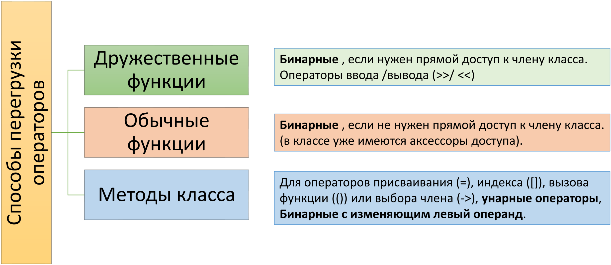
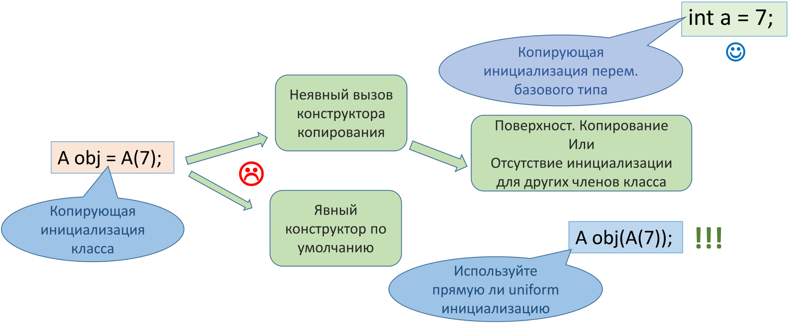

[**Назад**](https://github.com/BurdichxD4r/Cpp_Lessons/tree/master#course-ccqt)
# Перегрузка операторов в С++.
## Операторы, как функции
В языке C++ операторы реализованы в *виде функций*. Используя перегрузку функции оператора, вы можете определить свои собственные версии операторов, которые будут работать с разными типами данных (включая **классы**). Использование перегрузки функции для перегрузки оператора называется **перегрузкой оператора**.

```cpp
int a = 5;                      double m = 4.0;
int b = 6;                      double p = 5.0;
std::cout << a + b << '\n';     std::cout << m + p << '\n';
/*
operator+(a, b)                 operator+(m, p)
(int версия)                    (double версия)
*/
```
Если все операнды **фундаментальных типов** данных, то вызываются встроенные соответствующие версии операторов (!если таковые существуют). Если таковых не существует, то компилятор выдаст ошибку.
## Операторы для пользовательских типов
```cpp
MyString hello = "Hello, ";
MyString world = "World!";
std::cout << hello + world << '\n';
/*
operator+(hello, world)
(? версия)
*/
```
- Если какой-либо из операндов - пользовательского типа данных , то компилятор будет искать версию оператора, которая работает с таким типом данных.
- Если компилятор не найдет ничего подходящего, то попытается выполнить конвертацию одного или нескольких операндов пользовательского типа данных в фундаментальные типы данных, чтобы использовать соответствующий встроенный оператор.
- Если это не сработает — компилятор выдаст ошибку.

При перегрузке операторов старайтесь максимально приближенно сохранять функционал операторов в соответствии с их первоначальными применениями.

**Нельзя перегружать в С++**:
- тернарный оператор **(?:)**;
- оператор **sizeof**;
- оператор разрешения области видимости **(::)**;
- операторы выбора члена **.** и __.*__.
```
```
- вы можете перегрузить только существующие операторы;
- по крайней мере один из операндов перегруженного оператора должен быть пользовательского типа данных;
- изначальное количество операндов, поддерживаемых оператором, изменить невозможно;
- все операторы сохраняют свой приоритет и ассоциативность по умолчанию
## Способы перегрузки операторов



При перегрузке бинарных операторов для работы с операндами разных типов, нужно писать две функции — по одной на каждый случай. (int, MyClass) и (MyClass, int)
## Перегрузка через дружественные функции
```cpp
class A{
    int m_a;
public:
    A(int a) {m_a = a;}
    // прототип
    friend A operator+(const A & a1, const A & a2);
};

// реализация
A operator+(const A & a1, const A & a2){
    return A(a1.m_a + a2.m_a);
}

int main(){
    A obj1(7);
    A obj2(3);
    A sum = obj1 + obj2;
    return 0;
}
```
## Перегрузка через обычные функции
```cpp
class A{
    int m_a;
public:
    A(int a) {m_a = a;}
    int getA() const {return m_a}; // геттер
};

// реализация
A operator+(const A & a1, const A & a2){
    return A(a1.getA() + a2.getA());
}

int main(){
    A obj1(7);
    A obj2(3);
    A a_sum = obj1 + obj2;
    return 0;
}
```
## Перегрузка через методы класса
```cpp
class A{
    int m_a, m_b;
public: //констр. по умолчанию
    A(int a = 0, int b = 1): m_a(a), m_b(b){}

// констр. копирования

    A(const A & copy): m_a(copy.m_a), m_b(copy.m_b){}
    A& operator= (const A & objA){
        m_a = objA.m_a;
        m_b = objA.m_b;
        return * this; // Возвращаем текущий объект
    }
};

int main(){
    A obj1(1,7); // К. по умолч.
    A obj2;
    obj2 = obj1; // опер. присв.
    return 0;
}
```
## Копирующая инициализация



**Конструктор копирования должен быть задан явно**. В нем должно быть описано: инициализация всех членов класса, выделение дин. памяти как под указатели так и под динамические переменные т.е. Описано “глубокое” копирование. **А так же должен быть перегружен оператор присваивания (=)**.
## Конструктор преобразования
Конструкторы, которые используются в неявных преобразованиях, называются **конструкторами преобразования**.
```cpp
// Конструктор по умолчанию
Drob(int numerator = 0, int denominator = 1) :
m_numerator(numerator), m_denominator(denominator){
    assert(denominator != 0);
}

// Конструктор копирования
Drob(const Drob &copy) :
m_numerator(copy.m_numerator),
m_denominator(copy.m_denominator){
    std::cout << "Copy constructor worked here!\n"; // просто, чтобы показать, что это работает
}
```
Явные конструкторы (с ключевым словом **explicit**) не используются для неявных конвертаций.
```cpp
Drob makeNegative(Drob d){
    d.setNumerator(-d.getNumerator());
    return d;
}

int main(){
    std::cout << makeNegative(7); // передаем целочисленное значение
    return 0;
}
/*
-> Copy constructor worked here!
    -7/1
*/
```
У класса Drob есть конструктор, который может принимать одно целочисленное значение (конструктор по умолчанию), поэтому компилятор выполнит **неявную конвертацию литерала 7** в объект класса **Drob**. Это делается путем выполнения копирующей инициализации параметра **d** функции makeNegative() с помощью конструктора Drob(int, int).
## Поверхностное копирование
**Конструктор копирования** и оператор присваивания, которые C++ предоставляет по умолчанию, используют **поверхностное копирование**. Это означает, что C++ выполняет копирование для каждого члена класса индивидуально. (Если нет членов с дин. выделенной памятью то все в порядке.)

**При поверхностном копировании указателя копируется только адрес указателя — никаких действий по содержимому адреса указателя не предпринимается.**

При выполнении поверхностного копирования, два указателя будут содержать в себе адрес одного и того же участка памяти!

Если объект-копия выходит из области видимости, то вызывается деструктор для этой копии. Он освобождает динамически выделенную память, на которую указывает копия и объект с помощью которого копия была создана! Следовательно, удаляя копию, мы также (случайно) удаляем и данные первоначального объекта. Объект copy затем уничтожается, но первоначальный объект остается указывать на освобожденную память!
## Глубокое копирование
При глубоком копировании память сначала выделяется для копирования адреса, который содержит исходный указатель, а затем для копирования фактического значения.

Таким образом копия находится в отдельной, от исходного значения, памяти и они никак не влияют друг на друга. Для выполнения **глубокого копирования** нам необходимо написать свой собственный **конструктор копирования** и перегрузить **оператора присваивания**.
# Практика
## Перегрузка операторов вывода
```cpp
#include <iostream>

class Point{
    double m_x, m_y;
public:
    Point(double x = 0.0, double y = 0.0):m_x(x), m_y(y){}
    friend std::ostream & operator<<(std::ostream & out, const Point & point);
};

std::ostream & operator<<(std::ostream & out, const Point & point){
    out << "Point(" << point.m_x << ", " << point.m_y << ")\n";
    return out;
}

int main(){
    Point point1(5.5, 6.0);
    std::cout << point1;
    return 0;
}
```
## Перегрузка унарных операторв
```cpp
#include <iostream>

class A{
private:
    int m_a;
public:
    A(int a = 0):m_a(a){}
    int getA() const {return m_a;}
    A operator-()const;
};

A A::operator-() const{
    return A(-m_a);
}

int main(){
    A a1(5);
    std::cout << (-a1).getA() << std::endl;
    return 0;
}
```
## Перегрузка операторов сравнения
```cpp
#include <iostream>

class Car{
private:
    std::string m_comp;
    std::string m_model;
public:
    Car(std::string comp, std::string model):m_comp(comp), m_model(model){}
    friend bool operator==(const Car & car1, const Car & car2);
};

bool operator==(const Car & car1, const Car & car2){
    return (car1.m_comp == car2.m_comp && car1.m_model == car2.m_model);
}

int main(){
    Car car1("FORD", "MUSTANG");
    Car car2 ("KIA", "RIO");
    if (car1 == car2){
        std::cout << "True\n";
    }else{
        std::cout << "False\n";
    }
    return 0;
}
```
## Перегрузка инкремента/декремента
```cpp
#include <iostream>

class N{
private:
    int m_n;
public:
    N(int n):m_n(n){}
    N & operator--();
    N operator++(int);
    void getN(){
        std::cout << m_n << std::endl;
    }
};

N & N::operator--(){
    if (m_n == 0){
        m_n = 8;
    }else{
        --m_n;
    }
    return * this;
}

N N::operator++(int){
    N tmp(m_n);
    ++(*this).m_n;
    return tmp;
}

int main(){
    N n1(3);
    n1.getN();
    --n1;
    n1.getN();
    n1++;
    n1.getN();
    return 0;
}
```
## Перегрузка оператора ()
```cpp
#include <iostream>

class Accumulator{
private:
    int m_counter = 0;
public:
    Accumulator(){}
    int operator()(int i){return (m_counter += i);}
};

int main(){
    Accumulator accum;
    std::cout << accum(30) << std::endl;
    std::cout << accum(40) << std::endl;
    return 0;
}
```
## Перегрузка оператора[]
```cpp
#include <iostream>

class intArray{
private:
    int m_array[10];
public:
    int & operator[](const int index){
        return m_array[index];
    }
};

int main(){
    intArray array;
    array[4] = 5;
    std::cout << array[4] << std::endl;
    return 0;
}
```
# Домашняя работа
- Перегрузка оператора ввода (>>)
- Перегрузка оператора ввода (>)
- Перегрузка инкремента/декремента(++х/х--)
- Перегрузка оператора[] при работе с указателем.
- Перегрузка операций преобразования типов данных
- Перегрузка оператора присваивания (=)
## Источники информации
[**Через VPN**](https://ravesli.com/uroki-cpp/#toc-0)