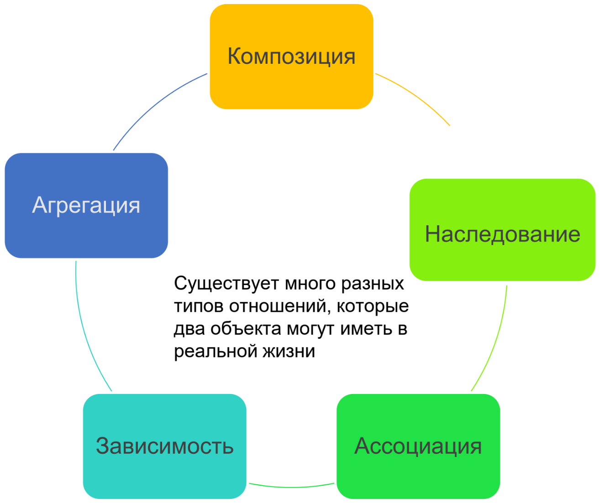
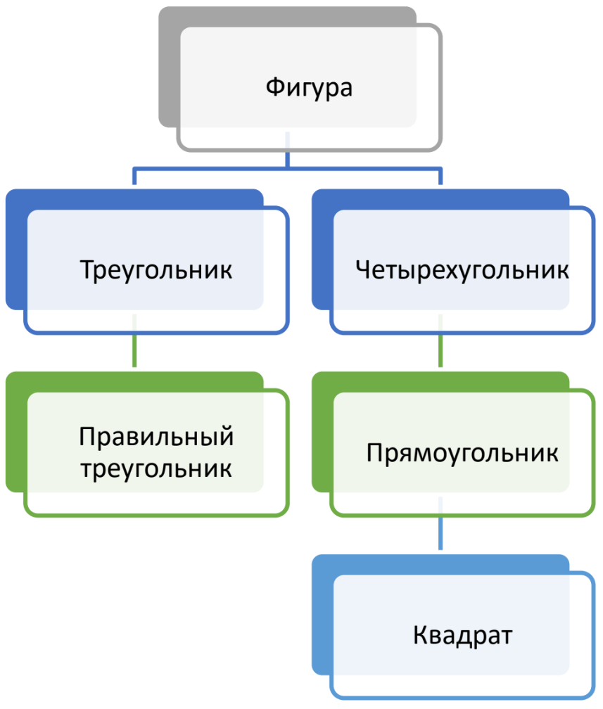
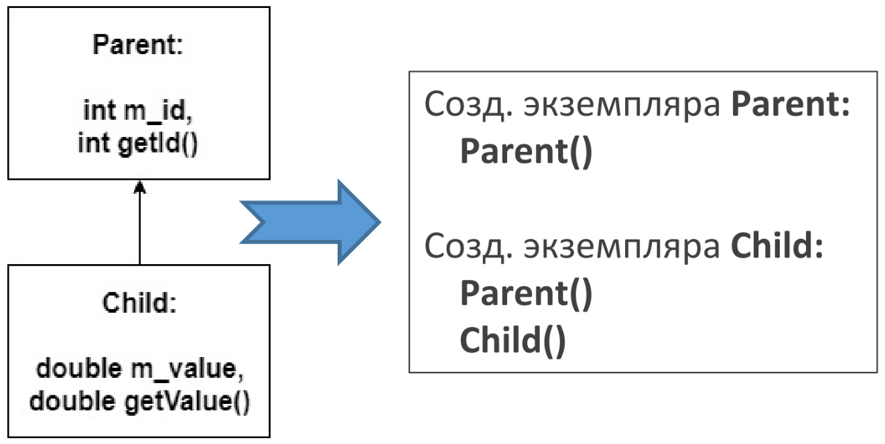
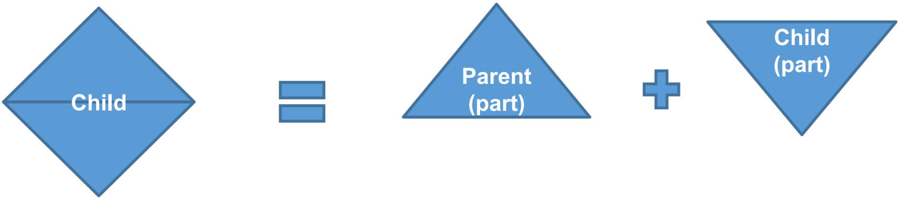
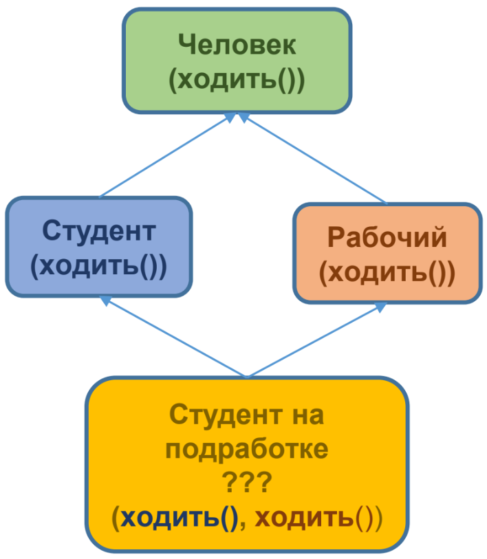

# Наследование в С++
## Типы отношений между объектами
Квадрат «***является***» геометрической фигурой.

Автомобиль «***имеет***» руль.

Программист «***использует***» клавиатуру.

Цветок «***зависит от***» растения.

Ученик является «***членом***» класса.



Наш мозг существует как «***часть***» нас самих.
## Типы отношений подробно
Для реализации **композиции** объект и часть должны иметь следующие отношения:<br>
Часть (член) является частью объекта (класса).<br>
Часть (член) может принадлежать только одному объекту (классу) в моменте.<br>
Часть (член) существует, управляемая объектом (классом).<br>
Часть (член) не знает о существовании объекта (класса).

Для реализации **агрегации** целое и его части должны соответствовать следующим отношениям:<br>
Часть (член) является частью целого (класса).<br>
Часть (член) может принадлежать более чем одному целому (классу) в моменте.<br>
Часть (член) существует, не управляемая целым (классом).<br>
Часть (член) не знает о существовании целого (класса).

В композиции:<br>
**Используются обычные переменные-члены**.<br>
**Используются указатели, если класс реализовывает собственное управление памятью** (происходит динамическое выделение/освобождение памяти).<br>
Класс ответственный за создание/уничтожение своих частей.

В агрегации:<br>
**Используются указатели/ссылки, которые указывают/ссылаются на части вне класса**.<br>
Класс не несет ответственности за создание/уничтожение своих частей.
## Типы отношений подробно
В **ассоциации** два несвязанных объекта должны соответствовать следующим отношениям:<br>
Первый объект (член) не связан со вторым объектом (классом).<br>
Первый объект (член) может принадлежать одновременно сразу нескольким объектам (классам).<br>
Первый объект (член) существует, не управляемый вторым объектом (классом).<br>
Первый объект (член) может знать или не знать о существовании второго объекта (класса).

*Ассоциации чаще всего они реализованы через указатели, где классы указывают на объекты друг друга*.

**Зависимость** возникает, когда один объект обращается к функционалу другого объекта для выполнения определенного задания. Эти отношения слабее отношений в ассоциации, но всё же любое изменение объекта, который предоставляет свой функционал зависимому объекту, может стать причиной сбоя работы зависящего объекта. Зависимость всегда является однонаправленной.

Хорошим примером зависимости, являются отношения классов и `std::cout (типа std::ostream)`. Классы *используют* `std::cout` для вывода чего-либо в консоль.
## Наследование как тип отношений
**Наследование** - моделирует **тип отношения «является»** между двумя объектами. В отличие от композиции объектов, которая включает в себя создание новых объектов путем объединения других объектов, наследование включает в себя создание новых объектов путем непосредственного сохранения свойств и поведения других объектов, а затем их расширения или наоборот — конкретизации.

**Иерархия** — это диаграмма со связями объектов. Большинство иерархий либо демонстрируют прогрессию с течением времени, либо классифицируют вещи таким образом, чтобы они переходили от общего к конкретному.
## Базовое наследование
Наследование в C++ происходит между классами и имеет тип отношений «является». Класс, от которого наследуют, называется родительским (или «*базовым*», «*суперклассом*»), а класс, который наследует, называется дочерним (или «*производным*», «*подклассом*»).

Использование наследования означает, что нам не нужно переопределять информацию из родительских классов в дочерних. Мы автоматически получаем методы и переменные-члены суперкласса через наследование, а затем просто добавляем специфичные методы или переменные-члены, которые хотим.



*Можно наследовать от класса, который сам наследует от другого класса.*
## Порядок построения дочерних классов
Язык C++ выполняет построение дочерних классов поэтапно, начиная с верхнего класса иерархии и заканчивая нижним классом. По мере построения каждого класса для выполнения инициализации вызывается соответствующий конструктор соответствующего класса.

<br>

## Конструкторы и инициализация дочерних классов
При уничтожении дочернего класса, каждый деструктор вызывается в порядке обратном построению классов.

Что происходит при инициализации объекта **parent**:
- выделяется память для объекта **parent**;
- вызывается соответствующий конструктор **класса** **Parent**;
- список инициализации инициализирует переменные;
- выполняется тело конструктора;
- точка выполнения возвращается обратно.

Единственное различие между инициализацией объектов обычного и дочернего класса заключается в том, что при инициализации объекта дочернего класса, сначала выполняется конструктор родительского класса (для инициализации части родительского класса) а потом - конструктор дочернего класса.

Что происходит при инициализации объекта **child**:
- выделяется память для объекта дочернего класса (достаточная порция памяти для части **Parent** и части **Child** объекта класса **Child**);
- вызывается соответствующий конструктор класса **Child**;
- создается объект класса **Parent** с использованием соответствующего конструктора класса **Parent**. Если такой конструктор программистом не предоставлен, то будет использоваться конструктор по умолчанию класса **Parent**;
- список инициализации инициализирует переменные;
- выполняется тело конструктора класса **Child**;
- точка выполнения возвращается обратно.
## Типы наследования
- **public** — публичные (public) и защищенные (protected) данные наследуются без изменения уровня доступа к ним;
- **protected** — все унаследованные данные становятся защищенными;
- **private** — все унаследованные данные становятся приватными.

|Спецификатор доступа|Тип|наследования||
|:-:|:-:|:-:|:-:|
|**для элемента БК**|**public**|**protected**|**private**|
|**public**|public|protected|private|
|**protected**|protected|protected|private|
|**private**|Не доступен|Не доступен|Не доступен|
## Работа над функционалом
Мы можем наследовать функционал родительского класса, а затем добавить свой функционал/ изменить существующий функционал/ скрыть ненужные части родительского функционала.
```cpp
class Parent{
    int m_value;
public:
    Parent(int value):m_value(value){}
    void identify(){
        std::cout << "I am a Parent!\n";
    }
};
```
```cpp
/* Добавим функцию,
которой не было в
родительском классе
*/

class Child: public Parent{
public:
    Child(int value):Parent(value){}
    int getValue(){return m_value;}
};
```
```cpp
/* Переопределим метод
родительского класса
*/

class Child : public Parent{
public:
    Child(int value):Parent(value){}
    int getValue(){return m_value;}
    // Вот наш изменяемый метод родительского класса
    void identify(){std::cout << "I am a Child!\n";}
};
```
```cpp
/* Расширение функционала
родительского класса
*/

class Child : public Parent{
public:
    Child(int value):Parent(value){}
    int GetValue(){return m_value;}
    void identify(){
        Parent::identify(); // сначала выполняется вызов Parent::identify()
        std::cout << "I am a Child!\n";
        // затем уже вывод этого текста
    }
};
```
```cpp
/* Удаление функционала
родительского класса
*/

class Parent{
    int m_value;
public:
    Parent(int value):m_value(value){}
    int getValue(){return m_value;}
};

class Child : public Parent{
public:
    Child(int value):Parent(value){}
    int getValue() = delete; // делаем этот метод недоступным
};

int main(){
    Child child(9);
    // Следующее не сработает, поскольку getValue() удален
    std::cout << child.getValue();
    return 0;
}
```
## Множественное наследование
**Множественное наследование позволяет одному дочернему классу иметь несколько родителей.**

Проблемы с множественным наследованием: может возникнуть неоднозначность, когда несколько родительских классов имеют метод с одним и тем же именем;

«алмаз смерти» (или «алмаз обреченности»). Это ситуация, когда один класс имеет 2 родительских класса, каждый из которых, в свою очередь, наследует свойства одного и того же родительского класса. Иллюстративно мы получаем форму алмаза.



Компилятор не будет знать какую версию **ходить()** ему вызывать.

Возможность возникновения конфликтов имен увеличивается экспоненциально с каждым добавленным родительским классом, и в каждом из таких случаев нужно будет явно указывать версии методов, которые следует вызывать, дабы избежать возможности возникновения конфликтов имен.

Хотя эту проблему можно решить с помощью явного указания класса и метода, поддержка и обслуживание такого кода может привести к непредсказуемым временным затратам.

Используйте множественное наследование только в крайних случаях, когда задачу нельзя решить одиночным наследованием
# Практика
## Базовое наследование
```cpp
#include <string>

class Human{
public:
    std::string m_name;
    int m_age;

    Human(std::string name = "", int age = 0)
    :m_name(name), m_age(age){}
    std::string getName() const{return m_name;}
    int getAge() const
    {return m_age;}
};

class BasketballPlayer : public Human{
public:
    double m_gameAverage;
    int m_points;
    BasketballPlayer(double gameAverage = 0.0, int points = 0)
    :m_gameAverage(gameAverage), m_points(points){}
};
```
## Базовое наследование
```cpp
// Employee открыто наследует Human
class Employee: public Human{
public:
    int m_wage;
    long m_employeeID;
    Employee(int wage = 0, long employeeID = 0)
    :m_wage(wage), m_employeeID(employeeID){}
    void printNameAndWage() const {
        std::cout << m_name << ": " << m_wage << '\n';
    }
};
```
```cpp
class Supervisor: public Employee{
public:
    // Этот Супервайзер может наблюдать максимум за 5-тью Работниками
    long m_nOverseesIDs[5];
    Supervisor(){}
};
```
## Порядок построения дочерних классов
```cpp
class A{
public:
    A(){std::cout << "A\n";}
};

class B: public A{
public:
    B(){std::cout << "B\n";}
};

class C: public B{
public:
    C(){std::cout << "C\n";}
};

class D: public C{
public:
    D(){std::cout << "D\n";}
};

int main(){
    std::cout << "Constructing A: \n";
    A cA;
    std::cout << "Constructing B: \n";
    B cB;
    std::cout << "Constructing C: \n";
    C cC;
    std::cout << "Constructing D: \n";
    D cD;
    return 0;
}
```
## Порядок построения дочерних классов
На основе предыдущего слайда выяснить как будут вызываться деструкторы в цепочке освобождения классов
## Private-наследование
```cpp
class Base{
private:
    int privateBase;
protected:
    int protBase;
public:
    int pubBase;
};

class Derived : private Base{
// унаследованные данные класса
// недоступно:
// int privateBase;
private:
    int protBase;
private:
    int pubBase;
public:
    void updateDerived(){
        // privateBase = 0; //нельзя получить доступ
        // к private данным Base
        protBase = 0;
        pubBase = 0;
    }
};

class Derived1 : public Derived{
public:
    void updateDerived1(){
        // privateBase = 1; //нельзя получить доступ
        // к private данным Base
        // protBase = 1;//protBase недоступно,
        // потому что Derived использовал
        // private при наследовании от Base
        // pubBase = 1; //pubBase недоступно, потому что
        // Derived использовал private
        // при наследовании от Base
    }
};

int main(){
    // При вызове извне, получить доступ не получится ни к чему
    Derived dd;
    // dd.privateBase = 3; недоступно
    // dd.protBase = 3; недоступно
    // dd.pubBase = 3; недоступно
    return 0;
}
```
## Protected-наследование
```cpp
class Base{
private:
    int privateBase;
protected:
    int protBase;
public:
    int pubBase;
};

class Derived : protected Base{
// унаследованные данные класса
// недоступно:
// int privateBase;

// protected:
// int protBase;

// protected:
// int pubBase;
public:
    void updateDerived(){
        // privateBase=0; //нельзя получить доступ к
        // private данным Base

        protBase = 0;
        pubBase = 0;
    }
};

class Derived1 : public Derived{
public:
    void updateDerived1(){
        //privateBase = 1;
        //нельзя получить доступ к
        //private данным Base
        protBase=1; //а тут уже все в порядке,
        //в Derived они стали protected
        pubBase=1; // что значит, что наследник имеет
        //к ним доступ
    }
};

int main(){
    Derived dd;
    // dd.privateBase = 3; недоступно
    // dd.protBase = 3; недоступно
    // dd.pubBase = 3; недоступно
    return 0;
}
```
## Public-наследование
```cpp
class Base{
private:
    int privateBase;
protected:
    int protBase;
public:
    int pubBase;
};

class Derived : public Base{
    //унаследованные данные класса
    //недоступно:
    // int privateBase;

    //protected:
    // int protBase;

    //public:
    // int pubBase;
public:
    void updateDerived(){
        //privateBase = 0; //нельзя получить доступ к
        //private данным Base
        protBase = 0;
        pubBase = 0;
    }
};

class Derived1 : public Derived{
public:
    void updateDerived1(){
        //privateBase = 1; //нельзя получить доступ к
        //private данным Base
        protBase = 1;
        pubBase = 1;
    }
};

int main(){
    Derived dd;
    //dd.privateBase = 3;
    //dd.protBase = 3;
    dd.pubBase = 3; //pubBase остался с уровнем доступа public,
    //к нему теперь можно получить доступ.
    return 0;
}
```
# Домашняя работа #14
Спроектировать структуру классов в соответствии с индивидуальным заданием. Наследование осуществляется по типу **public**. Создать несколько объектов производных классов, задавая случайным образом их свойства. Определить Вычисляемый показатель.
- Недвижимость. Таунхаус, квартира в многоквартирном доме. [Максимальная жилая площадь]
- Часы. Электронные часы, механические часы. [Самый дорогой экземпляр]
- Диета. Для здоровья, для похудения. [Максимальное дневное количество белков]
- Транспортное средство. Легковой автомобиль, грузовой автомобиль. [Максимальный пробег на полном бензобаке]