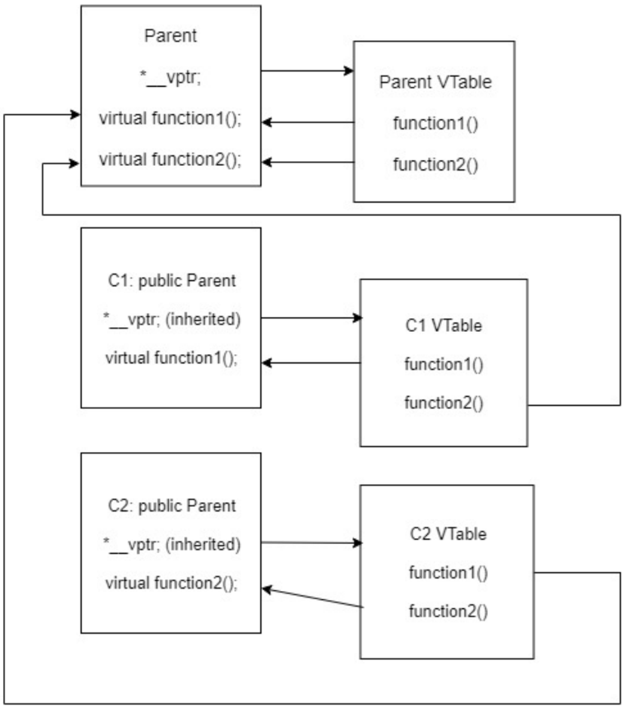
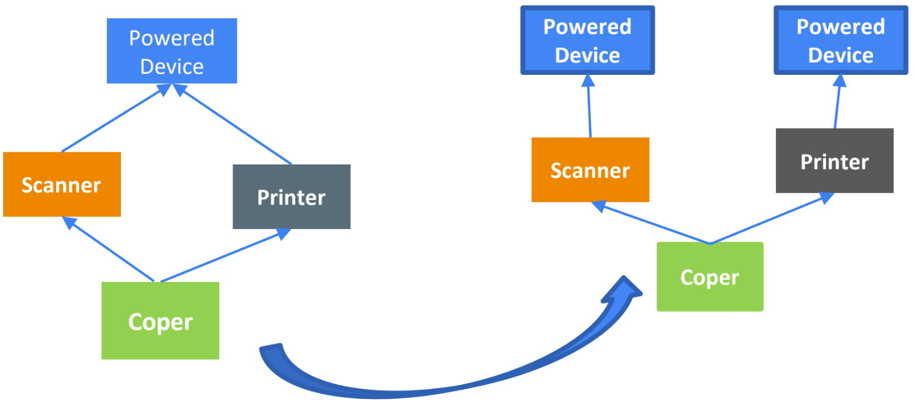

[**Назад**](https://github.com/BurdichxD4r/Cpp_Lessons/tree/master)
# Виртуальные функции и полиморфизм
## Виртуальные методы класса
Чтобы сделать функцию виртуальной, нужно просто указать ключевое слово virtual перед объявлением функции.
```cpp
class Parent{
public:
    virtual const char * getName(){return "Parent";}
    // добавили ключевое слово virtual
};

class Child: public Parent{
public:
    virtual const char * getName(){return "Child";}
};

int main(){
    Child child;
    Parent & rParent = child;
    std::cout << "rParent is a " <<
        rParent.getName() << '\n';
    return 0;
}

// Результат:
// -> rParent is a Child
```
Если функция отмечена как виртуальная, то все её переопределения считаются виртуальными даже если возле них нет слова **virtual**.<br>
Но слово virtual всё же лучше использовать и с дочерними переопределениями.
## Виртуальные методы, Пояснения
**Виртуальная функция в языке С++** — это особый тип функции, которая, при её вызове, выполняет «наиболее» ***дочерний метод***, который существует между родительским и дочерними классами. Это свойство еще известно, как **полиморфизм**.<br>
Дочерний метод вызывается тогда, когда совпадает:
- сигнатура (имя, типы параметров и является ли метод константным),
- тип возврата дочернего метода с сигнатурой и типом возврата метода родительского класса.

Такие методы называются **«переопределенными методами»**.

Обработка и выполнение вызова виртуального метода занимает больше времени, чем обработка и выполнение вызова обычного метода. Кроме того, компилятор также должен выделять один дополнительный указатель для каждого объекта класса, который имеет одну или несколько виртуальных функций.

**Виртуальный метод** (виртуальная функция) — это метод класса, который может быть переопределён в классах-наследниках так, что конкретная реализация метода для вызова будет определяться во время исполнения.

Никогда не вызывайте виртуальные функции в теле конструкторов или деструкторов.

Если вы будете вызывать виртуальную функцию из конструктора класса Parent при том, что дочерняя часть создаваемого объекта еще не была создана, то вызвать дочерний метод вместо родительского будет невозможно, так как объект child для работы с методом класса Child еще не будет создан. В таких случаях, в языке C++ будет вызываться родительская версия метода.<br>
Если вы вызываете виртуальную функцию в теле деструктора класса Parent, то всегда будет вызываться метод класса Parent, так как дочерняя часть объекта уже будет уничтожена.
## Модификаторы override и final
Модификаторы: **override** и **final**. Эти модификаторы не являются ключевыми словами — это обычные модификаторы, которые имеют особое значение в определенных местах использования.

Модификатор **override** может использоваться с любым методом, который должен быть переопределением. Достаточно просто указать **override** в том месте, где обычно указывается **const** (после скобок с параметрами). Если метод не переопределяет виртуальную функцию родительского класса, то компилятор выдаст ошибку!

Если мы хотим запретить наследование определенного класса, то модификатор **final** указывается после имени класса.
## Ковариантный тип возврата
Есть один случай, когда тип возврата переопределения может не совпадать с типом возврата виртуальной функции родительского класса, но при этом оставаться **переопределением**. Если типом возврата виртуальной функции является **указатель** или **ссылка на класс**, то переопределения могут возвращать указатель или ссылку на свой собственный класс (т.е. вместо родительского класса указывать на дочерний класс). Это называется **ковариантным типом возврата**.
```cpp
class Parent{
public:
    // Этот метод getThis() возвращает указатель на класс Parent
    virtual Parent * getThis(){
        std::cout << "called Parent::getThis()\n";
        return this;
    }

    void printType(){
        std::cout << "returned a Parent\n";
    }
};

class Child : public Parent{
public:
    // Обычно, типы возврата переопределений и
    // виртуальных функций родительского класса должны совпадать.
    // Однако, поскольку Child наследует класс Parent,
    // следующий метод может возвращать Child* вместо Parent *
    virtual Child * getThis(){
        std::cout << "called Child::getThis()\n";
        return this;
    }

    void printType(){
        std::cout << "returned a Child\n";
    }
};

int main(){
    Child ch;
    Parent *p = &ch;
    ch.getThis()->printType(); // вызывается Child::getThis(), возвращается Child*, вызывается Child::printType()
    p->getThis()->printType(); // вызывается Child::getThis(), возвращается Parent*, вызывается Parent::printType()
    return 0;
}
// Результат выполнения программы:
// called Child::getThis()
// returned a Child
// called Child::getThis()
// returned a Parent
```
## Виртуальные деструкторы
При работе с наследованием ваши деструкторы всегда должны быть виртуальными.
```cpp
class Parent{
public:
    virtual ~Parent(){ // Деструктор виртуальный
    std::cout << "Calling ~Parent()" << std::endl;
    }
};

class Child: public Parent{
private:
    int * m_array;
public:
    Child(int length){
        m_array = new int[length];
    }
    virtual ~Child(){ // Деструктор виртуальный
        std::cout << "Calling ~Child()" << std::endl;
        delete[] m_array;
    }
};

int main(){
    Child * child = new Child(7);
    Parent * parent = child;
    delete parent;
    return 0;
}
```
parent является указателем класса Parent, то при его уничтожении компилятор будет смотреть, является ли деструктор класса Parent виртуальным. Поскольку это не так, то компилятор вызовет только деструктор класса Parent
```
Результат выполнения программы:
Calling ~Child()
Calling ~Parent()
```
## Игнорирование виртуальных функций
```cpp
class Parent{
public:
    virtual const char * getName(){return "Parent";}
};

class Child: public Parent{
public:
    virtual const char * getName(){return "Child";}
};

/*Чтобы это сделать, нужно просто
использовать оператор разрешения
области видимости (::)*/

int main(){
    Child child;
    Parent & parent = child;
    // Вызов Parent::GetName() вместо переопределения Child::GetName()
    std::cout << parent.Parent::getName() << std::endl;
    return 0;
}
```
## Раннее и Позднее Связывания
**Связывание** — это процесс, который используется для конвертации идентификаторов (таких как имена переменных или функций) в адреса.

Прямые вызовы функций выполняются с помощью **раннего связывания**. Раннее связывание (или «**статическая привязка**») означает, что компилятор (или линкер) может напрямую связать имя идентификатора (например, имя функции или переменной) с машинным адресом.
```cpp
void printValue(int value){
    std::cout << value;
}

int main(){
    printValue(7); // это прямой вызов функции
    return 0;
}
```
В некоторых программах невозможно знать наперёд, какая функция будет вызываться первой. В таком случае используется позднее связывание (или «динамическая привязка»). В языке C++ для выполнения позднего связывания используются указатели на функции.
```cpp
int add(int a, int b){return a + b;}

int subtract(int a, int b){return a - b;}

int main(){
    int (* pFcn)(int, int) = nullptr;
    switch (op){
        case 0: pFcn = add; break;
        case 1: pFcn = subtract; break;
    }
    return 0;
}
```
## Виртуальные таблицы
Для реализации **виртуальных функций** язык C++ использует специальную форму позднего связывания — **виртуальные таблицы**.

Виртуальная таблица в языке С++(**«vtable», «таблицей виртуальныx функций» или «таблицей виртуальных методов»**.) — это таблица поиска функций для выполнения вызовов функций в режиме **позднего (динамического) связывания**.

Вызов виртуальной функции происходит медленнее, чем вызов невиртуальной функции из-за следующего:
- мы должны использовать ***__vptr** для перехода к соответствующей виртуальной таблице.
- мы должны индексировать виртуальную таблицу, чтобы найти правильную функцию для вызова.
- и только теперь мы сможем выполнить вызов функции.

Компилятор также добавляет скрытый указатель на
родительский класс - ***__vptr**. Этот указатель автоматически создается при создании объекта класса и указывает на виртуальную таблицу этого класса. В отличие от скрытого указателя ***this**, который фактически является параметром функции, используемым компилятором для «указания на самого себя», ***__vptr** является реальным указателем. Следовательно, размер каждого объекта увеличивается на размер этого указателя. ***__vptr** также наследуется дочерними классами.

## Визуализация работы виртуальных таблиц



```cpp
class Parent{
public:
    FunctionPointer *__vptr;
    virtual void function1(){};
    virtual void function2(){};
};

class C1: public Parent{
public:
    virtual void function1(){};
};

class C2: public Parent{
public:
    virtual void function2(){};
};
```
## Чисто виртуальные функции, Абстрактные классы
C++ позволяет создавать особый вид виртуальных функций, так называемых **чистых виртуальных функций** (или «**абстрактных функций**»), которые вообще не имеют определения! Переопределяют их дочерние классы. При создании чистой виртуальной функции, вместо определения (написания тела) виртуальной функции, мы просто присваиваем ей значение 0.
```cpp
class Parent {
public:
    const char * sayHi(){return "Hi";}
    // обычная невиртуальная функция
    virtual const char * getName(){return "Parent";}
    // обычная виртуальная функция
    virtual int getValue() = 0;
    // чистая виртуальная функция
    int doSomething() = 0;
    // ошибка компиляции: нельзя присвоить невиртуальным функциям значение 0
};
```
Любой класс с одной и более чистыми виртуальными функциями становится **абстрактным классом**, объекты которого создавать нельзя!

Все дочерние классы **абстрактного родительского класса** должны **переопределять** все чистые виртуальные функции, в противном случае — они также будут считаться **абстрактными классами**.
## Интерфейсы
**Интерфейс** — это класс, который не имеет переменных-членов и все методы которого являются чистыми виртуальными функциями!<br>
Интерфейсы еще называют «**классами-интерфейсами**» или «**интерфейсными классами**».<br>
Интерфейсные классы принято называть с **I** в начале.
```cpp
class IErrorLog{
public:
    virtual bool openLog(const char * filename) = 0;
    virtual bool closeLog() = 0;
    virtual bool writeError(const char * errorMessage) = 0;
    virtual ~IErrorLog() {};
    // создаем виртуальный деструктор, чтобы вызывался
    // соответствующий деструктор дочернего класса в случае, если
    // удалим указатель на IErrorLog
};
```
Любой класс, который наследует **IErrorLog**, должен предоставить свою реализацию всех 3 методов класса **IErrorLog**. Вы можете создать дочерний класс с именем **FileErrorLog**, где *openLog()* открывает файл на диске, *closeLog()* — закрывает файл, а *writeError()* — записывает сообщение в файл.<br>
Вы можете создать еще один дочерний класс с именем **ScreenErrorLog**, где *openLog()* и *closeLog()* ничего не делают, а *writeError()* выводит сообщение во всплывающем окне.
## Виртуальный базовый класс
Чтобы сделать родительский (базовый) класс общим, используется ключевое слово **virtual** в строке объявления дочернего класса. **Виртуальный базовый класс** — это класс, объект которого является общим для использования всеми дочерними классами.



```cpp
class PoweredDevice{};

class Scanner: virtual public PoweredDevice{};

class Printer: virtual public PoweredDevice{};

class Copier: public Scanner, public Printer{};

```
Теперь, при создании класса Copier, мы получим только одну копию PoweredDevice, которая будет общей как для Scanner, так и для Printer.
## Пояснение
- Виртуальные базовые классы всегда создаются перед невиртуальными базовыми классами, что обеспечивает построение всех базовых классов до построения их производных классов.

- Конструкторы Scanner и Printer по-прежнему вызывают конструктор PoweredDevice. При создании объекта Copier эти вызовы конструктора просто игнорируются, так как именно Copier отвечает за создание PoweredDevice, а не Scanner или Printer. Однако, если бы мы создавали объекты Scanner или Printer, то эти конструкторы вызывались бы и применялись обычные правила наследования.

- Если класс, становясь дочерним, наследует один или несколько классов, которые, в свою очередь, имеют виртуальные родительские классы, то наиболее дочерний класс отвечает за создание виртуального родительского класса. В программе, приведенной выше, Copier наследует Printer и Scanner, которые оба имеют общий виртуальный родительский класс PoweredDevice. Copier, наиболее дочерний класс, отвечает за создание PoweredDevice. Это работает даже в случае одиночного наследования: когда Copier наследует только Printer, а Printer виртуально наследует PoweredDevice, то Copier по-прежнему ответственный за создание PoweredDevice.
# Практика
## Виртуальные методы
Мы делаем этот конструктор protected так как не хотим, чтобы пользователи имели возможность создавать объекты класса Animal напрямую, но хотим, чтобы в дочерних классах доступ был открыт.

```cpp
#include <iostream>

class Animal{
protected:
    std::string m_name;
    Animal(std::string name):m_name(name){}
public:
    std::string getName(){return m_name;}
    virtual const char * speak(){return "???";}
};

class Cat: public Animal{
public:
    Cat(std::string name) : Animal(name){}
    virtual const char * speak(){return "Meow";}
};

class Dog: public Animal{
public:
    Dog(std::string name) : Animal(name){}
    virtual const char * speak(){return "Woof";}
};

void report(Animal & animal){
    std::cout << animal.getName() << " says " << animal.speak() << '\n';
}
int main(){
    Cat cat("Matros");
    Dog dog("Barsik");
    report(cat);
    report(dog);
    return 0;
}

// Matros says Meow
// Barsik says Woof
```
## Модификаторы Override и final
```cpp
class A{
public:
    virtual const char * getName1(int x){return "A";}
    virtual const char * getName2(int x){return "A";}
    virtual const char * getName3(int x){return "A";}
};

class B : public A{
public:
    virtual const char * getName1(short int x) override {return "B";}
    // ошибка , метод не является переопределением
    virtual const char * getName2(int x) const override {return "B";}
    // ошибка , метод не является переопределением
    virtual const char * getName3(int x) override {return "B";}
    // всё хорошо, метод является переопределением
    A::getName3(int)
};
```
```cpp
class A{
public:
    virtual const char * getName(){return "A";}
};

/*Запрешаем наследование опред-
ого класса (модификатор final
указ-ся после имени класса.)*/
class B final : public A{ // модификатор final здесь
public:
                            /*что метод
                            переопределить уже
                            нельзя*/
    virtual const char * getName() override final
{return "B";}
};

class C : public B { // ошибка компиляции: нельзя наследовать final-класс
public:
    virtual const char * getName() override {return "C";}
};
```
## Пример чисто виртуальной функции
```cpp
class Animal{ // этот Animal является абстрактным родительским классом
protected:
    std::string m_name;
public:
    Animal(std::string name): m_name(name){}
    std::string getName(){return m_name;}
    virtual const char * speak() = 0;
    // speak() является чистой виртуальной функцией
};

class Lion: public Animal{
public:
    Lion(std::string name): Animal(name){}
    virtual const char * speak(){return "RAWRR!";}
};

int main(){
    Lion lion("John");
    std::cout << lion.getName() << " says " << lion.speak() << '\n';
    return 0;
}

// Что нам говорит лев Джон ?
```
## Чисто виртуальные фун-ии с определением
```cpp
class Animal {// это абстрактный родительский класс
protected:
    std::string m_name;
public:
    Animal(std::string name): m_name(name){}
    std::string getName() {return m_name;}
    virtual const char * speak() = 0;
    // speak() - чисто виртуальной ф.
    // Мы можем определить
    // чисто виртуальные функ.
};

/*При определении чисто
виртуальной функции,
её тело должно быть
записано отдельно.*/
const char* Animal::speak(){
    // реализация по умолчанию
    return "buzz";
}

class Dragonfly: public Animal{
public:
    Dragonfly(std::string name): Animal(name){}
    virtual const char * speak(){
        // этот класс уже не является абстрактным, так как мы
        // переопределили функцию speak()
        return Animal::speak(); // используется 
        // реализация по умолчанию класса Animal
    }
};

int main(){
    Dragonfly dfly("Barbara");
    std::cout << dfly.getName() << " says " << dfly.speak() << '\n';
    return 0;
}

// Что нам говорит стрекоза Барбара?
```
# Домашняя работа # 15
- Объявляется 3 класса с именами A, B, C. Класс A является базовым для класса B. Класс B является базовым для класса C. Классы содержат только один метод, выводящий название класса. С помощью механизма полиморфизма в функцию DemoPolymorphism() передается ссылка на один из экземпляров. В соответствии с переданным экземпляром вызывается требуемый метод.

- Приводится пример 3-х классов CalcLength, CalcArea, CalcVolume, в которых в виртуальной функции Calc() возвращается соответственно длина окружности, площадь круга и объем шара. Для демонстрации создается некоторая функция ShowResult(), в которую передается указатель на базовый класс. Функция вызывает виртуальную функцию Calc() по указателю. В теле функции ShowResult() неизвестно, экземпляр какого класса будет ей передан. Экземпляр будет сформирован во время выполнения.