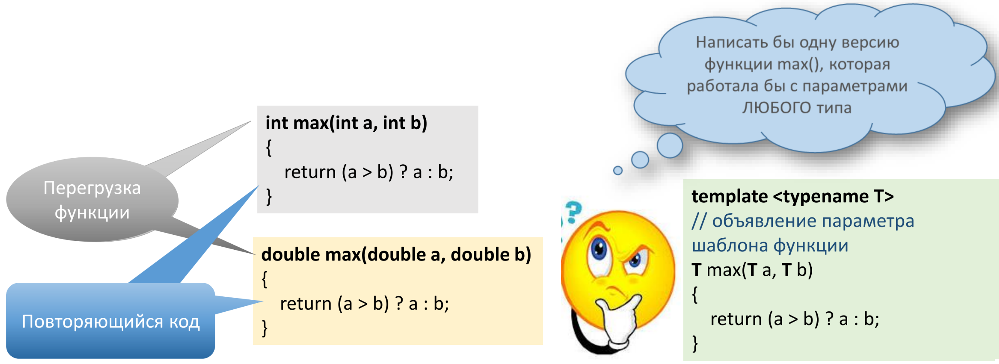

[**Назад**](https://github.com/BurdichxD4r/Cpp_Lessons/tree/master)
# Шаблоны в С++
## Шаблоны функций



**Шаблоны функций в С++** — это функции, которые служат образцом для создания других подобных функций. Главная идея — создание функций без указания точного типа(ов) некоторых или всех переменных.

Нужно сообщить компилятору две вещи:
- Определение шаблона функции.
- Указание того, что T является типом параметра шаблона функции.
```
```
- Ключевое слово **template**, сообщает компилятору, что дальше мы будем объявлять параметры шаблона.
- Параметры шаблона функции указываются в угловых скобках (<>).
- Для создания типов параметров шаблона используются ключевые слова **typename** и **class**.(Взаимозаменяемы)
- Называем тип параметра шаблона (**обычно T**).
```cpp
/*Если требуется
несколько типов
параметров шаблона*/
template <typename T1, typename T2>
// Шаблон функции здесь
```
**Имеется несколько недостатков**:
1) некоторые старые компиляторы могут не поддерживать шаблоны функций или поддерживать, но с ограничениями.
2) шаблоны функций часто выдают сумасшедшие сообщения об ошибках, которые намного сложнее расшифровать.
3) шаблоны функций могут увеличить время компиляции и размер кода, так как один шаблон может быть «реализован» и перекомпилирован в нескольких файлах.
```cpp
template <typename T>
const T & max(const T & a, const T & b){
    return (a > b) ? a : b;
}
```
*Примечание*: Поскольку тип аргумента функции,
передаваемый в тип **T**, может быть классом, а классы, как правило, не рекомендуется передавать по значению, то лучше сделать параметры и возвращаемое значение нашего шаблона функции **константными ссылками**.
## Экземпляры шаблонов функций
Когда компилятор встречает вызов шаблона функции, он копирует шаблон функции и заменяет типы параметров шаблона функции фактическими (передаваемыми) типами данных.

Функция с фактическими типами данных называется **экземпляром шаблона функции**.
```cpp
template <typename T> // объявление пар-ра шаблона ф.
const T & max(const T & a, const T & b){
    return (a > b) ? a : b;
}
```
Если вы создадите шаблон функции, но не вызовете его, **экземпляры этого шаблона созданы не будут**!
```cpp
int i = max(4, 8); // вызывается max(int, int)

/*Компилятор видит, что оба числа являются
целочисленными, поэтому он копирует шаблон функции
и создает экземпляр шаблона max(int, int)*/
```
Любые операторы или вызовы других функций, которые присутствуют в шаблоне функции, должны быть определены/ перегружены для работы с фактическими (передаваемыми) типами данных.
```cpp
const int & max(const int & a, const int & b){
return (a > b) ? a : b;
}
```
## Шаблоны классов
Создание шаблона класса аналогично созданию шаблона функции.
```cpp
// “templates.cpp”:

#include "Array.h"
#include "Array.cpp" // мы нарушаем правила хорошего тона
// в программировании, но только в этом месте

// Здесь вы #include другие файлы .h и .cpp с
// определениями шаблонов, которые вам нужны
template class Array<int>; // явно создаем экземпляр шаблона класса Array<int>
template class Array<double>; // явно создаем экземпляр шаблона класса Array<double>
// Здесь вы явно создаете другие экземпляры шаблонов, которые вам нужны
```
При работе с шаблонами классов следует использовать подход трех файлов:
- Определение шаблона класса хранится в заголовочном файле.(*h)
- Определения методов шаблона класса хранятся в отдельном файле (*.cpp).
- Затем добавляем третий файл, который содержит все необходимые нам экземпляры шаблона класса.

Каждый метод шаблона класса, объявленный вне тела класса, нуждается в собственном объявлении шаблона. Также обратите внимание, что имя шаблона класса — Array<T>, а не Array
```cpp
// Array.cpp

#include "Array.h"
template <typename T>
int Array<T>::getLength(){return m_length;}
```
```cpp
template <class T>
class Array{
private:
    int m_length;
    T * m_data;
public:
    Array(){
        m_length = 0;
        m_data = nullptr;
    }
    Array(int length){
        m_data = new T[length];
        m_length = length;
    }
    ~Array(){
        delete[] m_data;
    }
    void Erase(){
        delete[] m_data;
        // Присваиваем значение nullptr для m_data, чтобы на выходе не получить висячий указатель!
        m_data = nullptr;
        m_length = 0;
    }
    T& operator[](int index){
        assert(index >= 0 && index < m_length);
        return m_data[index];
    }
    // Длина массива всегда является целочисленным значением, она не зависит от типа элементов массива
    int getLength();
};
```
```cpp
// main.cpp

#include "Array.h"

int main(){
    Array<int> intArray(10);
    Array<double> doubleArray(10);

    for (int count = 0; count < intArray.getLength(); ++count){
        intArray[count] = count;
        doubleArray[count] = count + 0.5;
    }

    for (int count = intArray.getLength()-1; count >= 0; --count)
        std::cout << intArray[count] << "\t" <<
        doubleArray[count] << '\n';

    return 0;
}
```
## Параметр non-type в шаблоне
Шаблоны могут иметь еще один параметр, кроме параметра типа **T** известный как параметр **non-type**.

Параметр **non-type** в шаблоне — это специальный параметр шаблона, который заменяется не типом данных, а конкретным значением. Этим значением может быть:
- целочисленное значение или перечисление;
- указатель или ссылка на объект класса;
- указатель или ссылка на функцию;
- указатель или ссылка на метод класса;
- std::nullptr_t.
## Явная специализация шаблонов функций
На данный момент все экземпляры функции имеют одну реализацию, но разные типы данных. Иногда может понадобиться, чтобы реализация шаблона функции для одного типа данных отличалась от реализации шаблона функции для другого типа данных. Для этих целей предназначена **специализация шаблонов**.

*Предположим*, *что с одним из типов*, *шаблон должен работать как то особенно*!
```cpp
// Шаблон класса

template <class T>
class Repository{
private:
    T m_value;
public:
    Repository(T value){
        m_value = value;
    }
    ~Repository(){}
    void print(){
        std::cout << m_value << '\n';
    }
};

/*сообщает компилятору, что это шаблон
функции, но без параметров*/
template <>
    void Repository<double>::print(){
        std::cout << std::scientific << m_value << '\n';
}
// полная/явная специализация шаблона функции

int main(){
    // Инициализируем объекты класса
    Repository<int> nValue(7);
    Repository<double> dValue(8.4);
    // Выводим значения объектов класса
    // Шаблон работает со многими типами данных
    nValue.print();
    dValue.print();

    return 0;
}
```
## Перегрузка шаблонной функции
Шаблонные функции тоже можно перегружать.
```cpp
#include <iostream>
#include <vector>

// общая версия
template <typename T>
T max(const T & x, const T & y){
    if (x > y){
        return x;
    }else{
        return y;
    }
}

// перегрузка для векторов
using namespace std;
template <typename T>
const vector<T> & max(const vector<T> & v1, const vector<T> & v2){
    if (v1.size() > v2.size()){
        return v1;
    }else if(v1.size() < v2.size()){
        return v2;
    }else if(v1 > v2){
        return v1;
    }else{
        return v2;
    }
}

int main(){
    std::cout << max(1, 2) << "\n"; // вызов общей версии

    std::vector<int> v1 = {1, 2, 3};
    std::vector<int> v2 = {4, 5};
    for (int x : max(v1, v2)){ // вызов перегруженной версии
        std::cout << x << " "; // 1 2 3
    }
    std::cout << "\n";

    return 0;
}
```
# Практика
## Шаблоны функций
```cpp
#include <iostream>

template <typename T>
const T & max(const T & a, const T & b){
    return (a > b) ? a : b;
}

int main(){
    int i = max(4, 8);
    std::cout << i << std::endl;

    double d = max(7.56, 21.434);
    std::cout << d << std::endl;

    char ch = max('b', '9');
    std::cout << ch << std::endl;

    return 0;
}

// А как бы выглядел шаблон функции Swap()?
```
## Шаблон для пользовательского типа
```cpp
template <typename T> // объявление параметра шаблона функции
const T & max(const T & a, const T & b){
    return (a > b) ? a : b;
}

class Dollars{
private:
    int m_dollars;
public:
    Dollars(int dollars):m_dollars(dollars){}
    friend bool operator>(const Dollars & d1, const Dollars & d2){
        return (d1.m_dollars > d2.m_dollars);
    }
};

int main(){
    Dollars seven(7);
    Dollars twelve(12);

    Dollars bigger = max(seven, twelve);

    return 0;
}
```
## Параметр non-type в шаблоне
```cpp
template <class T, int size> // size является параметром non- type в шаблоне класса

class StaticArray{
private:
    // Параметр non-type в шаблоне класса отвечает за размер выделяемого массива
    T m_array[size];
    public:
    T * getArray();
    T & operator[](int index){
        return m_array[index];
    }
};

// Синтаксис определения шаблона метода и самого метода вне тела класса с параметром non-type
template <class T, int size>
T * StaticArray<T, size>::getArray(){
    return m_array;
}

int main(){
    // Объявляем целочисленный массив из 10 элементов
    StaticArray<int, 10> intArray;
    // Заполняем массив значениями
    for (int count=0; count < 10; ++count){
        intArray[count] = count;
    }
    // Выводим элементы массива в обратном порядке
    for (int count=9; count >= 0; --count){
        std::cout << intArray[count] << " ";
        std::cout << '\n';
    }
    return 0;
}

// Результат выполнения программы:
// 9 8 7 6 5 4 3 2 1 0
// 5.5 5.6 5.7 5.8 5.9
```
## Явная специализация шаблонов класса
```cpp
template <class T>
class Repository8{
private:
    T m_array[8];
public:
    void set(int index, const T & value){
        m_array[index] = value;
    }

    const T & get(int index){
        return m_array[index];
    }
};

int main()
{
// Объявляем целочисленный объект-массив
    Repository8<int> intRepository;
    for (int count=0; count<8; ++count){
        intRepository.set(count, count);
    }
    for (int count=0; count<8; ++count){
        std::cout << intRepository.get(count) << '\n';
    }
    // Объявляем объект-массив типа bool
    Repository8<bool> boolRepository;
    for (int count=0; count<8; ++count){
        boolRepository.set(count, count % 5);
    }
    for (int count=0; count<8; ++count){
        std::cout << (boolRepository.get(count) ? "true" : "false") << '\n';
    }

    return 0;
}

template <>
class Repository8<bool>{ // специализируем шаблон класса Repository8 для работы с типом bool
// Реализация класса
private:
    unsigned char m_data;
public:
Repository8():m_data(0){}
    void set(int index, bool value){
        // Выбираем оперируемый бит
        unsigned char mask = 1 << index;
        if (value) // если на входе у нас true, то бит нужно "включить"
            m_data |= mask; // используем побитовое ИЛИ, чтобы "включить" бит
        else // если на входе у нас false, то бит нужно "выключить"
            m_data &= ~mask; // используем побитовое И, чтобы "выключить" бит
    }

    bool get(int index){
        // Выбираем бит
        unsigned char mask = 1 << index;
        // Используем побитовое И для получения значения бита, а затем выполняется его неявное преобразование в тип bool
        return (m_data & mask) != 0;
    }
};
```
# Домашняя работа #16
- [***Частичная специализация шаблона***](https://ravesli.com/urok-179-chastichnaya-spetsializatsiya-shablona/)