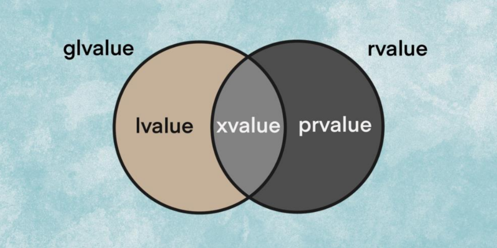

[**Назад**](https://github.com/BurdichxD4r/Cpp_Lessons/tree/master)
# Умные указатели, Семантика перемещения
## Проблема работы с динамической памятью
При выделении памяти в **конструкторе** класса, вы можете быть уверены, что эта память будет освобождена в **деструкторе** при уничтожении объекта класса (независимо от того, выйдет ли он из области видимости, будет ли явно удален и т.д.). Это лежит в основе **парадигмы программирования RAII**.
```cpp
#include <iostream>

void myFunction(){
    Item * ptr = new Item;
    int a;
    std::cout << "Enter an integer: ";
    std::cin >> a;
    if (a == 0)
        return; // функция выполняет досрочный возврат, вследствие чего ptr не будет удален!
    // Делаем что-либо с ptr здесь
    delete ptr;
}
```
Выходом является использование класса для управления указателями и выполнения соответствующей очистки памяти т.е. создание «умного указателя»
## Принцип RAII
*“Resource Acquisition is Initialization”* – захват ресурса есть инициализация.

Все объекты в ООП должны быть реализованы исходя из этого принципа.

- Обращение к ресурсу происходит в один этап. Либо мы получаем готовый полностью функциональный объект сразу, либо не получаем ничего.
- Безопасность по отношению к исключению.
- Даже если ресурсов несколько, мы уверены что все они будут корректно освобождены. Идиома очень удобна, когда нужно отслеживать важные ресурсы, а при этом сопровождение кода оставляет желать лучшего.<br>
Часто при использовании нескольких ресурсов освобождать их следует в обратном порядке. При использовании идиомы RAII, вследствие того, что объекты с захваченными ресурсами располагаются на стеке, их уничтожение происходит в обратном порядке, что как правило и является желательным.

В **конструкторе**, объект получает доступ к какому либо ресурсу и сохраняет описатель ресурса в закрытый члена класса, а при вызове **деструктора** этот ресурс освобождается. При объявлении объекта данного класса на стеке происходит и его инициализация с вызовом конструктора, захватывающего ресурс. При выходе из области видимости, объект выталкивается из стека, но перед этим вызывается деструктор объекта, который и освобождает захваченный ресурс.

Поддержка принципа **DRY** (Don’t Repeat Yourself). Код инициализации и освобождения ресурса содержится только в одном месте. Нет необходимости копировать и вставлять код инициализации в каждое место в программе где это необходимо. Достаточно просто создать объект.<br>
При необходимости использовать дополнительные параметры для обращения к ресурсу (например, логин и пароль к БД) эти параметры могут быть переданы в качестве аргументов конструктора. Накладные расходы при простейшей реализации обращения к ресурсу минимальны.

## Умные указатели
Создадим класс, единственными задачами которого является хранение и «управление» переданным ему указателем, а затем корректное освобождение памяти при выходе объекта класса из области видимости. До того момента, пока объекты этого класса создаются как локальные переменные, мы можем гарантировать, что, как только они выйдут из области видимости (независимо от того, когда или как), переданный указатель будет уничтожен.

```cpp
/*Для создание объекта умного указателя
требуется передать в конструктор какой то указатель*/
template<class T>
class Auto_ptr1{
    T * m_ptr;
public:
    // Получаем указатель для "владения" через конструктор
    Auto_ptr1(T* ptr = nullptr):m_ptr(ptr){}
    // Деструктор позаботится об удалении указателя
    ~Auto_ptr1(){
        delete m_ptr;
    }
    // Выполняем перегрузку оператора разыменования и оператора ->, чтобы иметь
    // возможность использовать Auto_ptr1 как m_ptr
    T & operator*() const {return *m_ptr;}
    T * operator->() const {return m_ptr;}
};

// Класс для проверки работоспособности вышеприведенного кода
class Item{
public:
    Item() { std::cout << "Item acquired\n"; }
    ~Item() { std::cout << "Item destroyed\n"; }
};

int main(){
    // динамическое выделение памяти
    Auto_ptr1<Item> item1(new Item);
    Auto_ptr1<Item> item2(item1);
    // ... но никакого явного delete здесь не нужно
    // Также обратите внимание на то, что Item-у в угловых скобках не
    // требуется символ *, поскольку это предоставляется шаблоном класса
    return 0;
} // item выходит из области видимости здесь и уничтожает выделенный Item вместо нас

// Результат выполнения программы:
// Item acquired
// Item destroyed
```
```cpp
void passByValue(Auto_ptr1<Item> item){}

int main(){
    Auto_ptr1<Item> item1(new Item);
    passByValue(item1)
    return 0;
}

/*В этой программе item1 передается по значению в параметр item функции
passByValue(), что приведет к дублированию указателя Item. Мы
можем получить аварийное завершение ПО.*/
```
Мы можем явно определить и удалить конструктор копирования с оператором присваивания, тем самым предотвращая выполнение любого копирования. Это также предотвратит передачу по значению. Но как нам тогда вернуть Auto_ptr1 из функции обратно?

Другой вариант — переопределить конструктор копирования и оператор присваивания для выполнения глубокого копирования. Таким образом, мы, по крайней мере, гарантированно избежим дублирования указателей. Но это слишком затратная процедура.

Мы не можем вернуть Auto_ptr1 по ссылке, так как локальный Auto_ptr1 будет уничтожен в конце функции, и в main() передастся ссылка, которая будет указывать на удаленную память. Передача по адресу имеет ту же проблему.<br>
Мы могли бы вернуть указатель item по адресу, но мы можем забыть удалить item, что является основным смыслом использования умных указателей. Так что возврат Auto_ptr1 по значению — это единственная опция, которая имеет смысл, но тогда мы получим поверхностное копирование, дублирование указателей и высокую вероятность аварийного завершения!

А что, если бы наш **конструктор копирования** и **оператор присваивания** не копировали указатель (семантика копирования), а передавали владение указателем из источника в объект назначения? Это основная идея семантики перемещения. Семантика перемещения означает, что класс, вместо копирования, передает право собственности на объект.
```cpp
??? generateItem(){
    Item * item = new Item;
    return Auto_ptr1(item);
}
```
## Семантика перемещения
Семантика перемещения – это совокупность семантических правил и средств языка C++, предназначенных для перемещения объектов, время жизни которых скоро истечет, вместо их копирования. Операция перемещения данных передает владение данными от одного объекта к другому и в большинстве случаев не изменяет размещение этих данных физически в памяти. Это позволяет избежать дорогостоящего копирования.

Семантика перемещения была введена в стандарте C++11. Для ее реализации были добавлены **rvalue** ссылки, **конструкторы перемещения** и **перемещающий оператор** присваивания. Также в стандартную библиотеку шаблонов (STL) были добавлены функции для поддержки семантики перемещения, например, **std::move** и **std::forward**.
## Когда нужна семантика перемещений
Напишем шаблонную функцию Swap(), принимающую два любых объекта одного типа и меняющую их местами.
```cpp
/*Swap() меняет местами их
значения, делая при этом три копии.*/
#include <iostream>
#include <string>

template<class T>
void Swap(T & x, T & y){
    T tmp {x}; // вызывает конструктор копирования
    x = y; // вызывает оператор присваивания копированием
    y = tmp; // вызывает оператор присваивания копированием
}

int main(){
    std::string x{"Anton"};
    std::string y{"Max"};
    std::cout << "x: " << x << '\n';
    std::cout << "y: " << y << '\n';
    Swap(x, y);
    std::cout << "x: " << x << '\n';
    std::cout << "y: " << y << '\n';
    return 0;
}
```
```cpp
// Теперь усложним задачу:
int main(){
    std::vector<int> arrA(1'000'000, 0);
    std::vector<int> arrB(1'000'000, 1);
    Swap(arrA, arrB);
    return 0;
}
```
Здесь создаются два объекта типа std::vector<int> по 1'000'000 элементов, и затем происходит обмен между ними. Шаблон класса std::vector содержит нетривиальный конструктор копирования, который делает следующее:
- производит динамическую аллокацию памяти на нужное количество элементов;
- полностью копирует элементы из переданного экземпляра std::vector.

В результате будет произведено 3'000'000 копирований объектов типа int. Ситуация может усугубиться еще сильнее, если класс std::vector инстанцирован нетривиально копируемым типом.

Чтобы избавиться от ненужных копирований, можно воспользоваться семантикой перемещения. Для этого необходимо указать компилятору, что объект может быть перемещен, преобразовав его к **rvalue-ссылке**:

В случае шаблона класса **std::vector** его нетривиальный конструктор/оператор перемещения произведет обмен указателей на динамическую память, устраняя дорогостоящие операции по аллокации памяти и копированию элементов.

Проблема состоит в том, что параметры x и y являются ссылками l-value, а не ссылками r-value, поэтому у нас нет способа вызвать конструктор перемещения или оператор присваивания перемещением вместо конструктора копирования и оператора присваивания копированием. По умолчанию у нас используется семантика копирования.

Для того, чтобы упростить написание кода при перемещении объектов, в стандартную библиотеку была введена функция **std::move**, которая превращает переданный ей объект в **rvalue-ссылку**.

```cpp
#include <utility>

template <typename T>

void Swap(T & lhs, T & rhs) noexcept {
    T t = std::move(lhs);
    lhs = std::move(rhs);
    rhs = std::move(t);
}
```
*спецификатор **noexcept** (который означает, что функция обещает не выбрасывать исключения самостоятельно)*
## Ссылки l-value
**l-value** объект (функция, переменная) который имеет свой адрес памяти. Изначально l-values были определены как «значения, которые должны находиться в левой части операции присваивания». Однако позже в язык С++ было добавлено ключевое слово const, и l-values были разделены на две подкатегории:
- Модифицируемые **l-values**, **которые можно изменить** (например, переменной x можно присвоить другое значение).
- Немодифицируемые **l-values**, **которые являются const** (например, константа PI).



До версии C++11 существовал только один тип ссылок, его называли просто — «ссылка». В C++11 этот тип ссылки еще называют «ссылкой l-value».<br>
Ссылки l-value могут быть инициализированы только изменяемыми l-values.

Ссылки **l-value на const объекты** могут быть инициализированы с помощью как l-values, так и r-values. Однако эти значения не могут быть изменены. Этот тип ссылок особенно полезен так как даёт возможность передавать аргументы любого типа (l- или r-) в функцию без выполнения копирования.
## Ссылки r-value
Изначально **r-value** являлись всем остальным, что не является **l-value**. (литералы, временные объекты, анонимные объекты). Имеют область видимости выражения в котором находятся и им нельзя что либо присвоить.

В C++11 добавили новый тип ссылок — ссылки **r-value**. Ссылки **r-value** — это ссылки, которые инициализируются только значениями **r-values**.<br>
Ссылка **l-value** создается с использованием одного амперсанда, ссылка **r-value** создается с использованием двойного амперсанда:
```cpp
int x = 7;
int & lref = x; // инициализация ссылки l-value переменной x (значение l-value)
int && rref = 7; // инициализация ссылки r-value литералом 7 (значение r-value)
```
Ссылки r-value имеют два полезных свойства:
- Они увеличивают продолжительность жизни объекта, которым инициализируются, до продолжительности жизни ссылки r-value (ссылки l-value на константные объекты также могут это делать).
- Неконстантные ссылки r-value позволяют нам изменять значения r-values, на которые указывают ссылки r-value!
## Ссылки r-value в качестве пар-в функции
Ссылки r-value чаще всего используются в качестве параметров функции. Это наиболее полезно при перегрузке функций, когда мы хотим, чтобы выполнение функции отличалось в зависимости от аргументов (**l-values** или **r-values**). Например:
```cpp
#include <iostream>
void fun(const int &lref){ // перегрузка функции для работы с аргументами l-values
    std::cout << "l-value reference to const\n";
}

void fun(int &&rref){ // перегрузка функции для работы с аргументами r- values
    std::cout << "r-value reference\n";
}

int main(){
    int x = 7;
    fun(x); // аргумент l-value вызывает функцию с ссылкой l-value
    fun(7); // аргумент r-value вызывает функцию с ссылкой r-value

    return 0;
}
// Результат выполнения программы:
// l-value reference to const
// r-value reference
```
При передаче l-value, выполняется перегрузка функции с ссылкой l-value в качестве параметра, а при передаче r-value — выполняется перегрузка функции с ссылкой r-value в качестве параметра.
## Конструктор перемещения
В C++11 добавили две новые функции для работы с семантикой перемещения: конструктор перемещения и оператор присваивания перемещением. В то время как цель семантики копирования состоит в том, чтобы выполнять копирование одного объекта в другой, цель семантики перемещения состоит в том, чтобы переместить владение ресурсами из одного объекта в другой (что менее затратно, чем выполнение операции копирования).
```cpp
template<class T>

class Auto_ptr{
    T * m_ptr;
public:
    Auto_ptr(T * ptr = nullptr):m_ptr(ptr){}

    ~Auto_ptr(){delete m_ptr;}
    // Конструктор копирования, который выполняет глубокое копирование x.m_ptr в m_ptr

    Auto_ptr(const Auto_ptr & x){ // const l-value
        m_ptr = new T;
        *m_ptr = *x.m_ptr;
    }

    // Конструктор перемещения, который передает право собственности на x.m_ptr в m_ptr
    Auto_ptr(Auto_ptr && x):m_ptr(x.m_ptr){ // r-value
        x.m_ptr = nullptr; // об этом чуть позже
    }

// Оператор присваивания

    // Оператор присваивания копированием, который выполняет глубокое копирование x.m_ptr в m_ptr
    Auto_ptr & operator=(const Auto_ptr& x){
        // Проверка на самоприсваивание
        if (&x == this)
            return *this;

        // Удаляем всё, что к этому моменту может хранить указатель
        delete m_ptr;

        // Копируем передаваемый объект
        m_ptr = new T;
        *m_ptr = *x.m_ptr;

        return *this;
    }

    // Оператор присваивания перемещением, который передает право собственности на x.m_ptr в m_ptr
    Auto_ptr& operator=(Auto_ptr&& x){

        // Проверка на самоприсваивание
        if (&x == this)
            return *this;

        // Удаляем всё, что к этому моменту может хранить указатель
        delete m_ptr;

        // Передаем право собственности на x.m_ptr в m_ptr
        m_ptr = x.m_ptr;
        x.m_ptr = nullptr; //об этом чуть позже
        
        return *this;
    }

    T & operator*() const {return *m_ptr;}

    T * operator->() const {return m_ptr;}

    bool isNull() const {return m_ptr == nullptr;}
};
```
Проверка на Самоприсваивание - проверка является ли наш неявный объект тем же, что и передаваемый в качестве параметра, мы сможем сразу же возвратить его без выполнения какого-либо кода.
## Использование семантик
Конструктор перемещения и оператор присваивания перемещением вызываются, когда аргументом для создания или присваивания является r-value. Чаще всего этим r-value будет литерал или временное значение (временный объект).<br>
В большинстве случаев конструктор перемещения и оператор присваивания перемещением не предоставляются по умолчанию. Однако в тех редких случаях, когда они могут быть предоставлены по умолчанию, эти функции будут выполнять то же самое, что и конструктор копирования вместе с оператором присваивания копированием — копирование, а не перемещение.<br>
**Правило**: **Если вам нужен конструктор перемещения и оператор присваивания перемещением**, **которые выполняют перемещение** (**а не копирование**), **то вам их нужно предоставить** (**написать**) **самостоятельно**.

**Эксперимент**:<br>
Выделим массив (объект класса DynamicArray), который будет хранить миллион целочисленных значений. Чтобы проверить эффективность этого кода определим скорость выполнения нашего кода и покажем разницу в производительности между семантикой копирования и семантикой перемещения.

**Результат**:<br>
Сравниваем время выполнения двух программ: 0.0131518 / 0.0225438 = 58.3%. Версия с использованием семантики перемещения была почти на 42% быстрее версии с использованием семантики копирования!
## 4 класса умных указателей
`#include <memory>`

**std::unique_ptr;**<br>
Следует использовать именно его для управления любым динамически выделенным объектом / ресурсом, но с условием, что std::unique_ptr полностью владеет переданным ему объектом, а не делится «владением» еще с другими классами.

**std::shared_ptr;**<br>
предназначен для случаев, когда несколько умных указателей совместно владеют одним динамически выделенным ресурсом. Ресурс уничтожается лишь в том случае, когда уничтожены все **std::shared_ptr**, указывающие на него.

**std::auto_ptr;**<br>
(который не следует использовать — он удален в C++17);

**std::weak_ptr;**<br>
был разработан для решения проблемы «циклической зависимости». std::weak_ptr является наблюдателем — он может наблюдать и получать доступ к тому же объекту, на который указывает **std::shared_ptr** (или другой std::weak_ptr), но не считаться владельцем этого объекта. Помните, когда std::shared_ptr выходит из области видимости, он проверяет, есть ли другие владельцы std::shared_ptr. std::weak_ptr владельцем не считается!
# Практика
## Ссылки
```cpp
class Fraction{
private:
    int m_numerator;
    int m_denominator;
public:
    Fraction(int numerator = 0, int denominator = 1)
        :m_numerator(numerator), m_denominator(denominator){}
    friend std::ostream& operator<<(std::ostream & out, const Fraction & f1){
        out << f1.m_numerator << "/" << f1.m_denominator;
        return out;
    }
};

int main(){
    int &&rref = 7; // поскольку мы инициализируем ссылку r-value литералом 7, то
        // создается временный объект со значением 7, на который указывает ссылка r-value
    rref = 12;
    std::cout << rref;

    return 0;
}
// Результат выполнения программы: 12
```
```cpp
int main(){
    Fraction && rref = Fraction(4, 7); // ссылка r-value на анонимный объект класса Fraction
    std::cout << rref << '\n';

    return 0;
} // rref (и анонимный объект класса Fraction) выходит из области видимости здесь
// Результат: 4/7
```
Создаваемый анонимный объект Fraction(4, 7) обычно вышел бы из области видимости в конце выражения, в котором он определен. Однако, так как мы инициализируем ссылку r-value этим анонимным объектом, то его продолжительность жизни увеличивается до продолжительности жизни самой ссылки r-value, т.е. до конца функции main(). Затем мы используем ссылку r-value для вывода значения анонимного объекта класса Fraction.
```cpp
//Какие из следующих выражений, обозначенные буквами, не скомпилируются?

int main(){
    int x;
    // Ссылки l-value
    int & ref1 = x; // A
    int & ref2 = 7; // B

    const int & ref3 = x; // C
    const int & ref4 = 7; // D
    // Ссылки r-value
    int && ref5 = x; // E
    int && ref6 = 7; // F

    const int && ref7 = x; // G
    const int && ref8 = 7; // H

    return 0;
}
```
## Функция std::move()
Функция std::move() — это стандартная библиотечная функция, которая конвертирует передаваемый аргумент в r-value. Мы можем передать l-value в функцию std::move(), и std::move() вернет нам ссылку r-value. Для работы с std::move() нужно подключить заголовочный файл utility.
```cpp
#include <iostream>
#include <string>
#include <utility>

template<class T>

void swap(T & x, T & y){
    T tmp { std::move(x) }; // вызывает конструктор перемещения

    x = std::move(y); // вызывает оператор присваивания перемещением

    y = std::move(tmp); // вызывает оператор присваивания перемещением
}

int main(){
    std::string x{"Anton"};
    std::string y{"Max"};

    std::cout << "x: " << x << '\n';
    std::cout << "y: " << y << '\n';

    swap(x, y);

    std::cout << "x: " << x << '\n';
    std::cout << "y: " << y << '\n';

    return 0;
}

/* Результат:
x: Anton
y: Max
x: Max
y: Anton
*/
```
При инициализации tmp, вместо создания копии x, мы используем std::move() для конвертации переменной x, которая является l- value, в r-value. А поскольку параметром становится r-value, то с помощью семантики перемещения x перемещается в tmp.<br>
Затем, спустя несколько дополнительных перестановок, значение переменной x перемещается в переменную y, а значение y перемещается в переменную x.
## Чем еще полезна ф-ция std::move()
Функция std::move() также может быть полезна при сортировке элементов массива. Многие алгоритмы сортировки (такие как «метод выбора» и «сортировка пузырьком») работают путем замены целых пар элементов. Теперь же мы можем использовать семантику перемещения, которая эффективнее.<br>
Функция std::move() также может быть полезна при перемещении содержимого из одного умного указателя в другой.

Функция **std::move()** может использоваться всякий раз, когда нужно обрабатывать **l-value** как **r-value** с целью использования семантики перемещения вместо семантики копирования.
# Домашняя работа # 17
- Разобрать реализацию и поведение: **Умный указатель std::unique_ptr**.

- Сортировка любим из способов с использованием семантики перемещения.