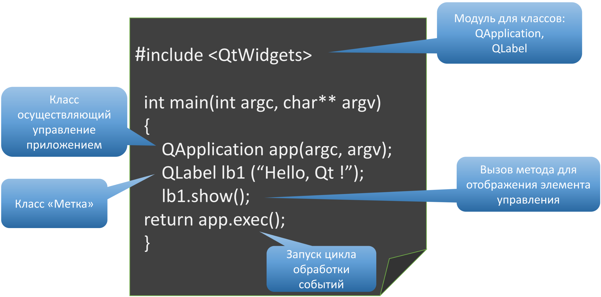
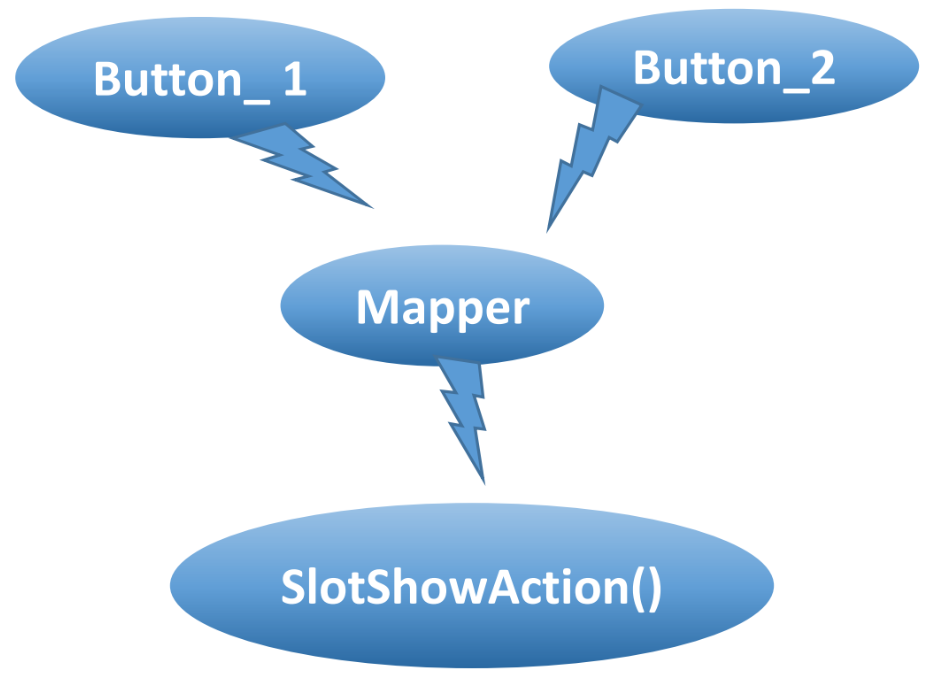
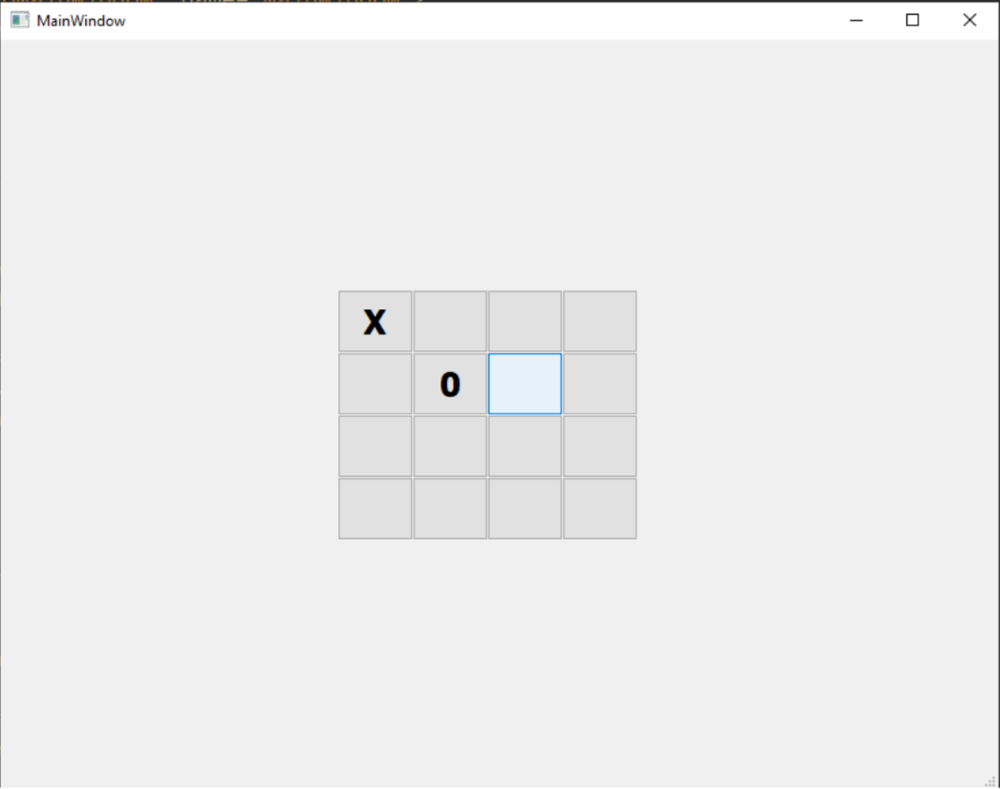

[**Назад**](https://github.com/BurdichxD4r/Cpp_Lessons/tree/master)
# Философия Qt. Сигналы, Слоты
## Первая программа на Qt



## Модули Qt
|Модуль|Обозначение в *.pro|Описание|
|:--|:--|:--|
|QtCore|core|Состоит из классов не связанных с графическим интерфейсом. Базовый модуль.|
|QtGui|gui|Модуль базовых классов, для программирования графического интерфейса.|
|QtWidgets|widgets|Модуль доп. классов для разработки графического интерфейса.|
|QtNetwork|network|Модуль для программирования сети.|
|QtSql|sql|Модуль для программирования БД.|
|QtXml|xml|Модуль поддержки XML.|
|QtOpenGL|opengl|Поддержка OpenGL графики.|
|QtTest|test|Модуль классов для создания тестов для тестирования.|
## Добавление / Удаление модулей в проект
Добавить модуль в проект:
```pro
QT += widgets network sql
```
Удалить из проекта:
```pro
QT -= gui
```
Пространство имен Qt:
```cpp
using namespace Qt;
```
## Модуль QtCore
Базовый модуль Qt. Он содержит более 200 классов, но не относящихся к интерфейсу. Консольные приложения могут быть написаны при помощь его.<br>
Основные классы в составе модуля:
- Контейнерные классы;
- Классы для ввода/вывода;
- Классы процесса и многопоточности;
- Классы работы с таймером;
- Классы для работы с датой/временем;
- Класс QObject;
- Базовый класс событий;
- Класс приложения (Без GUI).

Объект класса приложения **QCoreApplication**, можно представить как контейнер, содержащий объекты, подсоединённые к контексту ОС. Срок жизни объекта **QCoreApplication** – длительность работы приложения, и он остается доступным в любой момент работы ПО, должен создаваться в приложении только один раз.<br>
Задачи класса:
- управление событиями между приложением и ОС;
- передача и предоставление аргументов командной строки.
## Модуль QtGui
Этот модуль предоставляет классы интеграции с оконной системой, с OpenGL. Он поддерживает класс QWindow, который является элементарной областью с возможностью получения событий пользовательского ввода, изменения фокуса, размера, а так же позволяющий проводить графические операции и рисование на своей поверхности.

Класс приложения этого модуля – **QGuiApplication**.<br>
Он содержит механизм цикла событий и обладает возможностями:
- Получение доступа к **буферу обмена**;
- Инициализация **настроек приложения** – палитры элементов управление и т.п.;
- Управление формой **курсора мыши**.
## Модуль QtWidgets
Класс **QWidget** – базовый класс для всех элементов управления. По своему внешнему виду – это закрашенный четырехугольник, но за этой внешней простотой скрывается большой потенциал непростых функциональных возможностей. Это класс с 254 методами и 53 свойствами.

Модуль содержит около 300 классов виджетов, являющихся «кирпичиками» графического интерфейса пользователя:
- классы для размещения элементов: QVBoxLayout, QHBoxLayout;
- классы элементов отображения: QLabel, QLCDNumЬer ;
- классы кнопок: QPushButton, QCheckBox, ... ;
- классы элементов установок: QSlider, QScrollBar ;
- классы элементов ввода: QLineEdit, QSpinBox ;
- классы элементов выбора: QComboBox, QToolBox;
- классы меню: QMainWindow и QMenu ;
- класс приложения QApplication;

Класс **QApplication** – является наследником **QCoreApplication** и представляет собой «контрольный пункт» Qt- приложений с пользовательским интерфейсом на базе виджетов.<br>
Объект класса используется для получения событий клавиатуры, мыши, таймера, и т.д. на которые приложение должно реагировать cответствующим образом.<br><br>
Цепочка наследования для этого класса:<br>
`QCoreApplication -> QGuiApplication -> QApplication + доп. ф-ции:`

- установка стиля приложения.
- получение указателя на объект рабочего стола (desktop);
- управление глобальными манипуляциями с мышью (например, установка интервала двойного щелчка кнопкой мыши) и регистрация движения мыши в пределах и за пределами окна приложения;
- обеспечение правильного завершения работающего приложения при завершении работы операционной системы.
## Философия объектной модели
Объектная модель Qt подразумевает, что все построено на объектах. Фактически, класс **QObject** - это основной, базовый класс. Подавляющее большинство классов Qt являются его наследниками. Классы, имеющие сигналы и слоты, должны быть унаследованы от этого класса, причем при множественном наследовании:
- При определении класса имя класса QObject (или унаследованного от него) **ДОЛЖНО СТОЯТЬ первым**.
- От класса QObject должен быть унаследован только один из базовых классов. Другими словами, **нельзя производить наследование сразу от нескольких классов**, **наследующих класс QObject**.

```cpp
class MyClass : public QObject, public AnotherClass {
};
```
Класс QObject содержит в себе поддержку:
- сигналов и слотов (signal/slot);
- таймера;
- механизма объединения объектов в иерархии;
- событий и механизма их фильтрации;
- организации объектных иерархий;
- метаобъектной информации;
- приведения типов;
- свойств.

**Механизм объединения объектов в иерархические структуры** позволяет резко сократить временные затраты при разработке приложений, не заботясь об освобождении памяти создаваемых объектов, поскольку объекты-предки сами отвечают за уничтожение своих потомков.

**Метаобъектная информация** включает в себя информацию о наследовании классов, что позволяет определять, являются ли классы непосредственными наследниками, а также узнать имя класса.
## Механизм сигналов и слотов
**Сигналы и слоты** - это средства, позволяющие эффективно производить обмен информацией о событиях, вырабатываемых объектами.

Элементы графического интерфейса определенным образом реагируют на действия пользователя и посылают сообщения.

Механизм сигналов и слотов полностью замещает старую модель “функций обратного вызова”, он очень гибок и полностью объектно-ориентирован. Сигналы и слоты - это концепт программирования в Qt, позволяющий соединить вместе несвязанные друг с другом объекты. Каждый унаследованный от **QObject** класс способен отправлять и получать сигналы. Эта особенность идеально вписывается в концепцию ООП и не противоречит человеческому восприятию.

У вас звонит телефон, и вы реагируете на это снятием трубки. На языке сигналов и слотов подобную ситуацию можно описать следующим образом: объект «телефон> выслал сигнал - «звонок», на который объект «человек> отреагировал слотом «СНЯТИЕ трубки».<br><br><br>

1. Каждый класс, унаследованный от QObject, может иметь любое количество сигналов и слотов;
2. Сообщения, посылаемые посредством сигналов, могут иметь множество аргументов любого типа;
3. Сигнал можно соединять с различным количеством слотов. Отправляемый сигнал поступит ко всем подсоединенным слотам;
4. Слот может принимать сообщения от многих сигналов, принадлежащих разным объектам;
5. Соединение сигналов и слотов можно производить в любой точке приложения;
6. Сигналы и слоты являются механизмами, обеспечивающими связь между объектами. Более того, эта связь может выполняться между объектами, которые находятся в различных потоках;
7. При уничтожении объекта происходит автоматическое разъединение всех сигнально - слотовых связей. Это гарантирует, что сигналы не будут отправляться к несуществующим объектам.

- Сигналы и слоты не являются частью языка с++, поэтому перед компиляцией программы **требуется запуск дополнительного препроцессора** (MOC);
- Отправка сигналов происходит **немного медленнее**, чем обычный вызов функции, который осуществляется при использовании механизма функций обратного вызова;
- Существует **необходимость в наследовании** класса QObject;
- В процессе компиляции **не производится никаких проверок**: имеется ли сигнал или слот в соответствующих классах или нет, совместимы ли сигнал и слот друг с другом и могут ли они быть соединены вместе. Об ошибке станет известно лишь тогда, когда приложение будет запущено в отладчике или на консоли.
## Сигналы
**Сигналы** (*signals*) окружают нас в повседневной жизни везде: звонок будильника, жест регулировщика, а также и в не повседневной - примером может служить индейский сигнальный костер.

Qt под понятием **сигнала** подразумеваются **методы**, которые в состоянии осуществлять **пересылку сообщений**.

Причиной для появления сигнала может стать сообщение об изменении состояния управляющего элемента - например, о перемещении ползунка. На подобные изменения присоединенный объект, отслеживающий такие сигналы, может соответственно отреагировать, что, впрочем, и не обязательно.

Соединяемые объекты могут быть абсолютно независимы и реализованы отдельно друг от друга.

Объект, отправляющий сигналы, может даже и не догадываться, что их принимают и обрабатывают другие объекты.<br>
Благодаря такому разделению можно разбить большой проект на компоненты, которые будут разрабатываться разными программистами по отдельности, а потом соединяться при помощи сигналов и слотов вместе.

Сигнал не обязательно соединять со слотом. Если соединения не произошло, то он просто не будет обрабатываться.

Сигналы определяются в классе, как и **обычные методы**, **только без реализации**. С точки зрения программиста они являются лишь прототипами методов, содержащихся в заголовочном файле определения класса. Всю дальнейшую заботу о реализации кода для этих методов берет на себя МОС.<br>
Методы сигналов **не должны возвращать** каких-либо **значений**, и поэтому перед именем метода всегда должен стоять возвращаемый параметр void.
```cpp
class MyClass {
    Q_OBJECT
    // за реализацию – отвечает МОС.
    signals: void doit();
};
```
Библиотека предоставляет большое количество уже готовых сигналов для существующих элементов управления. Но можно реализовать новые сигналы в своих классах.
```cpp
.......
void sendSignal() {
    emit sendString("Information");
}
signals: void sendString(const QString&);
......
```
Сигналы не определяют как **private**, **protected** или **public**, поскольку они играют роль вызывающих методов.
```cpp
class MyClass {
Q_OBJECT
public:
    void sendSignal() {
        // Выслать сигнал можно при помощи ключевого слова emit
        emit doit ();
    }
    signals: void doit ();
};
```
Конструкция отправки сигнала emit doit () приведет к обычному вызову метода doit ().
## Слоты
- **Слоты** (*slots*)- это методы, которые присоединяются к сигналам. Фактически это обычные методы. Отличие слотов и обычных методов состоит в возможности слотов принимать сигналы.
- Слоты определяются в классе как *public*, *private* или *protected*.
- Если необходимо, чтобы слот мог соединяться только с сигналами сторонних объектов, но не вызываться как обычный метод со стороны, этот слот необходимо объявить как *protected* или *private*. Во всех других случаях объявляйте их как *public*.
- В объявлениях перед каждой группой слотов должно стоять соответственно: *private slots:*, *protected slots:* или *public slots:*.
- Слоты могут быть и виртуальными.

В слотах нельзя использовать *параметры по умолчанию* или определять слоты как *static*.
```cpp
class MySlot : public QObject {
Q_OBJECT
public:
    MySlot (); {}
public slots:
    void slot () {
        qDebug() << "I'm а slot";
    }
};
```
Внутри слота вызовом метода **sender()** можно узнать, от какого объекта был выслан сигнал. Он возвращает указатель на объект типа QObject. Например, в этом случае на консоль будет выведено имя объекта, выславшего сигнал:
```cpp
void slot(){
    qDebug() << sender()->objectName();
}
```
## Соединение объектов
Соединение объектов осуществляется при помощи статического метода **connect()**, который определен в классе QObject.<br>
В общем виде вызов метода **connect()** выглядит следующим образом:
```cpp
QObject::connect(const QObject* sender, //отправитель сигнала
                const char* signal, //сигнал
                const QObject* receiver, // получатель сигнала
                const char* slot, // вызываемый слот
                Qt::ConnectionType type = Qt::AutoConnection // режим обработки

);
```
```cpp
void main() {
....
QObject::connect(pSender, SIGNAL(signalMethod()), pReceiver, SLOT(slotMethod())) ;
....
}
```
Альтернативный метод соединения:
```cpp
QObject::connect(pSender, &SenderClass::signalMethod, pReceiver, &ReceiverClass::slotMethod);
```
Метод connect() после вызова возвращает объект класса Connection, с помощью которого можно определить, произошло соединение успешно или нет.
```cpp
bool bOk = true;
bOk &= connect(pcmdl, SIGNAL(clicked()), pobjReceiverl, SLOT(slotButtonlClicked()));
bOk &= connect(pcmd2, SIGNAL(clicked()), pobjReceiver2, SLOT(slotButton2Clicked()));
Q_ASSERT(bOk);
```
Если объект не обрабатывает сигнал, а просто передает его дальше:
```cpp
MyClass::MyClass():QObj ect(){
    connect(pSender, SIGNAL(signalMethod()), SIGNAL(mySignal()));
}
```
Eсли в методе будет допущена какая-либо ошибка, то можно аварийно завершить программу вызовом макроса: **Q_ASSERT()**.

**Следите за совпадением типов сигналов со слотами**.
```cpp
connect(pobjl, SIGNAL(sig(int)), pobj2, SLOT(slt(int))); // ПРАВИЛЬНО!

connect(pobjl, SIGNAL(sig(int)), pobj2, SLOT(slt(QString))); // НЕПРАВИЛЬНО!
```
**Можно игнорировать в слоте значения**, **передаваемые сигналом**:
```cpp
connect(pobjl, SIGNAL(sig(int)), pobj2, SLOT(slt())); //МОЖНО!

connect(pobjl, SIGNAL(sig()), pobj2, SLOT(slt(int))); // НЕЛЬЗЯ!
```
**Не указывайте вместе с типом имя переменной**:
```cpp
connect(pobjl, SIGNAL(sig(int n)), pobj2, SLOT(slt(int n))); //ОШИБКА!
```
## Разъединение объектов
В Qt при уничтожении объекта все связанные с ним соединения уничтожаются автоматически, но иногда может возникнуть необходимость в уничтожении этих соединений «вручную». Для этого существует статический метод **disconnect()**, параметры которого аналогичны параметрам статического метода connect(). В общем виде этот метод выглядит так:
```cpp
QObject::disconnect(sender, signal, receiver, slot);

void main() {
    QObject::disconnect(pSender, SIGNAL(signalMethod()), pReceiver, SLOT(slotMethod())) ;
}
```
## Переопределение сигналов
Сократить в классе количество слот-методов и отреагировать действием на разные сигналы в одном слоте, можно используя класс **QSignalMapper**. С его помощью можно переопределить сигналы и сделать так, чтобы в слот отправлялись значения типов **int**, **QString** или **QWidget**.



```cpp
MyClass::MyClass(QWidget* pwgt) {
...
QSignalMapper* psigMapper = new QSignalMapper(this);
connect(psigMapper, SIGNAL(mapped(const QString&)), this, SLOT(slotShowAction(const QString&)));

QPushButton* pcmdl = new QPushButton("Button1");
connect(pcmdl, SIGNAL(clicked() ), psigMapper, SLOT(map()));
psigMapper->setMapping(pcmdl, "Buttonl Action");

QPushButton* pcmd2 = new QPushВutton("Button2");
connect(pcmd2, SIGNAL(clicked()), psigMapper, SLOT(map()));
psigMapper->setMapping(pcmdl, "Button2 Action");
void MyClass::slotShowAction(const QString& str) {
    qDebug() << str;
}
```
# Практика
## Создание сигнал-слотового объединения между 2 окнами
# Домашнее задание № 18
Реализовать в Qt Игровое поле для «x & 0». Реализовать 2 стратегии игры: С партнером, с ИИ.(попробуйте использовать паттерн «Стратегия»)

