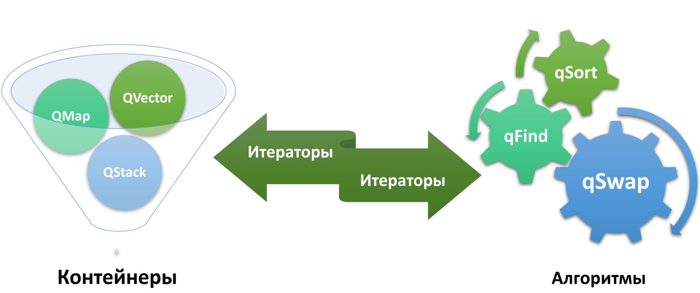
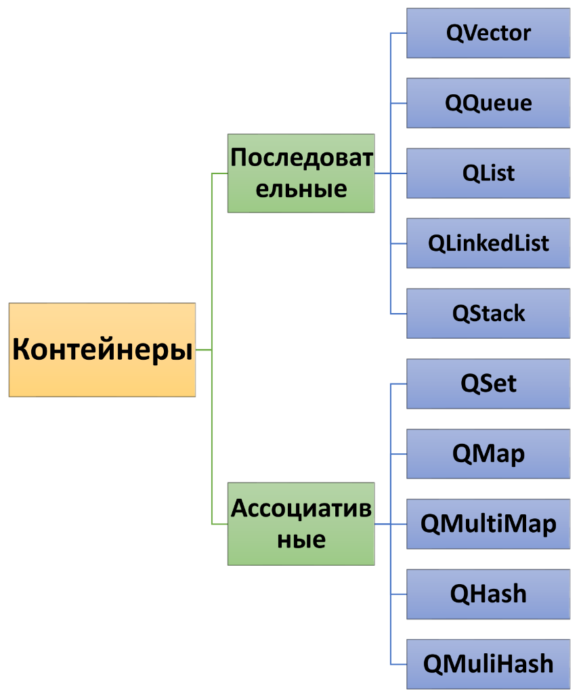
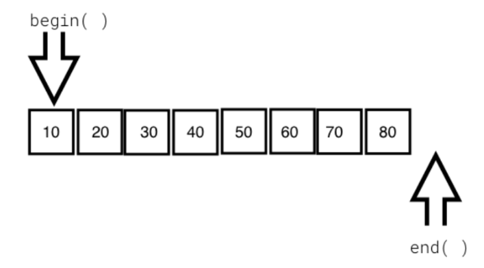
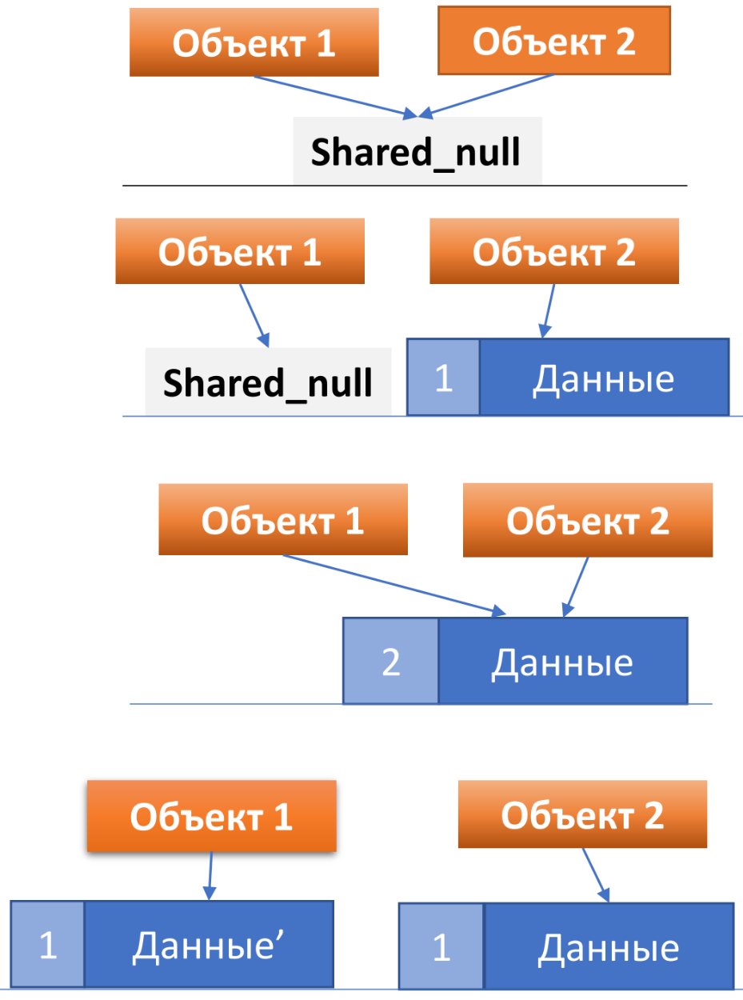

[**Назад**](https://github.com/BurdichxD4r/Cpp_Lessons/tree/master)
# Библиотека контейнеров Tulip
## Библиотека контейнеров Tulip
Tulip библиотека не только очень похожа на STL, но и совместима с ней. Реализация классов Tulip расположена в модуле QtCore.

В основе библиотеки Tulip (как и в STL) лежат три понятия:
- контейнерные классы (контейнеры);
- алгоритмы;
- итераторы.



## Контейнерные классы
Почти все контейнерные классы в Qt реализованы как шаблонные и, таким образом, они могут хранить данные любого типа.

Классы контейнеров могут включать целые серии других объектов, которые, в свою очередь, тоже могут являться контейнерами.

Контейнерные классы - это классы, которые в состоянии хранить в себе элементы различных типов данных.



## Методы контейнерных классов
|Оператор/метод|Описание|
|---|---|
|== , !=|Операторы сравнения, равно и не равно|
|=|Оператор присваивания|
|[]|Оператор индексации, кроме QSet, QLiskedList|
|begin(), constBegin()|Метод возвращает итератор на начало последовательности. Для QSet – только const итератор|
|end(), constEnd()|Методы возвращающие итераторы на окончание послед-ти.|
|clear()|Удаление всех элементов контейнера|
|insert()|Операция вставки элементов в контейнер|
|remove()|Операция удаления элементов из контейнера|
|size(), count()|Возвращает кол-во элементов контейнера|
|value()|Возвращает значение элемента контейнера. (Кроме QSet)|
|empty(), isEmpty()|Возвращает true, если контейнер пуст.|

Классы, **унаследованные от класса QObject**, не имеют доступного конструктора копирования и оператора присваивания, поскольку они находятся в секции private. Их объекты не могут храниться в контейнерах, поэтому **нужно сохранять в контейнерах не сами объекты**, наследуемые от класса **QObject**, **а указатели на них**.
## Итераторы
Итераторы служат для перемещения по элементам контейнера, позволяя при этом полностью абстрагироваться от структуры данных контейнера.

Итераторы в стиле STL могут быть использованы совместно с алгоритмами STL.



```cpp
QVector<QString> vec;
vec << "door" << "roof" << "window";
QVector<QString>::iterator it = vec.begin();
for (; it 1 = vec.end(); ++it){
    qDebug() << "Element:" << *it;
}
```
Если вы собираетесь только читать значения элементов, не изменяя их, то гораздо эффективнее использовать константный итератор **const_iterator**.
```cpp
QVector<QString>::iterator it = vec.end();
for (;it != vec.begin();) {
    --it;
    qDebug() << "Element:" << *it;
}
```
Итераторы можно использовать со стандартными алгоритмами STL, определенными в заголовочном файле `<algorithm>`
```cpp
QVector<QString> vec;
vec << "aaa" << "bbb" << "ccc";
std::sort (vec.begin(), vec.end());
qDebug() << vec;
```
## foreach
Это не ключевое слово, а создано искусственно, посредством препроцессора, и представляет собой разновидность цикла, предназначенного для перебора всех элементов контейнера. Этот способ является альтернативой константному итератору.

В **foreach**, как и в циклах, можно использовать ключевые слова **break**, **continue**, а также вкладывать циклы друг в друга.

Qt делает копию контейнера при входе в цикл **foreach**, поэтому если вы будете менять значение элементов в цикле, то на оригинальном контейнере это никак не отразится.

```cpp
QList<QString> list;
list << "aaa" << "bbb" << "ccc";

foreach(QString str, list){
    qDebug() << "Element:" << str;
}
```
## Последовательные контейнеры
|Оператор/метод|Описание|
|---|---|
|+|Объединение элементов 2-х контейнеров|
|+=, <<|Добавляет элемент в контейнер|
|at()|Возвращает указанный элемент|
|back(), last()|Возвращает ссылку на последний элемент, при усл. что контейнер не пуст|
|contains()|Проверяет наличие заданного в параметре элемента в контейнере|
|erase()|Удаляет элемент, расположенный на позиции итератора, переданного в параметре|
|front(), first()|Возвращает ссылку на первый элемент, при усл. Что контейнер не пуст.|
|indexOf()|Возвр. позицию первого совпадения в контейнере эл-та, переданного как параметр. (Кроме QLinkedList)|
|lastIndexOf()|Возвр. позицию последнего совпадения в контейнере эл-та, переданного как параметр. (Кроме QLinkedList)|
|mid()|Возвр. контейнер копий элементов от заданной позиции и зад. кол-вом.|
|pop_back(), pop_front()|Удаляет последний (первый) элемент контейнера|
|push_back(), append()|Добавляет эл-т в конец контейнера|
|push_front(), prepend()|Добавляет эл-т в начало контейнера|
## Ассоциативные контейнеры
|Метод|Описание|
|---|---|
|contains()|Возвращает true если в контейнере есть элемент с заданным в параметре ключом.|
|erase()|Удаляет элемент из контейнера в соотв. с переданным итератором|
|find()|Поиск элемента по значению. Если элемент не найден – возвращает итератор указывающий на end().|
|insertMulti()|Вставляет новый элемент. Если элемент уже присутствует в контейнере то создается новый элемент. (Кроме QSet)|
|insert()|Вставляет новый элемент. Если элемент уже присутствует в контейнере он заменяется на вставляемый.( Кроме QSet)|
|key()|Возвращает первый ключ в соответствии с переданным в этот метод знач. Кроме (QSet)|
|keys()|Возвращает список всех ключей, находящихся в контейнере. (Кроме QSet)|
|take()|Удаляет элемент из контейнера в соотв. С переданным ключом и возвращает копию его значения (Кроме QSet)|
|unite()|Добавляет элементы одного контейнера в другой|
|values()|Возвращает список всех значений|
## Алгоритмы
Алгоритмы определены в заголовочном файле `<QtAlgorithms>` и предоставляют операции, применяемые к контейнерам, - например: сортировку, поиск, преобразование данных. Реализованы в виде шаблонных функций, что позволяет их использовать не только для контейнеров, но и для обычных массивов.

|Алгоритм|Описание|
|---|---|
|qBinaryFind()|Двоичный поиск заданных значений|
|qCopy()|Копирование элементов, начиная с первого|
|qCopyBackward()|Копирование элементов, начиная с последнего|
|qSort()|Сортировка элементов|
|qFind()|Поиск заданных значений|
|qFill()|Присваивает всем элементам контейнера заданное значение|
|qStableSort()|Сортировка элементов с сохранением порядка следования равных элементов|

```cpp
QList<QString> list;
list << "Happy New Year" << "Santa" << "Rudolph";

qSort(list.begin(), list.end(), caseLessThan);
```
## Регулярные выражения
Для работы с регулярными выражениями имеется класс **QRegExp**. Это мощное средство для обработки строк. Регулярные выражения содержать в себе шаблон, предназначенный для поиска в строке.
|Символ|Описание|Пример|
|---|---|---|
|.|Любой символ|a.b|
|$|Должен быть конец строки|Abc$|
|[ ]|Любой символ из заданного набора|\[abc\]|
|-|Определяет диапазон символов в группе|\[0-9A-Za-z\]|
|^|В начале набора символов означает любой символ, не вошедший в набор|\[^def\]|
|( )|Ищет и сохраняет в памяти группу найденных символов|(ab\|ac)ad|
|\d|Любое число||
|\D|Все, кроме числа||
|\||Ищет один из 2-х вариантов|ac\|dc|
|\b|В этом месте присутствует граница слова|a\b|
|{n,m)|Допускается от n до m совпадений|a{2,3}b|
|{n}|Символ должен встретится в стоке указанное число раз|A{3}b|
|?|Символ должен встретится в строке 1 раз или не встретиться вообще|A?b|
## Тип QVariant
Объекты класса QVariant могут содержать данные разного типа, включая контейнеры, а так же int, QString, QColor, QBrush и т.д
```cpp
QVariant v1(34);
QVariant v2(true);
QVariant v2("Lostris");
/*Для создания объектов
класса QVariant:*/

QVariant v2(23);
int а = v2.tolnt() + 5; //а = 28
/*Получить из объекта QVariant
данные нужного типа*/

QVariant v(5.0);
qDebug() << QVariant::typeToName(v.type()); // =>double
/*Узнать тип записанных в
объекте QVariant данных*/

QPixmap pix(":/myimg.png"); // создаем объект QPixmap
QVariant vPix = pix; // сконвертируем его в QVariant, неявным вызовом
QPixmap::operator QVariant();
QPixmap pix2 = vPix.value<QPixmap>();
```
## Модель общего использования данных
Во многих классах Qt стараются избежать копирования данных - **вместо этого используется ссылка на нужные данные**. Этот принцип получил название “**общее использование данных**” (*shared data*). В Qt применяется модель неявных общих данных.

В данной модели вызов конструктора копирования или оператора присваивания не приведет к копированию данных, а только увеличит счетчик ссылок на эти данные на 1. Соответственно, при удалении элемента счетчик ссылок уменьшится на 1. Если значение счетчика ссылок становится равным 0, то данные уничтожаются. **Копирование данных происходит только при изменениях** - **соответственно**, **значение счетчика ссылок при этом уменьшается**.
```cpp
QString str1; //Ссылается на shared null
QString str2; // Ссылается на shared null
str1 = "Новая строка" //Ссылается на данные, счетчик ссылок = 1
str2 = str1; // str1 и str2 указывают на одни и те же данные счетчик ссылок = 2
str1 += "добавление"; // Производится копирование данных для str1
```



# Практика
## Последовательные контейнеры
```cpp
QVector<int> vec;
vec.push_back(10);
vec.push_back(20);
vec.push_back(ЗO);
qDebug () << vec;

QQueue<QString> que;
que.enqueue("Era");
que.enqueue("Corvus Corax");
que.enqueue("Gathering");
while ( !que.empty()) {
    qDebug() << "Element:"
    << que.dequeue();
}

QList<int> list;
list << 10 << 20 << 30;
QValueList<int>::iterator it = list.begin();
while (it != list.end()) {
    qDebug() << "Element:" << *it;
    ++it;
}

QStack<QString> stk;
stk.push("Era");
stk.push("Corvus Corax");
stk.push ( "Gathering");
while (!stk.empty()) {
    qDebug() << "Element:"
    << stk.pop();
}
// stk.top();
```
qDebug() - используется для записи пользовательской отладочной информации:<br>
`qDebug() << smth;`
Требует подключения библиотеки:<br>
`#include <QDebug>`
## Ассоциативные контейнеры
```cpp
QMap<QString, QString> mapPhonebook;
mapPhonebook["Ivan"] "+49631322187";
mapPhonebook["Vlad"] "+49631322186";
mapPhonebook["Kate"] "+49631322181";
QMap<QString, QString>::iterator it = mapPhonebook.begin();
for (;it != mapPhonebook.end(); ++it) {
    qDebug() << “Name:” << it.key()
    <<“ Phone:” << it.value();
}

QМultiMap<QString, QString> mapPhonebook;
mapPhonebook.insert("Alex", "+49631322181");
mapPhonebook.insert("Mary", "+49631322186");
mapPhonebook.insert("Jane", "+49631322000");
mapPhonebook.insert("Max", "+49631322010");
mapPhonebook.insert("Anton", "+49631322187");
mapPhonebook.insert("Anton", "+49631322999");
QMultiMap<QString, QString>::iterator it = mapPhonebook.find("Anton");
for (; it 1 = mapPhonebook.end() && it.key() == "Anton"; ++it){
    qDebug() << it.value();
}

if (mapPhonebook. contains("Ivan") ) {
    qDebug () << "Phone:"
    << mapPhonebook [“Ivan”];
}
```
## Регулярные выражения
```cpp
QRegExp regEmail (" ( [a-zA-Z0-9 _ \\-\\.] +)@ ( [a-zA-Z0-9 _.-]) +\\. ( [a-zA-Z] {2, 4}] [0- 9] { 1, 3}) ");
QString strEmail1 = "marusia@gmail.com";
QStriпg strEmail2 = "baturina#yandex.com";
QString strEmail3 = "Max.Schlee@neonway";
bool b1 regEmail.exactMatch(strEmail1); //b1 true
bool b2 regEmail.exactMatch(strEmail2); //b2 false
bool b3 regEmail.exactMatch(strEmail3); //b3 false

QRegExp rxp("( .com| .ru)"); // шаблон
int n1 = rxp.indexin("www.bhv.ru"); // n1 = 7 (совпадение на 7-йпозиции)
int n2 = rxp.indexin("www.bhv.de"); // n2 = -1 (совпадений не найдено)

QRegExp reg (" [ 0-9] { 1, 3} \ \. [0-9] {1, 3} \ \. [0-9] { 1, 3} \ \. [0-9] { 1, 3} ") ;
QString str("this is an ip-address 123.222.63.1 lets check it");
qDebug() << (str.contains(reg) > 0); // true
```