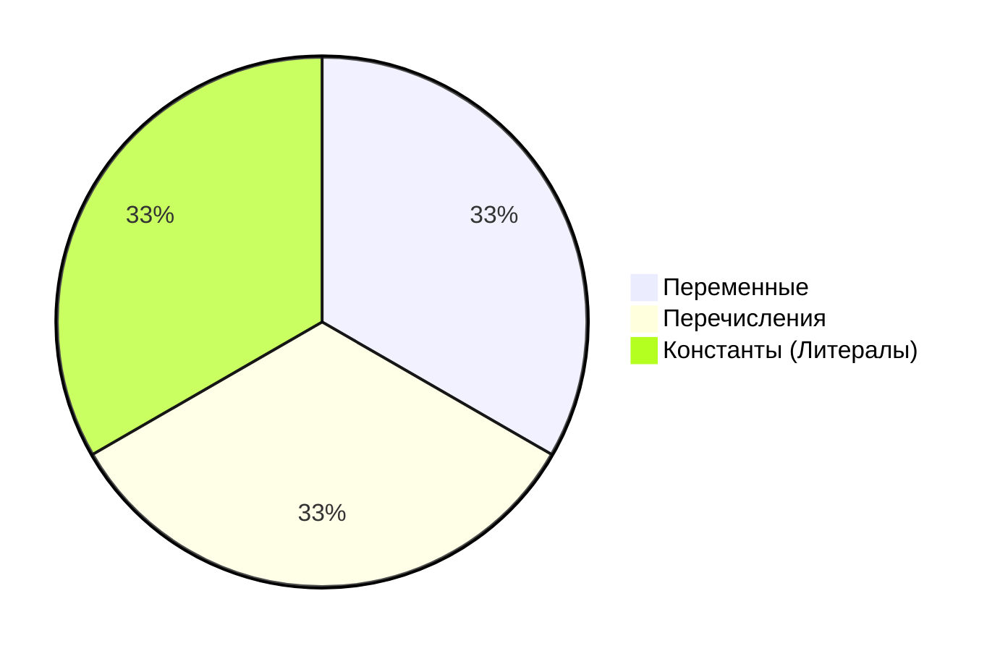

[**Назад**](https://github.com/BurdichxD4r/Cpp_Lessons/tree/master#course-ccqt)

# Данные в языке C
## Виды данных
**Переменная** - это каким-либо образом поименнованая и/или фдресованная область физической или виртуальной памяти, предназначенная для хранения данных (значений).

**Перечисление** - это набор именованных целочисленных констант, определяющий все допустимые значения, которые может принимать переменная.

**Константа** - способ адресации данных, изменение которых рассматривается программой не предполагается или запрещается.



|Вид / Подвид|Числовая|Логическая|Символьная|Адресная|
|---|---|---|---|---|
|Константа|3, -23.76||'A', "Hello"||
|Переменная|int p = 4;|bool b = true;|char c = 'c';|int a = 3;<br>int *p = &a;|
|Перечисление|||||

## Тип переменной
Тип требуется компилятору для того чтобы он мог:
- Выделить нужное количество бит для хранения значения переменной;
- Распознать в каком виде использует данные программист и перевести их в двоичное представление; (знак./беззнак.)
- При выполнении действий с переменными разного типа сгенерировать разные низкоуровневые команды:
```c
int x1 = 1, y1 = 2, z1;
z1 = x1 + y1; // -> add

double x2 = 1.0, y2 = 2.0, z2;
z2 = x2 + y2; // -> fadd
```