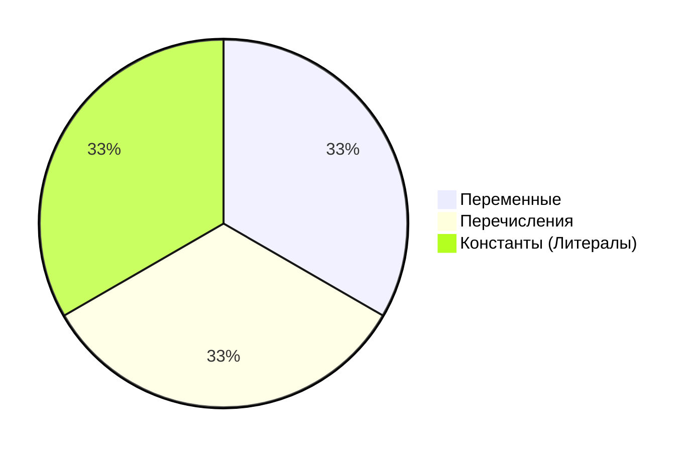
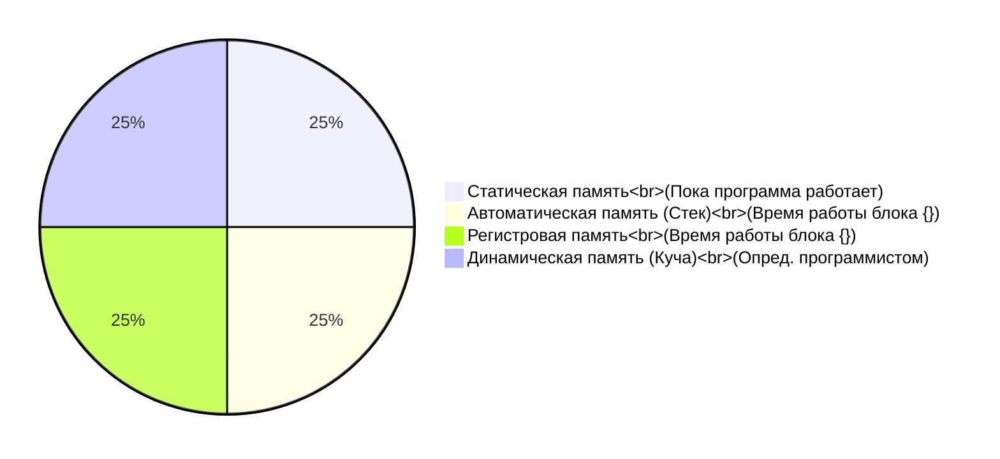

[**Назад**](https://github.com/BurdichxD4r/Cpp_Lessons/tree/master#course-ccqt)

# Данные в языке C
## Виды данных
**Переменная** - это каким-либо образом поименнованая и/или фдресованная область физической или виртуальной памяти, предназначенная для хранения данных (значений).

**Перечисление** - это набор именованных целочисленных констант, определяющий все допустимые значения, которые может принимать переменная.

**Константа** - способ адресации данных, изменение которых рассматривается программой не предполагается или запрещается.



|Вид / Подвид|Числовая|Логическая|Символьная|Адресная|
|---|---|---|---|---|
|Константа|3, -23.76||'A', "Hello"||
|Переменная|int p = 4;|bool b = true;|char c = 'c';|int a = 3;<br>int *p = &a;|
|Перечисление|||||

## Тип переменной
Тип требуется компилятору для того чтобы он мог:
- Выделить нужное количество бит для хранения значения переменной;
- Распознать в каком виде использует данные программист и перевести их в двоичное представление; (знак./беззнак.)
- При выполнении действий с переменными разного типа сгенерировать разные низкоуровневые команды:
```c
int x1 = 1, y1 = 2, z1;
z1 = x1 + y1; // -> add

double x2 = 1.0, y2 = 2.0, z2;
z2 = x2 + y2; // -> fadd
```

## Типы данных
|Типы данных|Размер в байтах|Диапазон значений|
|:--|:-:|--:|
|unsigned char|1|от 0 до 255|
|signed char|1|от -128 до 127|
|unsigned int|2 или 4|от 0 до 65535<br>от 0 до 4294967295|
|signed int|2 или 4|от -32768 до 32767<br>от -2147483648 до 2147483647|
|unsigned short|2|от 0 до 65535|
|signed short|2|от -32768 до 32767|
|long int|4|от -2147483648 до 2147483647|
|long long int|8|от -(2^63-1) до (2^63-1)|
|unsigned long int|4|от 0 до 4294967295|
|unsigned long long int|8|от 0 до (2^64-1)|
|float|4|от +-3.4E-38 до 3.4E+38|
|double|8|от +-1.7E-308 до 1.7E+308|
|long double|10|от +-3.4E-4923 до 1.1E+4932|
|void||тип без значения|

# Приведение типов
Приведение типов может быть:
- **Неявное** (компилятор)
- **Явное** (программист)

В ряде случаев преобразования сопроваждаются потерей информации. Без потери информации проходят следующие цепочки преобразований:
```mermaid
flowchart LR
    char --> short --> int --> long
    unsigned char --> unsigned short --> unsigned int --> unsigned long
    float --> double --> long double
```

При арифметических операциях компилятор
преобразует:

1. Если имеется в выражении тип long double, то всё к
типу long doublе
2. Если п.1 не выполняется и если имеется тип double, то
всё к типу doublе
3. Если п.2 не выполняется и если имеется тип float, то
всё к типу float
4. Если п.3 не выполняется и если имеется тип unsigned
long int, то всё к типу unsigned long int
5. Если п.4 не выполняется и если имеется тип long, то
всё к типу long
6. Если п.5 не выполняется и если имеется тип unsigned,
то всё к типу unsigned
7. Если п.6 не выполняется то оба операнда приводятся к
типу int

```
Правило неявного приведения:
• Определяется тип выражения
справа от «=»;
• Значение выражения справа
приводится к типу слева от «=».
```
```c
int x = 1;
double y = 2.2
int z = x + y;
```
Явное приведение типа (программист).
- Стиль С:

```c
int x = 1, y = 2;
double z = (double) x/y;
```

- Стиль С++:

`static_cast <type>(выр-е)` – преобр-е с проверкой
корректности во время компиляции.
`reinterpret_cast <type>(выр-е)` – преобр-е без проверки во
время компиляции.
`const_cast <type>(выр-е)` – константное преобр-е во время
компиляции (аннулирует или назначает действие модиф.:
const, volotile).
`dynamic_cast <type>(выр-е)` – преобр-е с проверкой во
время выполнения

```
Достаточно явно привести к “старшему” типу
только один операнд. Второй операнд будет
приведен к “старшему” типу самим компилятором.
```
```cpp
int d = static_cast <int>(7.5);
int const * cpd = &d;
int * pd = const_cast <int *>(cpd);
float f = static_cast <float>(d);
float * pf = reinterpret_cast <float*>(pd);
float * pf2 = static_cast <float*>(static_cast <void*>(pd));
float h = *reinterpret_cast<float*>(&d);
```

## Размещение и Время существования
- Имеется 4 основных способа
размещения переменных.

- От способа размещения
зависит время жизни
переменной.
```c
static auto register
malloc() new
```
