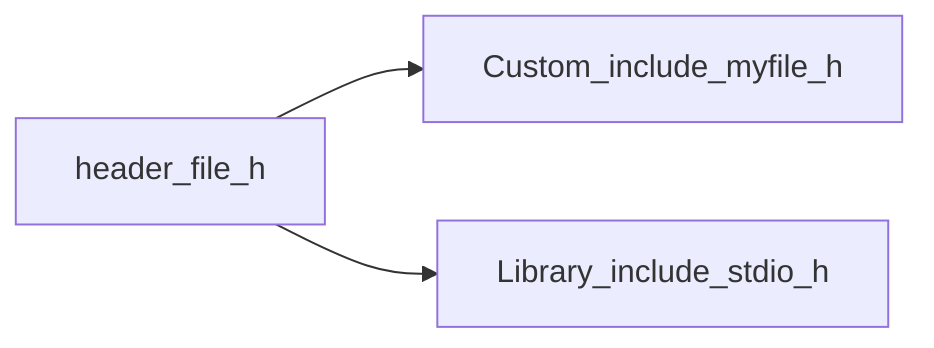

[**Назад**](https://github.com/BurdichxD4r/Cpp_Lessons/tree/master#course-ccqt)
# Препроцессор.<br>Пространство имен.
## Определение и особенности использования
**Препроцессор** — это специальная программа, являющаяся частью компилятора языка С. Она предназначена для предварительной обработки текста программы. Препроцессор позволяет включать в текст программы файлы и вводить макроопределения.

Работа препроцессора осуществляется с помощью специальных директив (указаний).

*Специфика использования директив:*
- Начинаются с символа «#»;
- Директивы пишутся каждая на отдельной строчке;
- Раздеритель «;» в конце строчке не нужны;
- При переносе длинной директивы на другую строку
используется «\»;
- Большинство директив можно использовать в любом
месте программы;
- Однострочные комментарии лучше не использовать
для директив;
## Директивы препроцессора
|Директива|Описание|
|---|---|
|#include|вставляет текст из указанного файла|
|#define|задаёт макроопределение (макрос) или символическую константу|
|#undef|отменяет предыдущее определение|
|#if|осуществляет условную компиляцию при истинности константного выражения|
|#ifdef|осуществляет условную компиляцию при определённости символической константы|
|#ifndef|осуществляет условную компиляцию при неопределённости символической константы|
|#else|ветка условной компиляции при ложности выражения|
|#elif|ветка условной компиляции, образуемая слиянием else и if|
|#endif||
|#line|препроцессор изменяет номер текущей строки и имя компилируемого файла|
|#error|выдача диагностического сообщения|
|#pragma|действие, зависящее от конкретной реализации компилятора|
### Директива #include
Способ включения в программу стандартного или определяемого пользователем файла, который в основном пишется в начале любой программы на C/C++.

Встретив эту директиву препроцессор заменяет её на содержимое указанного файла.

Заголовочные файлы (*.h) позволяют программисту:
- Воспользоваться средствами стандартных
библиотек;
- Отделение интерфейса от реализации;


```h
// server.h
extern int x,y,z;
```
```cpp
// server.cpp
int x,y,z;
```
```cpp
// client1.cpp
#include "server.h"
void f1()
{
    z = x + y;
}
```
```cpp
// client2.cpp
#include "server.h"
void f2()
{
    z = x - y;
}
```
```cpp
// client3.cpp
#include "server.h"
void f3()
{
    z = x * y;
}
```
### Директива #define
Определяет идентификатор и последовательность символов, которые будут подставляться вместо идентификатора каждый раз, когда он встретится в исходном файле. Позволяет задавать «макроопределения» (макросы).

Идентификатор должен представлять одно слово, а заменяющая его последовательность символов может состоять из нескольких слов или символов, разделенных пробелами.

Следует учитывать, что директива препроцессор не заменяет последовательности символов в «"» и «'» и в комментариях:

*Макросы бывают различные:*
```c
#include <stdio.h>
#define N 23 // N именованная константа

int main(void)
{
    int x = N; // int x = 23;
    printf("Number: %d", x); // Number: 23
    return 0;
}
```
```c
#include <stdio.h>
#define BEGIN {
#define END }
#define N 23

int main(void)
BEGIN
    int x = N;
    printf("Number: %d", x); // Number: 23
    return 0;
END
```
```c
#include <stdio.h>
#define ADD(a, b) (a + b)

int main(void)
{
    int n1 = 10;
    int n2 = 5;
    printf("%d + %d = %d", n1, n2, ADD(n1, n2)); // 10 + 5 = 15
    return 0;
}
```
### Директива #undef
Используется для снятия определения макроса.
```c
#define LEN 100
#define WIDTH 100

char array[LEN][WIDTH];
#undef LEN
#undef WIDTH

// в данный момент как LEN, так и WIDTH не определены
```
```c
#include <stdio.h>
#define far (a - 32) * 5 / 9
int main()
{
    float a;
    a = 79; // Температура в Фаренгейтах
    printf("Температура в Цельсиях:%.2f\n", far);
    // Выводим на экран содержимое переменной b
    #undef far // Освобождаем идентификатор
    int far = 5;
    printf ("%d\n", far);
    return 0;
}
```
### Директивы условной компиляции #if, #elif, #else, #endif, #ifndef, #ifdef
Дают возможность выборочно компилировать части исходного кода вашей программы. Этот процесс называется "условной компиляцией".

```c
#if //константное выражение последовательность операторов
#endif
```
```c
// Простой пример #if/#else.
#include <stdio.h>

#define MAX 10

int main(void)
{
    #if MAX > 99
    printf("Компилирует для массива, размер которого больше 99.\n");
    #else
    printf("Компилирует для небольшого массива.\n");
    #endif

    return 0;
}
```
### Директива #pragma
Позволяет передавать компилятору различные инструкции.

Директива **#pragma pack** задаёт выравнивание данных в памяти.

Синтаксис:

**#pragma pack(n)<br>#pragma pack (push, n)<br>#pragma pack(pop)**

Директивы **#pragma exit** и **#pagma startup** позволяют программе задать функцию (функции), которая должна вызываться либо при загрузке программы (перед вызовом **main**), либо при выходе из программы (непосредственно перед выходом из программы через **_exit**).

Синтаксис :

**#pragma exit имя-функции <приоритет><br>#pragma startup имя-функции <приоритет>**

Директива **#pragma message** выдает сообщение при компиляции.

Синтаксис:

**#pragma message ("текст"...)**

Директива **#pragma link** заставляет компоновщик подключить к исполняемому модулю указанный объектный файл.

Синтаксис:

**#pragma link "имя_файла"**

**#pragma once** — нестандартная, но широко распространённая препроцессорная директива, разработанная для контроля за тем, чтобы конкретный исходный файл при компиляции подключался строго один раз.

## Пространство имен
- Переменная вне {} и без static, по умолчанию считается глобальной.
- В глобальной области видимости совместно могут находится:
    - Имена ваших собственных глобальных переменных;
    - Имена стандартной библиотеке;
    - Глобальные имена вашего коллеги работающего над тем же проектом.
- При сборке проекта линковщик выдаст сообщение, о множественном определении имени.
- Выход: Использование понятие «Пространства имЁн». Которое является средством ограничения области видимости.
- Каждое имя становится уникальным в своем пространстве имен.

```cpp
#include <iosteram>
namespace One
{
    int my_val = 1;
}
namespace Two
{
    int my_val = 21;
}
int main()
{
    int n1 = One::my_val;
    int n2 = Two::my_val;
    return 0;
}
```
## Особенности использования
Пространства имен позволяют сгруппировать имена по к.л. критерию:
```cpp
namespace Version
{
    int current_version;
    int previous_version;
    void SetVersion(int version);
}
```
Для использование имен в других модулях необходимо использовать **extern**:
```cpp
namespace One {int version = 1;} // -> 1.cpp
.....
namespace One {extern int version;} // -> 2.cpp
....
```
Имена из namespace являются глобальными, но ограничена область их видимости.

Можно использовать псевдонимы пространства имен:
```cpp
{
    namespace ver = Version_alfa_122;
    ver::currentVersion++;
}
```
Любое пространство имен может быть дополнено программистом по мере необходимости:
```cpp
namespace One {int version = 1;} // -> 1.cpp
.....
namespace One {int prev_version;} // -> 2.cpp
.....
namespace One
{
    extern int version;
    extern int prev_version;
    int my_version=3;
} // -> 3.cpp
```
## Директива using
Использование директивы делает доступными имена из упомянутого пространства имен, как если бы они были объявлены глобально.
```cpp
using namespace имя_пространства;
```
```cpp
using namespace имя_пространства::имя_из_пространства;
```
```cpp
namespace A
{
    int aа=1;
}
int main()
{
    using A::aа; // глоб. видимость только аа
    aа++; // можно обращаться к аа без префикса
    int aа = 3; // ошибка, повторное определение
    return 0;
}
```