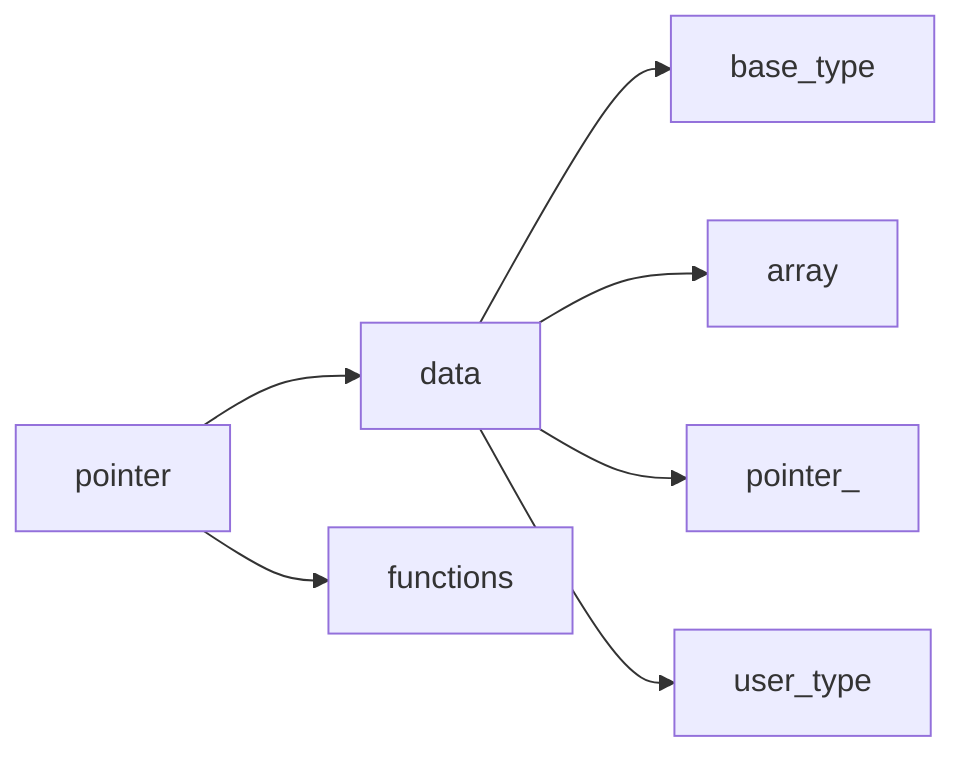

[**Назад**](https://github.com/BurdichxD4r/Cpp_Lessons/tree/master#course-ccqt)

# Указатели и Ссылки
## Что такое указатели?
Все определённые в программе данные, например, переменные, хранятся в памяти по определенному адресу. И указатели позволяют напрямую обращаться к этим адресам и благодаря этому манипулировать данными.

Обращение к объекту по адресу называется - **косвенное обращение**.

**Указатель** – переменная, значением которой является адрес другого элемента программы.
## Виды указателей
Оба вида указателей в качестве своих значений имеют адреса, но обладают различными свойствами, назначением и правилом работы с этими адресами.

## Объявление, определение
Объявление указателя совмещено с определением.

Определенный для одного типа не может быть использован для указания на другой.

Для указателя всегда выделяется один и тот же размер памяти.(64- разряда т.е. 8 байт), вне зависимости от типа объекта на который он указывает.
```c
int * p1, *p2, *p3;
double * p2;
extern char * p3;
```
## Оператор получения адреса(&)
Для получения адреса к переменной применяется **операция (&)**.

Эта операция применяется только к таким объектам, которые хранятся в памяти компьютера.
## Инициализация
**Без инициализации указатель использовать нельзя!**

Для инициализации используем оператор получения адреса объекта (&).
```
Нельзя присваивать указателю число без явного преобразования типов, кроме (0);
```
```
Нельзя преобразовать тип int -> *int.

int *p = 0x0111;
```
```c
int x = 25;
int * px= &x;
char * pstr = &“String”;
int * pval = 0;
```
## Оператор разыменования (*)
Извлечение значения, хранящегося по адресу в указателе происходит с использованием оператора разыменования (*).
```c
int x = 59;
int * px= &x;
int y = *px;
```
## Арифметика указателей
Что можно делать с указателем (-ми):
- Можно **копировать** адрес из одного указателя в другой:

    pn2 = pn1;
- К указателю можно **+/- целое число**:

    pn1++; // адрес следующего за pn1 элемента

    int num = 5;

    pn2 = pn1 + num; // адрес элем. Отстоящего от pn1 на num элементов типа int
- Указатели одного типа можно **вычитать**:

    int val = pn2 – pn1; // сколько элементов одного типа между элементами на которые указывают pn2, pn1
- Указатели одного типа можно всегда **сравнить**:

    if (pn1 == pn2) {...}
## Указатель типа *void
void * - (указатель без типа) специальный тип указателя, может содержать адрес объекта любого типа, но только пока мы не пытаемся оперировать данными по адресу в этом указатели.
```c
void * pVoid;
int n = 1; char c = ‘A’; int *pn = &n;
pVoid = &n; pVoid = &c; pVoid = pn;
```
Компилятор позволит присвоить адрес любого объекта, при этом сделает неявное преобразование:

`int*->void*; char*->void*;`

Обратное преобразование необходимо проводить явно:

`static_cast<int*>(void*);`

## NULL-pointer
NULL-pointer – указатель инициализированный специальным макроопределением NULL.

Этот указатель

- Никуда не указывает!
- Используется для проверки:

if (p){...} -> *его можно использовать*

```
С разыменованием (*) нулевого указателя большинстве случаев вы получите сбой в программе.
Нулевой указатель не имеет адреса, поэтому и такой результат.
```
## Указатель на указатель
Указатель так же имеет адрес, и может существовать другой указатель значение которого будет адрес первого указателя. Такой объект называется **Указатель на указатель**.


```c
int obj;
int *p = &obj;
int ** pp = &p;
```
## Указатель + const и volotile
Модификатор const (volotile) – может относиться к значению адреса или к значению объекта на который направлен указатель.

    const – “только для чтения”;

    volotile - возможно изменение извне;

|Указатель на сonst - объект|сonst – указатель на объект|сonst-указатель на const-объект|
|---|---|---|
|const T * имя|T * const имя|const T * const имя|
|• сonst char *pc = “ABC”;<br>• сhar c = *pc; //читать можем<br>• pc++; // знач. Указ. Изменить можем<br>• *pc = “WD”; // знач. объекта изм. не можем<br>Нельзя присваивать обычному указателю адрес, хранящийся в указателе на const – объект!<br>Указатель на const перем. Должен быть объявлен как указатель на const – объект.<br>const int i = 1;<br>const int *pn2 = &i;|• сhar c = ‘A’;<br>• сhar * const pc = &c; // init обязательна<br>• *pc = ‘B’; //объект изм. можем<br>• pc++; // значение адреса в указ. изм. нельзя|• int x = 1, y = 2;<br>• const int * const pn = &x;<br>• int z = *pn; //читать можно<br>• *pn = 5; // объект изменять нельзя!<br>• pn = &y; //адрес изменять нельзя!|

## Явное и неявное преобразование указателя
```c
Неявное приведение T *const -> T*:
int * const cp = &x;
int * p;
p = cp;
p++;
// cp++;
// cp = p;
```
```c
Неявное приведение T* -> const T*:

int m = 1;
int * p = &m;
(*p)++;
const int * pc = &m;
// (*pc)++;
```
```c
Нельзя void* - указателю присвоить адрес переменной, объявленной как const, volatile.

const int m = 1;
// void * p1 = &m;
// но !
extern volatile int v;
void volatile * p2 = &v;
```
```c
Снимаем const c указателя :

char c;
char * const pc = &c;
(const_cast <char*>(pc))++;
// только на время вычисления выражения
```
```c
При объявлении следует помнить:

сonst int * p1, *p2; // 2 указ.
    // на const объект
int * const p3 = &n, *p4; // const-
    //указатель, обыч. указ.
```
```c
Снимаем const с указываемого объекта:

char c = ‘A’;
const char * pc = &c;
// *pc = ‘B’;
*(const_cast<char*>(pc)) = ‘B’;
```
## В чем польза указателей
I. Массивы реализованы с помощью указателей. Указатели могут использоваться для итерации по массиву.

II. Они являются единственным способом динамического выделения памяти в С/C++. Это, самый распространенный вариант использования указателей.

III. Они могут использоваться для передачи большого количества данных в функцию без копирования этих данных.

IV. Они могут использоваться для передачи одной функции в качестве параметра другой функции.
## Динамическое управление памятью
Основные функции стандартной библиотеки по работе с динамической памятью:
- **void * malloc(size_t)** – выделяет указанное количество байтов в дин. памяти.
- **void * calloc(size_t)** – выделяет динамическую память и инициирует ее нулями.
- **void * realloc(void *, size_t)** - пере выделяет динамическую память если потребовалось больше и освобождает прежнюю.
- **free(*void)** – освобождает память
```c
// пример выделения памяти под неуправляемый
//указатель
int * p;
p = NULL;

// выделение памяти функцией malloc() для
// указателя на int
p = (int *)malloc(sizeof(int));
// выделение памяти функцией malloc() для
//указателя на double
double * pd = NULL;
pd = (double *)malloc(sizeof(double));
```
## Ссылки
Понятие ссылки есть только в С++.
- Ссылка позволяет программисту манипулировать адресом объекта.
- Может интерпретироваться как const-указатель на объект, при
каждом использовании которого происходит операция разыменование (*) (взятие значения по адресу).
- С ссылкой можно работать так же как с объектом на который она ссылается. Это псевдоним объекта.
```cpp
T & ref = obj;

Ссылки инициализируются только существующим объектом (не инициал. NULL !)
```
## Сравнение ссылки и указателя
|Отличие|Указатель|Ссылка|
|---|---|---|
|Обозначение типа|T *|T&|
|Объявление и определение|int x=1; int*p = &x;|int x=1; int & ref = x;|
|Инициализация|Не обязательна<br>int *p;|Обязательна<br>int & ref = x, но<br>extern int & ref1;|
|Получение значения|int temp = \*p;<br>(*p)++ - изм. значения объекта указателя|int temp = ref;<br>ref ++ - изм. знач. объекта ссылки|
|Изменение адреса|p++ - изменение адреса,<br>Возможно перенаправление указ. На др. объект|ref++ - изменение знач. по адресу,<br>Адрес хранящийся в ссылке изм. невозможно|
|NULL|int *p = NULL, указ. никуда не указ.|Не может быть инициализ. NULL|
|Взятие адреса|Адрес указ. : int ** pp = &p;|Адрес ссылки: int* pr = &ref;|
|Ссылка на указатель|нет|int n; int \*p = &n; int* & ref = p;<br>исп. для возвращения адреса переменной-указателя из ф-ции.|
|Ключ. слово void|void * p; универс. указ. типа void|Невозможно, это псевдоним конкретного объекта|
|Оператор sizeof|float * p;<br>sizeof(p) ~ 8 б, sizeof(*p) ~ 4 б|float f; float & ref = f;<br>sizeof(ref) ~ 8 б|
|Инициализация литералом|int \*p = (int*)0x1000000,<br>int * p = reinterpret_cast<int*>(0x1000000)|const int & ref = 5;<br>(используется для передаче параметров в функцию)|
