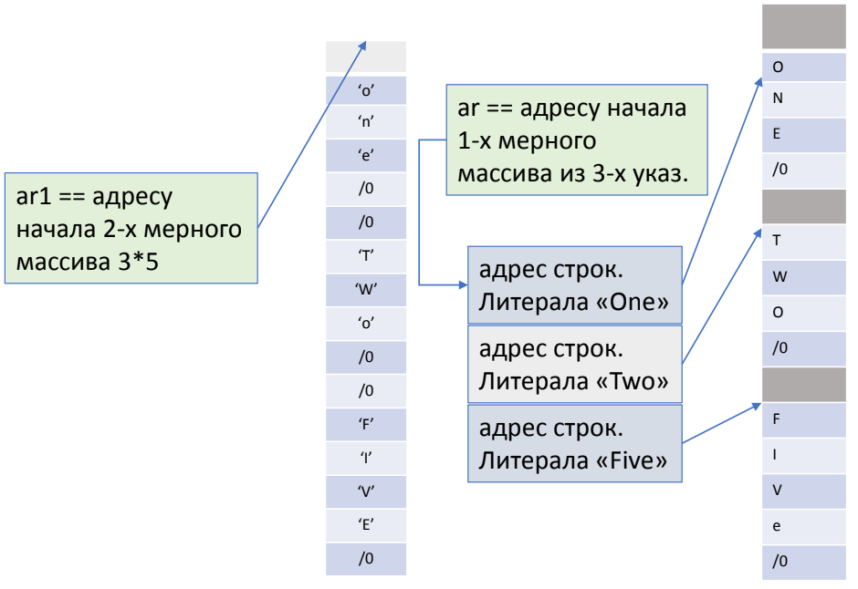
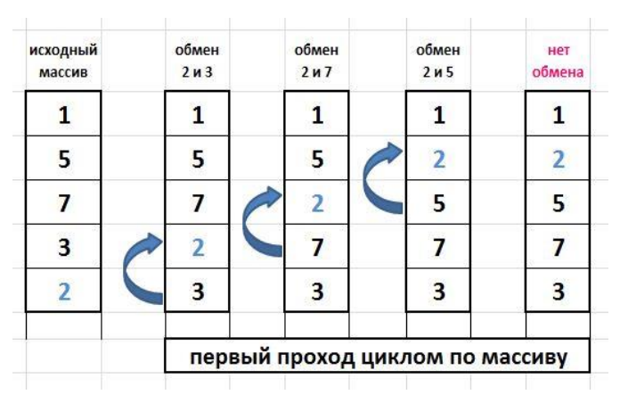

[**Назад**](https://github.com/BurdichxD4r/Cpp_Lessons/tree/master#course-ccqt)
# Массивы в языке С
## Объявление, обращение
**Массив** – сложный программный элемент с особенностями:
- Все элементы одного типа;
- Элементы расположены в памяти непрерывно;
- Имя массива – база(адрес участка памяти), относительно которой можно обращаться к любому элементу;
- Все элементы пронумерованы, начиная с 0;
- Доступ к элементам:
    - С помощью оператора индекса []; (2 пр.)
    - Через указатель, посредством опер. (*); (3 пр.)
- Массив может быть N-мерным;

Объявление:
- Имя;
- Тип элементов;
- Размерность;

```c
Т arr[N][M][L];

/*
Num = N * M * L;
N – число слоев;
M – число строк;
L – кол-во элем. в строке;
*/
```
**Индекс** – средство, которое позволяет компилятору исходя из размерности массива вычислить адрес требуемого элемента.

Размерность может быть задана только **сonst** выражением.
## Инициализация массива
Неявная инициализация:
- Глобальные и статические массивы инициал. по умолчанию «0»;
- Локальные и динамические массивы не инициализируются.

Явная инициализация:
- `T arr[n] = {1,2,3,...,n}` – полная инициализация;
- `T arr1[n] = {1,1,1,...,1}` – неполная инициализация;

    m < n,

    Правило неполной инициализации – массив частично инициализированный, инициализируется нулями до полной инициализации, при этом число n – обязательно!
- Можно опускать старшую размерность, но тогда список инициализации должен быть полным:

```c
T arr[] = {1,2,3,...,n};
```

Массив можно проинициализировать только при определении, нельзя присвоить новые значения уже существующим элементам массива!

В списке инициализаторов могут встречаться переменные:

```c
int n1 = 1, n2 = 2;
int arr[4] = {7, n1, n1, 8};
```
## Размер массива
Вычисление количества элементов массива на этапе компиляции:
- `char ar[] = "abc";`
- `size_t n= sizeof(ar)/sizeof(char);`
- `n= sizeof(ar)/sizeof(ar[0]);`

Сортировка выбором по возрастанию:

Последовательно проходим массив, сравнивая i-й элемент со всеми, находящимися после него и найдя min, переставим его на i-е место.
```c
{
    int ar[]={7,2,1,6,-2,5,3,8};
    int n = sizeof(ar)/sizeof(ar[0]);

    for(int i = 0; i < n-1; ++i){
        int min = i;
        for(int j = i + 1; j < n; ++j){
            if(ar[j] < ar[min]) min = j;
        }
        int temp = ar[min];
        ar[min] = ar[i];
        ar[i] = temp;
    }
}
```


## Связь массивов и указателей
```c
a[i] == i[a] == *(a + i);

// a-имя массива, i-имя целоч. перем.
```
Имя одномерного массива компилятор воспринимает как:

T *const p на [0] элемент массива.

T arr[n] = {1,...,1} – опре. массива,
```c
int *const p = arr; // int[]->int*
```
К i-му элементу массива можно обратится
как по имени, так и по указателю:
- int tmp = arr[i];
- int tmp = p[i];
- int tmp = *(p + i);
- int tmp = *(arr + i);

Отличия между указателем и массивом:
- Имя массива не содержит адреса как указатель (адрес 1- го эл. ассоциируется с именем массива);
- Под имя массива не отводится память как под указатель;
- p++; // ок
- аrr++; // error

Для вычисления адреса i-го элемента 1-о мерного массива:
```c
aдр[i] = адр[0] + i * sizeof(T)
// Размер самого массива не важен!
```
## Массивы указателей
Элементами массива могут быть указатели. Часто массивы указателей используются для хранения адресов строк текста.

**Массив:**
```c
char ar1[][6] = { "One", "Two", "Five"};
```
Массив указателей:
```c
const char * ar[] = {"One", "Two", "Five"};
```


## Динамические массивы в С
Если на этапе компиляции неизвестно какого размера массив понадобится? , используем механизм динамического управления памятью.

Основные функции стандартной библиотеки по работе с динамической памятью:
- void * malloc(size_t) – выделяе указанное количество байтов в дин. памяти.
- void * calloc(size_t) – выделяет динамическую память и инициирует ее нулями.
- void * realloc(void *, size_t) - пере выделяет динамическую память если потребовалось больше и освобождает прежнюю.
- free(*void) – освобождает память.

```c
unsigned int NUM_ARR; // размер массива, запрашиваем у пользователя

{
    size_t n = NUM_ARR * sizeof(int); // байт для Arr
    int *p = static_cast<int*>(malloc(n));
    if(p){ // память выделили, но хотим >
        p = static_cast<int*>(realloc(p, 2 * NUM_ARR));
        if(p){
            for(int i = 0; i < 2 * NUM_ARR; ++i){
            p[i] = 1;
            }
        }
        else {// придется просить еще раз 
        }
    }
    else { // придется просить еще раз 
    }
    ......
    free(p); // когда работа с памятью завершена
}
```
## Управление памятью в С++
Для динамического выделения памяти одной переменной
используется оператор

**new**
```cpp
int *ptr = new int(7); // динамически выделяем целочисленную переменную и присваиваем её адрес ptr, чтобы затем иметь доступ к ней
*ptr = 8; // присваиваем значение 8 только что выделенной памяти
```
Освободить память после переменной можно с помощью оператора

**delete**
```cpp
// Предположим, что ptr ранее уже был выделен с помощью оператора new
delete ptr; // возвращаем память, на которую указывал ptr, обратно в ОС
ptr = 0; // (используйте nullptr вместо 0 в C++11)
```
**Динамическое выделение памяти** — это способ запроса памяти из ОС запущенными программами по мере необходимости.

Без указателя с адресом на только что выделенную память у нас не было бы способа получить доступ к ней.

Указатель, указывающий на освобожденную память, называется висячим указателем. Разыменование или удаление висячего указателя приведет к неожиданным результатам.

## Динамические массивы в С++
Для выделения динамического массива и работы с ним используются отдельные формы операторов **new** и **delete**:

**new[]** и **delete[]**.
```cpp
#include <iostream>

int main()
{
    std::cout << "Enter a positive integer: ";
    int length;
    std::cin >> length;
    int *array = new int[length];
    std::cout << "allocated an array of integers of length " << length << '\n';
    array[0] = 7; // присваиваем элементу под индексом 0 значение 7
    delete[] array; // освобождения памяти под массив
    array = 0; // используйте nullptr вместо 0 в C++11
    return 0;
}
```
# Практическое занятие
## Список инициализаторов
```c
T arr[4] = {0,1,2,3}
T arr[7] = {?


T arr[N=2][M=5] = {{0,1,2,3,4},{0,1,2,3,4}}
arr[N=4][M=6] = {?


Т arr[N=3][M=4][L=2] = {
{{0,1},{0,1},{0,1},{0,1}},
{{2,3},{2,3},{2,3},{2,3}},
{{4,5},{4,5},{4,5},{4,5}}
}
Т arr[N=2][M=3][L=4] = {?
```
## Многомерные массивы
- Вычислите адрес 5-го эл-та 1-о мерного массива ar1[N]:

`aдр[i] = адр[0] + i * sizeof(T);`

- Вычислите адрес (4,7) –го эл-та 2-мерного массива ar2[N][M] , M = 8

`aдр[i][j] = адр[0][0] + i * M * sizeof(T) + j * sizeof(T);`

- Вычислите адрес (2,3,5) –го эл-та 3-мерного массива ar3[N][M][K], M=5, K=6

`aдр[i][j][k] = адр[0][0][0] + i * M * K* sizeof(T) + j * K * sizeof(T) + k * sizeof(T);`

```
К i-му элементу массива arr[N] можно обратится как по имени, так и по указателю:
int tmp = arr[i];
int tmp = p[i];
int tmp = *(p+i);
int tmp = *(arr+i);
```
```
К i, j-му элементу массива ar2[N][M]можно обратится как по имени, так и по указателю:
int tmp = ar2[i][j];
int tmp = p[i][j];
int tmp = *(p+i)[j];
int tmp = *(ar2+i)[j];
int tmp =*(*(ar2+i)+j);
int tmp = *(ar2[i] + j);
... дополните .
```
```
К i, j, k-му элементу массива ar3[N][M][K] можно обратится как по имени, так и по указателю:
int tmp = ar3[i][j][k];
...
tmp = p[i][j][k]
Дополните...
```
## Сортировка методом выбора (указатели)
```c
int ar[] = {4,1,-10, 55, 2, -5};
size_t n = sizeof(ar)/sizeof(ar[0]);
int * pCur = ar;
for (int i = 0; i < (n-1); ++i){
    int * pMin = pCur;
    int * pTmp = pCur + 1;
    for (int j = i + 1; j < n; ++j){
        if(*pTmp < *pMin){
            pMin = pTmp;
            pTmp++;
        }
    }
    int tmp = *pMin;
    *pMin = *pCur;
    *pCur = tmp;
    pCur++;
}
```
```c
for(int i = 0; i < n-1; ++i){
    int min = i;
    for(int j=i+1; j < n; ++j){
        if(ar[j] < ar[min]) min = j;
    }
    int temp = ar[min];
    ar[min] = ar[i];
    ar[i] = temp;
}
```
## Сортировка методом пузырька
Просматриваем массив снизу вверх и меняем стоящие рядом элементы если «Нижний» меньше чем «Верхний». Самый маленький элемент окажется вверху. Повторим все для n-1 оставшихся элементов, лежащих ниже самого маленького.
```c
int ar[]={6,1,-10, 5, 2, -7};

for( int i = 0; i < size; i ++) { // i - номер прохода
    for( j = size - 1; j > i; j-- ) {
        if ( a[j-1] > a[j] ) {
            x = a[j-1];
            a[j-1] = a[j];
            a[j] = x;
        }
    }
}
```


## Исправить код
Дана строка символов. Необходимо убрать из нее все пробелы за 1 проход.
```c
int main(){
    char * pStr = “asdfn ddf ddd ffff”;
    printf(“%s\n”, pStr);
    char* str = pStr;
    while (*str !=‘\0’){
        if (*str !=‘ ‘){
            *pStr = *str;
            *pStr++;
        }
        str++;
    }
    *pStr = ‘\0’;
    printf(“%p\n”, pStr);
    return 0;
}
```
# Домашняя работа.
1. Создать массив [5][7]. Инициализируем числами от 0 до 35:
    - при помощи списка инициализаторов;
    - в цикле ;
    - с использованием вложенного цикла.
2. Сортировка методом пузырька при помощи указателей.
3. Изучить вопрос создания многомерного динамического массива.
4. Задан массив из 30 вещественных чисел. Найти элемент (индекс),
имеющий максимальное значение в массиве.

* Вычисление значения арифметического выражения, введенного с
клавиатуры. Использовать операции: +, -