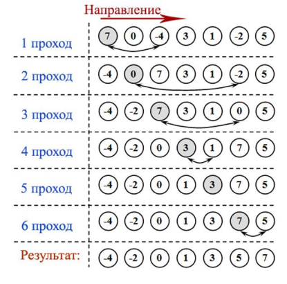

[**Назад**](https://github.com/BurdichxD4r/Cpp_Lessons/tree/master#course-ccqt)
# Массивы в языке С
## Объявление, обращение
**Массив** – сложный программный элемент с особенностями:
- Все элементы одного типа;
- Элементы расположены в памяти непрерывно;
- Имя массива – база(адрес участка памяти), относительно которой можно обращаться к любому элементу;
- Все элементы пронумерованы, начиная с 0;
- Доступ к элементам:
    - С помощью оператора индекса []; (2 пр.)
    - Через указатель, посредством опер. (*); (3 пр.)
- Массив может быть N-мерным;

Объявление:
- Имя;
- Тип элементов;
- Размерность;

```c
Т arr[N][M][L];

/*
Num = N * M * L;
N – число слоев;
M – число строк;
L – кол-во элем. в строке;
*/
```
**Индекс** – средство, которое позволяет компилятору исходя из размерности массива вычислить адрес требуемого элемента.

Размерность может быть задана только **сonst** выражением.
## Инициализация массива
Неявная инициализация:
- Глобальные и статические массивы инициал. по умолчанию «0»;
- Локальные и динамические массивы не инициализируются.

Явная инициализация:
- `T arr[n] = {1,2,3,...,n}` – полная инициализация;
- `T arr1[n] = {1,1,1,...,1}` – неполная инициализация;

    m < n,

    Правило неполной инициализации – массив частично инициализированный, инициализируется нулями до полной инициализации, при этом число n – обязательно!
- Можно опускать старшую размерность, но тогда список инициализации должен быть полным:

```c
T arr[] = {1,2,3,...,n};
```

Массив можно проинициализировать только при определении, нельзя присвоить новые значения уже существующим элементам массива!

В списке инициализаторов могут встречаться переменные:

```c
int n1 = 1, n2 = 2;
int arr[4] = {7, n1, n1, 8};
```
## Размер массива
Вычисление количества элементов массива на этапе компиляции:
- `char ar[] = "abc";`
- `size_t n= sizeof(ar)/sizeof(char);`
- `n= sizeof(ar)/sizeof(ar[0]);`

Сортировка выбором по возрастанию:

Последовательно проходим массив, сравнивая i-й элемент со всеми, находящимися после него и найдя min, переставим его на i-е место.
```c
{
    int ar[]={7,2,1,6,-2,5,3,8};
    int n = sizeof(ar)/sizeof(ar[0]);

    for(int i = 0; i < n-1; ++i){
        int min = i;
        for(int j = i + 1; j < n; ++j){
            if(ar[j] < ar[min]) min = j;
        }
        int temp = ar[min];
        ar[min] = ar[i];
        ar[i] = temp;
    }
}
```


## Связь массивов и указателей
