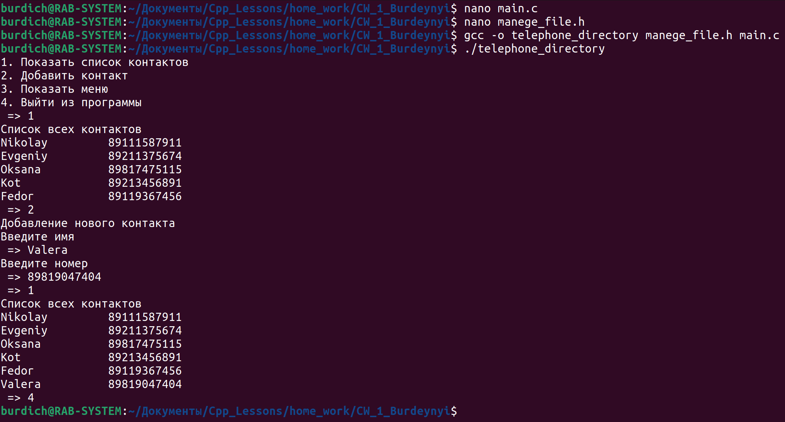

[**Назад**](https://github.com/BurdichxD4r/Cpp_Lessons/tree/master#course-ccqt)
# Курсовая работа №1
- Сделать программу «**Телефонный справочник**». Программа должна хранить связку «имя - телефон» с помощью структуры. Программа должна работать в режимах:

1. Добавление новых записей с консоли. Хранение записей в файле.
2. Выводить все записи справочника
3. * Режим поиска существующей записи

