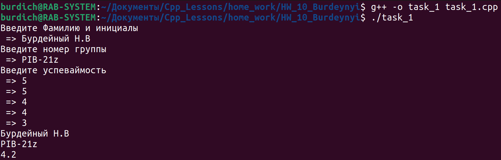
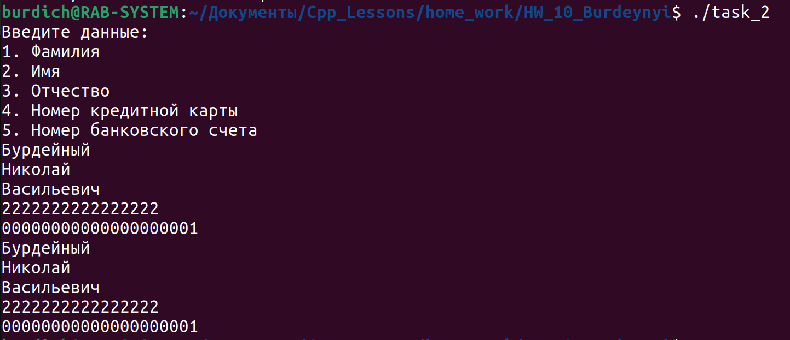

[**Назад**](https://github.com/BurdichxD4r/Cpp_Lessons/tree/master#course-ccqt)
## Task_1

- Создайте класс с именем Student, содержащую поля: фамилия и инициалы, номер группы, успеваемость (массив из пяти элементов).

## Task_2

- Класс **Покупатель**: Фамилия, Имя, Отчество, Адрес, Номер кредитной карточки, Номер банковского счета;

