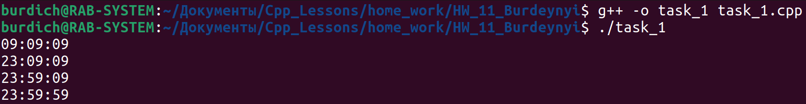

[**Назад**](https://github.com/BurdichxD4r/Cpp_Lessons/tree/master#course-ccqt)
## Task_1

- Составить описание класса для представления времени. Предусмотреть возможности установки времени и изменения его отдельных полей (час, минута, секунда) с проверкой допустимости вводимых значений. В случае недопустимых значений полей выводятся сообщения об ошибке. Создать методы изменения времени на заданное количество часов, минут и секунд.

