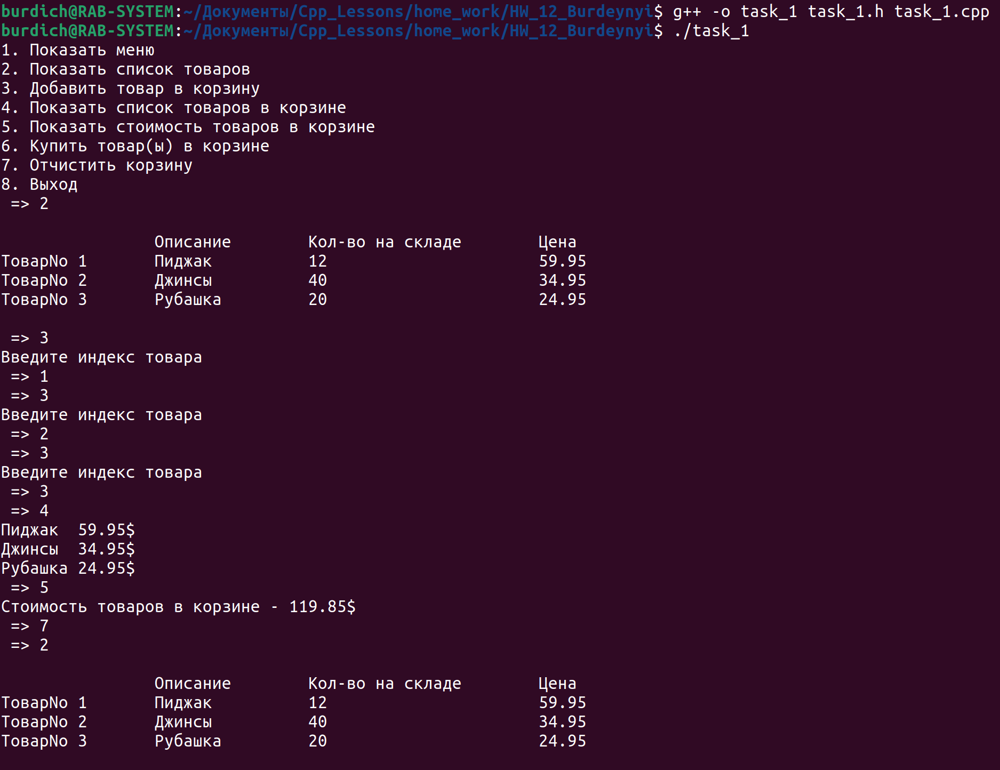
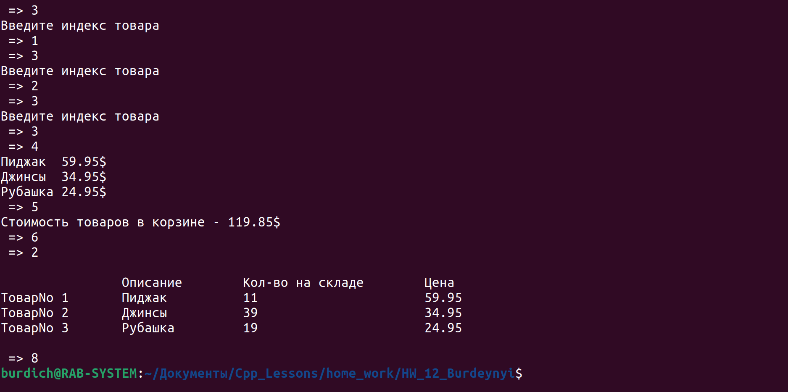

[**Назад**](https://github.com/BurdichxD4r/Cpp_Lessons/tree/master)
## Task_1

- Напишите класс под названием Retailitem (Розничная торговая единица), который содержит данные о товаре в розничном магазине. Этот класс должен хранить данные в атрибутах (полях): описание товара, кол-во единиц на складе и цена. После написания класса напишите приложение, которая создает 3 объекта этого класса и сохраняет в них приведенные в таблице 1.

Таблица 1.
||Описание|Кол-во на складе|Цена|
|---|---|---|---|
|ТоварNo 1|Пиджак|12|59.95|
|ТоварNo 2|Джинсы|40|34.95|
|ТоварNo 3|Рубашка|20|24.95|

Создайте класс CashRegister (Кассовый аппарат), который может использоваться вместе с классом Retailitem.

Класс СashRegister должен иметь внутренний список объектов Retailitem, а также приведенные ниже методы.
1. Метод buy _ item () (приобрести товар) в качестве аргумента принимает объект Retailrtem.
При каждом вызове метода buy _ item () объект Retailrtem, переданный в качестве аргумента, должен быть добавлен в список.
2. Метод get _ total () (получить сумму покупки) возвращает общую стоимость всех объектов Retailrtem, хранящихся во внутреннем списке объекта CashRegister.
3. Метод show items () (показать товары) выводит данные об объектах класса Retailrtem, хранящихся во внутреннем списке объекта класса СashRegister.
4. Метод clear () (очистить) должен очистить внутренний список объекта CashRegister. Продемонстрируйте класс CashRegister в программе, которая позволяет пользователю выбрать несколько товаров для покупки. Когда пользователь готов рассчитаться за покупку, программа должна вывести список всех товаров, которые он выбрал для покупки, а также их общую стоимость.

 