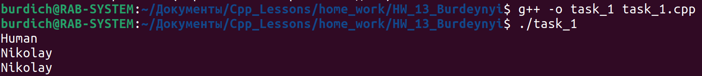
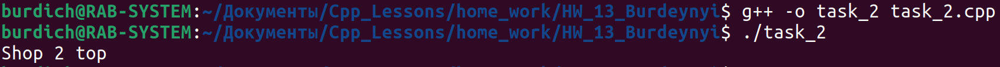
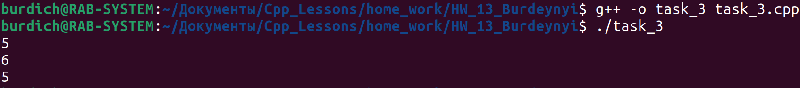
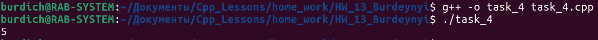
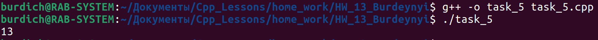
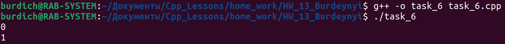

[**Назад**](https://github.com/BurdichxD4r/Cpp_Lessons/tree/master#course-ccqt)
## Task_1

- **Перегрузка оператора ввода (>>)**

```cpp
#include <iostream>

class Input{
private:
    std::string m_name;
public:
    Input(std::string name = "Human"):m_name(name){}
    void getName(){std::cout << m_name << std::endl;}
    friend std::istream & operator>>(std::istream & in, Input & input);
};

std::istream & operator>>(std::istream & in, Input & input){
    in >> input.m_name;
    return in;
}

int main(){
    Input i;
    i.getName();
    std::cin >> i;
    i.getName();
    return 0;
}
```



## Task_2

- **Перегрузка оператора сравнения (>)**

```cpp
#include <iostream>

class Shop{
private:
    int m_revenue;
public:
    Shop(int revenue = 0.0):m_revenue(revenue){}
    friend bool operator>(const Shop & shop1, const Shop & shop2);
};

bool operator>(const Shop & shop1, const Shop & shop2){
    return shop1.m_revenue > shop2.m_revenue;
}

int main(){
    Shop shop1(1800);
    Shop shop2(2000);
    if (shop1 > shop2){
        std::cout << "Shop 1 top\n";
    }else{
        std::cout << "Shop 2 top\n";
    }
    return 0;
}
```



## Task_3

- **Перегрузка инкремента/декремента(++х/х--)**

```cpp
#include <iostream>

class N{
private:
    int m_n;
public:
    N(int n = 0):m_n(n){}
    void getN(){std::cout << m_n << std::endl;}
    N & operator++();
    N operator--(int);
};

N & N::operator++(){
    ++m_n;
    return * this;
}

N N::operator--(int){
    N tmp(m_n);
    --(* this).m_n;
    return tmp;
}

int main(){
    N n(5);
    n.getN();
    ++n;
    n.getN();
    n--;
    n.getN();
    return 0;
}
```



## Task_4

- **Перегрузка оператора[] при работе с указателем**

```cpp
#include <iostream>

class intArray{
private:
    int m_array[10];
public:
    int & operator[](const int index){
        return m_array[index];
    }
};

int main(){
    intArray * array = new intArray;
    (*array)[4] = 5;
    std::cout << (*array)[4] << std::endl;
    delete array;
    return 0;
}
```



## Task_5

- **Перегрузка операций преобразования типов данных**

```cpp
#include <iostream>

class Ruble{
private:
    int m_ruble;
public:
    Ruble(int ruble):m_ruble(ruble){}
    operator float(){return m_ruble;}
    double getRuble(){std::cout << (float)m_ruble << std::endl; return (float)m_ruble;}
};

int main(){
    Ruble ruble(13);
    ruble.getRuble();
    return 0;
}
```



## Task_6

- **Перегрузка оператора присваивания (=)**

```cpp
#include <iostream>

class Shaverma{
private:
    bool m_poison;
public:
    Shaverma(bool poison = 0):m_poison(poison){}
    void getShava(){std::cout << m_poison << std::endl;}
    Shaverma & operator=(const Shaverma & shava){
        m_poison = shava.m_poison;
        return * this;
    }
};

int main(){
    Shaverma shava1(1);
    Shaverma shava2;
    shava2.getShava();
    shava2 = shava1;
    shava2.getShava(); // теперь вторая тоже отравлена
    return 0;
}
```


