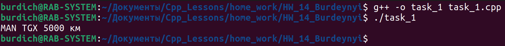

[**Назад**](https://github.com/BurdichxD4r/Cpp_Lessons/tree/master)
## Task_1

- Спроектировать структуру классов в соответствии с индивидуальным заданием. Наследование осуществляется по типу **public**. Создать несколько объектов производных классов, задавая случайным образом их свойства. Определить Вычисляемый показатель.

Транспортное средство. Легковой автомобиль, грузовой автомобиль. [Максимальный пробег на полном бензобаке]

