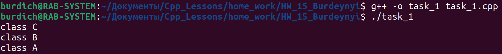
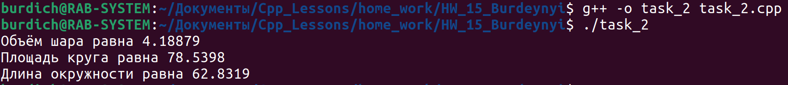

[**Назад**](https://github.com/BurdichxD4r/Cpp_Lessons/tree/master)
## Task_1

- Объявляется 3 класса с именами A, B, C. Класс A является базовым для класса B. Класс B является базовым для класса C. Классы содержат только один метод, выводящий название класса. С помощью механизма полиморфизма в функцию DemoPolymorphism() передается ссылка на один из экземпляров. В соответствии с переданным экземпляром вызывается требуемый метод.

## Task_2

- Приводится пример 3-х классов CalcLength, CalcArea, CalcVolume, в которых в виртуальной функции Calc() возвращается соответственно длина окружности, площадь круга и объем шара. Для демонстрации создается некоторая функция ShowResult(), в которую передается указатель на базовый класс. Функция вызывает виртуальную функцию Calc() по указателю. В теле функции ShowResult() неизвестно, экземпляр какого класса будет ей передан. Экземпляр будет сформирован во время выполнения.

