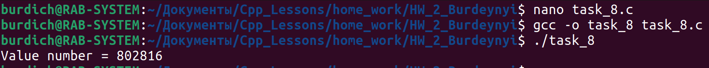
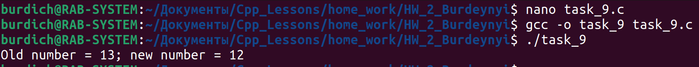

## Task_1

- Вывод на экран консоли значения X:

x = 2 % 2 +2 * 2 -2 / 2;

x = (3 * 9 *(3 + (9 * 3 / 3)));

## Task_2

- В выражении : a / b * c / d *e / f *h ,
расставьте скобки так что бы получилось:

    

## Task_3

- Даны натуральные числа – n, m (выберите сами значения).Вывести на экран консоли младшую цифру целой части.

## Task_4

- Идет k - ая (выберите сами) секунда суток. Определить сколько часов и минут будут показывать электронные часы, если на 0-ой секунде они показывали 0:0 ?

## Task_5

- Поменять местами значения переменных а и b без использования временной переменной c.

## Task_6

- Преобразовать секунды в чч:мм:сс. Количество секунд на входе выбрать самостоятельно.

## Task_7

- Осуществить перевод из 2 -> 10 систему счисления. Число в 2-ой системе счисления выбрать самостоятельно.

## Task_8

- Написать программу осуществляющую 10-ый сдвиг вправо для целого 3-х злачного числа.

## Task_9

- Осуществить 2-й сдвиг влево и вправо для двузначного числа. Объяснить результат.

