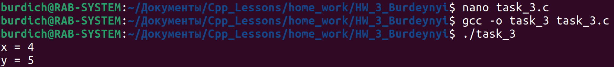
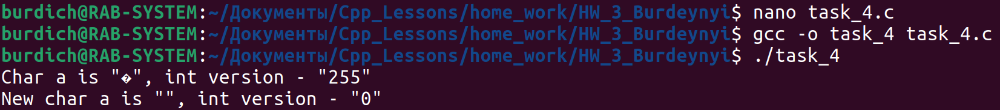
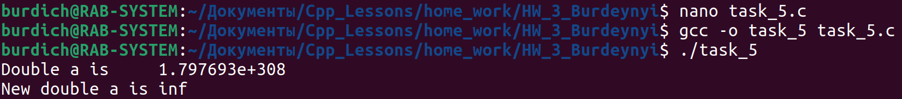
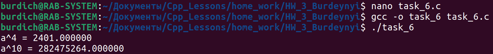

## Task_3

- Даны два числа x, y. Вывести первое число, если оно больше второго, и оба числа, если это не так.

## Task_4

- Написать программу демонстрирующую переполнение по типу char и вывести на экран и число и символ.

## Task_5

- Написать программу с переполнением по типу double.

## Task_6

- Дано действительное число а. Пользуясь только умножением получить а^4 и a^10 за четыре операции.

