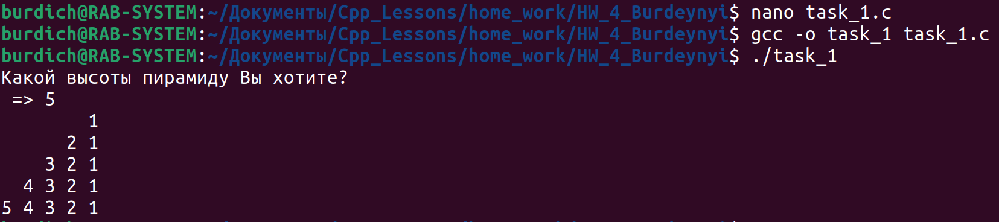
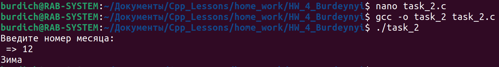
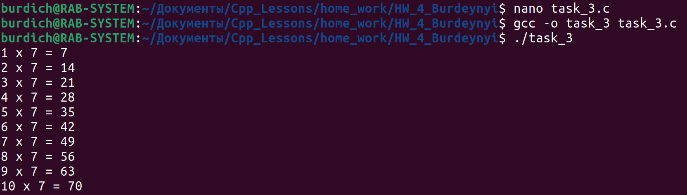
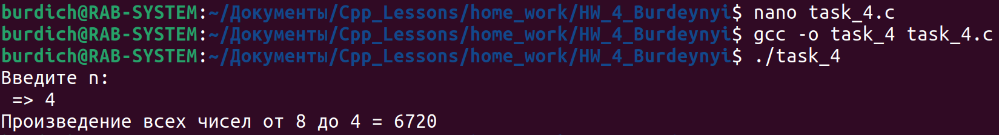
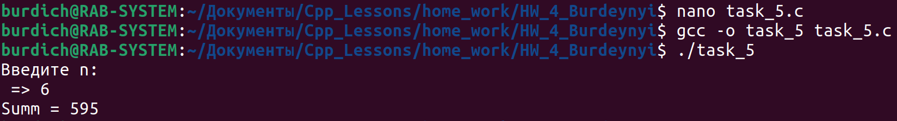

## Task_1

- Сделайте так, чтобы цифры выводились следующим образом :
```
        1
      2 1
    3 2 1
  4 3 2 1
5 4 3 2 1
```



## Task_2

- С клавиатуры вводится номер месяца. Необходимо проверить валидное ли введенное значение или нет, если нет выдать оператору сообщение об ошибке. Если значение валидное, вывести на экран название сезона к которому относится месяц.



## Task_3

- Напечатать таблицу умножения на 7. В виде :
```
1 х 7 = 7
2 х 7 = 14
и т.д
```



## Task_4

- Найти произведение всех чисел от 8 до n. Число n – вводится с клавиатуры оператором. Вывести результат на экран.



## Task_5

- Дано натуральное число n (вводим с клавиатуры). Найти сумму : n^2 + n+1^2 + ... + 2*n^2. Результат вывести на экран.

