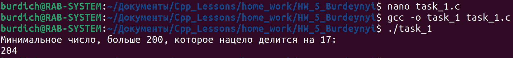
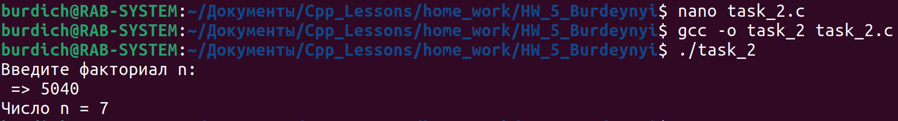
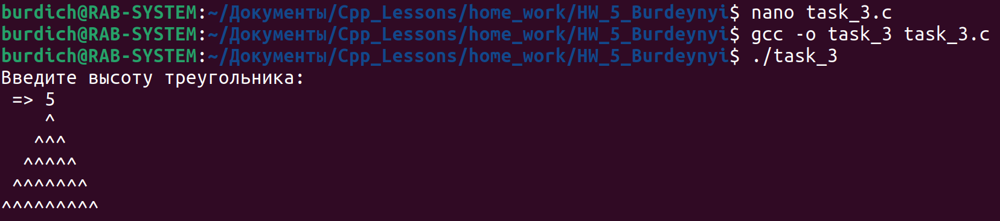
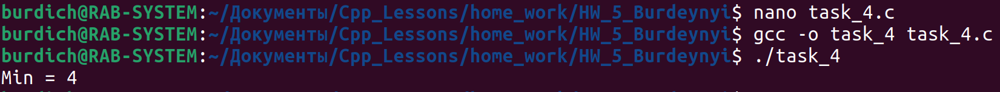
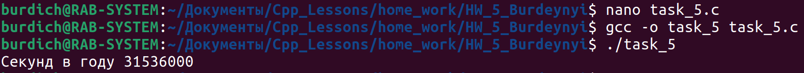

[**Назад**](https://github.com/BurdichxD4r/Cpp_Lessons/tree/master#course-ccqt)
## Task_1

- Напечатать минимальное число, большее 200, которое нацело делится на 17.



## Task_2

- Известен факториал числа. Найти это число (факториал числа n равен 1 · 2 · ... · n).



## Task_3

- Задача посложней. Нарисовать равнобедренный треугольник из символов ^. Высоту выбирает пользователь. Например: высота = 5, на экране:
```
    ^
   ^^^
  ^^^^^
 ^^^^^^^
^^^^^^^^^
```



## Task_4

- Напишите стандартный макрос MIN – поиск минимального значения из 2-х чисел. Для определенности пусть числа типа int.



## Task_5

- Используя директиву #define, напишите именованную константу, возвращающую число секунд в году. Високосным годом – пренебречь.

