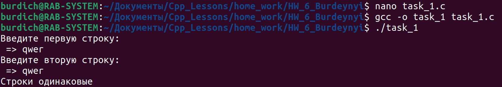
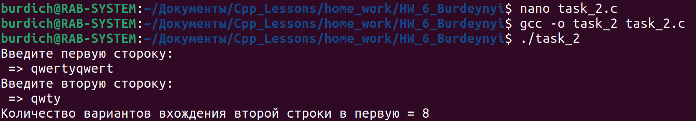

## Task_1

- Выполнить сравнение 2-х строк, введенных с клавиатуры с игнорированием пробелов.

## Task_2

- Для 2-х строк введенных с клавиатуры определить все возможные варианты вхождения второй строки в первую.

