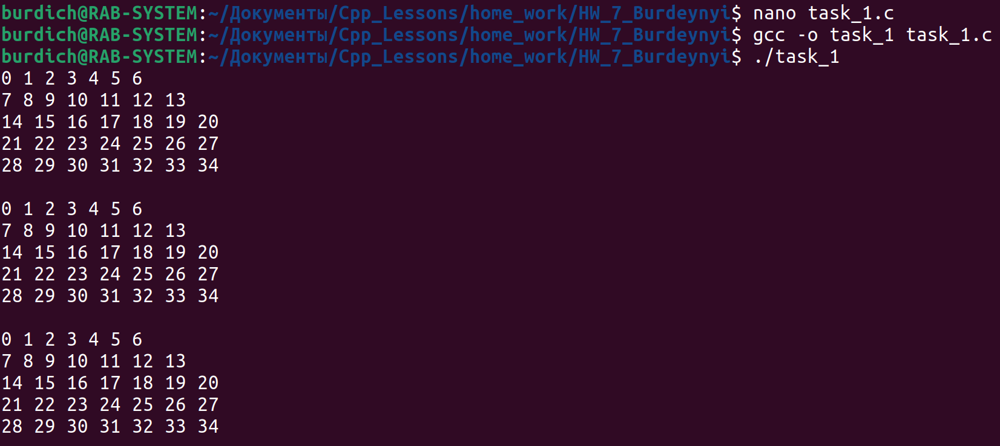

## Task_1

- Создать массив [5][7]. Инициализируем числами от 0 до 35:
    - при помощи списка инициализаторов;
    - в цикле ;
    - с использованием вложенного цикла.

## Task_2

- Сортировка методом пузырька при помощи указателей

## Task_3

- Изучить вопрос создания многомерного динамического массива

## Task_4

- Задан массив из 30 вещественных чисел. Найти элемент (индекс), имеющий максимальное значение в массиве

## Task_5

- Вычисление значения арифметического выражения, введенного с клавиатуры. Использовать операции: +, -

