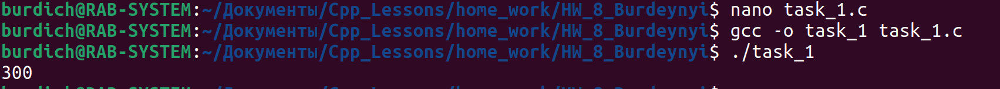
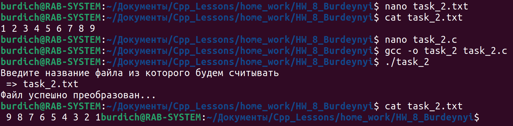

## Task_1

- Придумать эллипсис со своим механизмом контроля вводимых параметров.

## Task_2

- Массив:
    - считывается из файла;
    
    - передается в функцию где он сортируется по убыванию ;

    - отсортированный массива возвращается из функции ;
    
    - сохраняется в файл ;

Т.о задачу необходимо оформить в виде 3-х ф-ций:
- Считывание из файла
- Сортировки
- Запись в файл.

