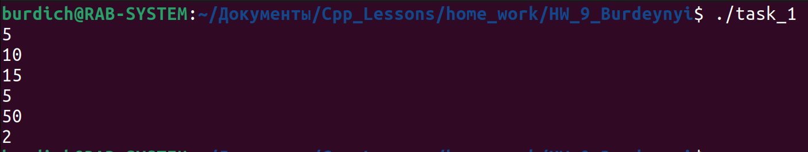

[**Назад**](https://github.com/BurdichxD4r/Cpp_Lessons/tree/master)
## Task_1

- Определить массив указателей на функции. Вводить цифру, определяющую, какую функцию надо выполнить: <pre>
    0 - найти min число;
    1 - найти max число;
    2 - вычислить сумму;
    3 - вычислить разность;
    4 - произведение чисел;
    5 - найти частное;
    6 - завершить работу.

Выполнить соответствующую функцию , используя указатель на неё.

